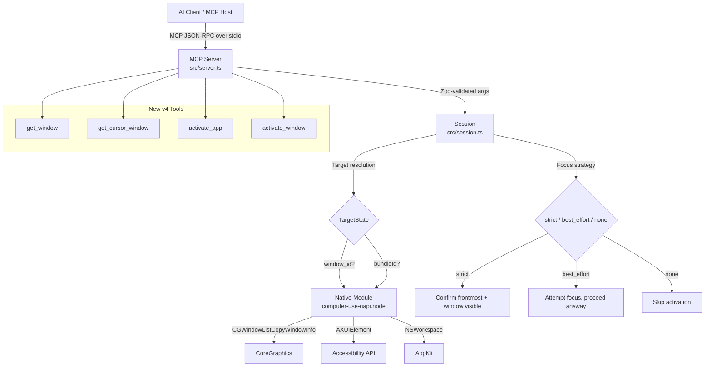

# Design Document: v4 Window-Aware Desktop Control

## Overview

This design upgrades `computer-use-mcp` from v3.0.0 to v4.0.0, making the MCP server window-aware, introspectable, and recoverable. The core change is shifting from app-level targeting (`target_app: string`) to window-level targeting (`target_window_id: number`) with structured focus diagnostics and configurable focus strategies.

The upgrade spans four layers:

1. **Native Rust Layer** — Replace Swift subprocess window enumeration with direct CoreGraphics/AXUIElement calls; add `getWindow`, `getCursorWindow`, `activateWindow`, and `displayId` to window records
2. **Session Layer** — Replace `targetApp: string` with a `TargetState` object; implement target resolution order, focus strategy dispatch, and enhanced FocusFailure diagnostics
3. **Server Layer** — Register 4 new MCP tools and add `target_window_id` + `focus_strategy` parameters to all input tools
4. **Client Layer** — Add typed convenience methods for new tools and update existing method signatures

### Design Decisions

- **CoreGraphics over AXUIElement for enumeration**: `CGWindowListCopyWindowInfo` is the fastest way to enumerate on-screen windows. AXUIElement is only needed for the `activateWindow` raise operation, since CG has no window-raise API.
- **Focus strategy as a per-call parameter**: Different tool categories have different reliability needs. Keyboard input is high-risk (keystrokes go to the wrong window silently), so it defaults to `strict`. Pointer input is lower-risk (clicks land at coordinates regardless of focus), so it defaults to `best_effort`.
- **Observation tools never mutate state**: This is a hard invariant. Agents must be able to introspect desktop state between actions without side effects on routing.
- **`target_window_id` takes precedence over `target_app`**: When both are provided, the window ID is more specific and wins. The owning app's bundle ID is resolved from the window.

## Architecture

The v4 architecture preserves the existing layered structure but adds window-level resolution at the session layer and native window APIs at the Rust layer.



### Data Flow: Window-Targeted Input

```
Agent sends: { tool: "key", args: { text: "command+v", target_window_id: 12345, focus_strategy: "strict" } }
  → Zod validates parameters
  → Session resolves window 12345 → bundleId "com.apple.iWork.Numbers"
  → Session checks focus_strategy: strict
  → Session confirms frontmost app == "com.apple.iWork.Numbers"
  → Session confirms window 12345 is on-screen
  → If not: attempt recovery (unhide → activate → raise → poll)
  → If still not: return FocusFailure with suggestedRecovery
  → If confirmed: Rust keyPress("command+v")
  → Session updates TargetState { bundleId, windowId: 12345, establishedBy: 'keyboard' }
  → Returns: { content: [{ type: "text", text: "Pressed command+v" }] }
```

### Data Flow: Window Activation with Hidden App Recovery

```
Agent sends: { tool: "activate_window", args: { window_id: 12345 } }
  → Session calls native.getWindow(12345) → finds bundleId, checks isOnScreen
  → If app is hidden: native.unhideApp(bundleId) → sleep(100ms)
  → native.activateApp(bundleId, timeoutMs) → poll frontmost
  → native.activateWindow(12345) → AXUIElement raise
  → Poll: confirm frontmost app matches AND window is on-screen
  → Update TargetState { bundleId, windowId: 12345, establishedBy: 'activation' }
  → Return: { windowId: 12345, activated: true, frontmostAfter: bundleId, reason: null }
```

## Components and Interfaces

### Native Module Extensions (`native/src/`)

#### New Rust Functions

```rust
// native/src/windows.rs (new file)

/// List on-screen windows using CGWindowListCopyWindowInfo directly.
/// Replaces the Swift subprocess in apps.rs.
/// Includes displayId via CGWindowListCreateDescriptionFromArray.
#[napi]
pub fn list_windows(bundle_id: Option<String>) -> napi::Result<serde_json::Value>

/// Look up a single window by its CGWindowID.
/// Returns the same shape as a list_windows entry, or error if not found.
#[napi]
pub fn get_window(window_id: u32) -> napi::Result<serde_json::Value>

/// Find the window under the current cursor position.
/// Combines cursorPosition() with CGWindowListCopyWindowInfo + point-in-bounds.
#[napi]
pub fn get_cursor_window() -> napi::Result<serde_json::Value>

/// Activate (raise) a specific window using AXUIElement API.
/// 1. Find the owning PID from CGWindowListCopyWindowInfo
/// 2. Create AXUIElementCreateApplication(pid)
/// 3. Enumerate AXUIElement children to find matching window
/// 4. AXUIElementPerformAction(kAXRaiseAction)
#[napi]
pub fn activate_window(window_id: u32, timeout_ms: Option<i32>) -> napi::Result<serde_json::Value>
```

#### Implementation Strategy for CoreGraphics Window Enumeration

The current `list_windows` in `apps.rs` spawns a Swift subprocess that calls `CGWindowListCopyWindowInfo`. The v4 implementation calls the same CoreGraphics C API directly from Rust via FFI:

```rust
// CoreGraphics FFI declarations needed
extern "C" {
    fn CGWindowListCopyWindowInfo(option: u32, relativeToWindow: u32) -> *const Object;
    // kCGWindowListOptionOnScreenOnly = 1 << 0
    // kCGNullWindowID = 0
}
```

The `core-graphics` crate doesn't expose `CGWindowListCopyWindowInfo` directly, so we use raw FFI through `core_foundation` for the CFArray/CFDictionary traversal. The window record shape matches the existing Swift output plus the new `displayId` field.

#### Implementation Strategy for AXUIElement Window Raise

Window-level activation requires the Accessibility framework. The approach:

1. Get the PID from the window's `kCGWindowOwnerPID`
2. Create an `AXUIElementCreateApplication(pid)` reference
3. Get the `kAXWindowsAttribute` array
4. Match by comparing window title and bounds (CGWindowID is not directly exposed via AX)
5. Call `AXUIElementPerformAction(window, kAXRaiseAction)`
6. Call `AXUIElementSetAttributeValue(window, kAXFrontmostAttribute, kCFBooleanTrue)` as fallback

This requires linking the `ApplicationServices` framework (already linked in `build.rs`).

#### Screenshot Consolidation

The `window_id_for_bundle` function in `screenshot.rs` currently spawns a Swift subprocess to find a window ID for a bundle. This will be replaced by calling the new native `list_windows` implementation and picking the first layer-0 window for the given PID. The `take_screenshot` function will also accept an optional `window_id: Option<u32>` parameter directly, bypassing the bundle-to-window lookup when a specific window ID is provided.

### Updated NativeModule TypeScript Interface (`src/native.ts`)

```typescript
export interface NativeModule {
  // ... existing methods unchanged ...

  // New v4 methods
  getWindow(windowId: number): {
    windowId: number
    bundleId: string | null
    displayName: string
    pid: number
    title: string | null
    bounds: { x: number; y: number; width: number; height: number }
    isOnScreen: boolean
    isFocused: boolean
    displayId: number
  } | null

  getCursorWindow(): {
    windowId: number
    bundleId: string | null
    displayName: string
    pid: number
    title: string | null
    bounds: { x: number; y: number; width: number; height: number }
    isOnScreen: boolean
    isFocused: boolean
    displayId: number
  } | null

  activateWindow(windowId: number, timeoutMs?: number): {
    windowId: number
    activated: boolean
    reason: string | null
  }

  // Updated: listWindows now includes displayId
  listWindows(bundleId?: string): Array<{
    windowId: number
    bundleId: string | null
    displayName: string
    pid: number
    title: string | null
    bounds: { x: number; y: number; width: number; height: number }
    isOnScreen: boolean
    isFocused: boolean
    displayId: number
  }>

  // Updated: takeScreenshot accepts optional windowId
  takeScreenshot(
    width?: number,
    targetApp?: string,
    quality?: number,
    previousHash?: string,
    windowId?: number
  ): {
    base64?: string
    width: number
    height: number
    mimeType: string
    hash: string
    unchanged: boolean
  }
}
```

### Session Layer (`src/session.ts`)

#### TargetState Interface

```typescript
interface TargetState {
  bundleId?: string
  windowId?: number
  establishedBy: 'activation' | 'pointer' | 'keyboard'
  establishedAt: number  // Date.now() timestamp
}
```

Replaces the current `let targetApp: string | undefined`.

#### FocusStrategy Type

```typescript
type FocusStrategy = 'strict' | 'best_effort' | 'none'
```

#### Enhanced FocusFailure Interface

```typescript
interface FocusFailure {
  error: 'focus_failed'
  requestedBundleId: string
  requestedWindowId: number | null
  frontmostBefore: string | null
  frontmostAfter: string | null
  targetRunning: boolean
  targetHidden: boolean
  targetWindowVisible: boolean | null
  activationAttempted: boolean
  suggestedRecovery: 'activate_window' | 'unhide_app' | 'open_application'
}
```

#### Target Resolution Logic

```typescript
function resolveTarget(args: Record<string, unknown>): { bundleId?: string; windowId?: number } {
  // 1. Explicit target_window_id
  if (typeof args.target_window_id === 'number') {
    const win = n.getWindow(args.target_window_id)
    if (!win) throw new WindowNotFoundError(args.target_window_id)
    return { bundleId: win.bundleId ?? undefined, windowId: win.windowId }
  }
  // 2. Explicit target_app
  if (typeof args.target_app === 'string' && args.target_app.length > 0) {
    return { bundleId: args.target_app }
  }
  // 3. Current TargetState (only for mutating tools)
  return { bundleId: targetState?.bundleId, windowId: targetState?.windowId }
}
```

#### Focus Strategy Dispatch

```typescript
function defaultStrategy(tool: string): FocusStrategy {
  const keyboardTools = ['type', 'key', 'hold_key']
  if (keyboardTools.includes(tool)) return 'strict'
  return 'best_effort'
}

async function ensureFocusV4(
  target: { bundleId?: string; windowId?: number },
  strategy: FocusStrategy
): Promise<void> {
  if (strategy === 'none') return
  if (!target.bundleId) return

  const front = n.getFrontmostApp()
  if (front?.bundleId === target.bundleId) {
    // App is frontmost — check window if strict + windowId
    if (strategy === 'strict' && target.windowId != null) {
      const win = n.getWindow(target.windowId)
      if (!win?.isOnScreen) throw new FocusError(/* ... */)
    }
    return
  }

  // App not frontmost — attempt recovery
  const runningApp = n.listRunningApps().find(a => a.bundleId === target.bundleId)

  if (runningApp?.isHidden) {
    n.unhideApp(target.bundleId)
    await sleep(100)
  }

  const result = n.activateApp(target.bundleId, 2000)
  await sleep(80)

  if (target.windowId != null) {
    try { n.activateWindow(target.windowId) } catch { /* best effort */ }
    await sleep(80)
  }

  const after = n.getFrontmostApp()
  if (strategy === 'strict' && after?.bundleId !== target.bundleId) {
    throw new FocusError(/* structured failure with all diagnostic fields */)
  }
}
```

#### Observation Tool Guarantee

Observation tools (`screenshot`, `list_windows`, `get_window`, `get_frontmost_app`, `get_cursor_window`) never call `rememberTarget()` or modify `targetState`. This is enforced by the dispatch switch — these cases return results without touching state.

### Server Layer (`src/server.ts`)

#### New Tool Registrations

```typescript
// New tools
tool('get_window', 'Look up a window by its CGWindowID', {
  window_id: z.number().int().describe('CGWindowID of the window to look up'),
})

tool('get_cursor_window', 'Get the window currently under the mouse cursor', {})

tool('activate_app', 'Activate an app and return structured before/after diagnostics', {
  bundle_id: z.string().describe('macOS bundle ID'),
  timeout_ms: z.number().int().positive().optional().describe('Activation polling timeout in ms'),
})

tool('activate_window', 'Raise a specific window by CGWindowID', {
  window_id: z.number().int().describe('CGWindowID of the window to raise'),
  timeout_ms: z.number().int().positive().optional().describe('Activation polling timeout in ms'),
})
```

#### Updated Input Tool Schemas

All input tools gain two optional parameters:

```typescript
const targetWindowIdParam = z.number().int().optional()
  .describe('CGWindowID to target. Takes precedence over target_app.')
const focusStrategyParam = z.enum(['strict', 'best_effort', 'none']).optional()
  .describe('Focus strategy: strict (fail if unconfirmed), best_effort (try and proceed), none (skip activation)')

const withTargeting = (schema: Record<string, ZodTypeAny>) => ({
  ...schema,
  target_app: targetAppParam,
  target_window_id: targetWindowIdParam,
  focus_strategy: focusStrategyParam,
})
```

#### Version Bump

```typescript
const server = new McpServer({ name: 'computer-use', version: '4.0.0' })
```

### Client Layer (`src/client.ts`)

#### New Methods

```typescript
export interface ComputerUseClient {
  // ... existing methods ...

  // New v4 methods
  getWindow(windowId: number): Promise<ToolResult>
  getCursorWindow(): Promise<ToolResult>
  activateApp(bundleId: string, timeoutMs?: number): Promise<ToolResult>
  activateWindow(windowId: number, timeoutMs?: number): Promise<ToolResult>

  // Updated signatures — existing methods gain optional window targeting
  click(x: number, y: number, targetApp?: string, opts?: { targetWindowId?: number; focusStrategy?: FocusStrategy }): Promise<ToolResult>
  type(text: string, targetApp?: string, opts?: { targetWindowId?: number; focusStrategy?: FocusStrategy }): Promise<ToolResult>
  key(combo: string, targetApp?: string, opts?: { targetWindowId?: number; focusStrategy?: FocusStrategy }): Promise<ToolResult>
  screenshot(args?: { width?: number; quality?: number; target_app?: string; target_window_id?: number; provider?: string }): Promise<ToolResult>
  // ... similar for all other input methods
}
```

The existing positional `targetApp` parameter is preserved for backward compatibility. The new `opts` parameter is additive.

## Data Models

### Window Record

Returned by `list_windows`, `get_window`, and `get_cursor_window`:

```typescript
interface WindowRecord {
  windowId: number          // CGWindowID — unique system-wide at any point in time
  bundleId: string | null   // Owning app's bundle identifier
  displayName: string       // Owning app's localized name (kCGWindowOwnerName)
  pid: number               // Owning process ID
  title: string | null      // Window title (kCGWindowName) — may be null for untitled windows
  bounds: {
    x: number               // Left edge in logical pixels
    y: number               // Top edge in logical pixels
    width: number           // Width in logical pixels
    height: number          // Height in logical pixels
  }
  isOnScreen: boolean       // Whether the window is currently visible (alpha > 0)
  isFocused: boolean        // Whether the owning app is the frontmost application
  displayId: number         // CGDirectDisplayID of the display containing the window
}
```

### TargetState

Session-internal state tracking the current target context:

```typescript
interface TargetState {
  bundleId?: string                              // Target app's bundle ID
  windowId?: number                              // Target window's CGWindowID
  establishedBy: 'activation' | 'pointer' | 'keyboard'  // How the target was set
  establishedAt: number                          // Date.now() when established
}
```

### FocusFailure Payload

Returned as JSON text content with `isError: true` when focus acquisition fails:

```typescript
interface FocusFailure {
  error: 'focus_failed'
  requestedBundleId: string                      // The bundle ID that was requested
  requestedWindowId: number | null               // The window ID that was requested (null if app-only)
  frontmostBefore: string | null                 // Bundle ID of frontmost app before attempt
  frontmostAfter: string | null                  // Bundle ID of frontmost app after attempt
  targetRunning: boolean                         // Whether the target app is in the running apps list
  targetHidden: boolean                          // Whether the target app is hidden
  targetWindowVisible: boolean | null            // Whether the requested window is on-screen (null if no window requested)
  activationAttempted: boolean                   // Whether activation was attempted
  suggestedRecovery: 'activate_window' | 'unhide_app' | 'open_application'
}
```

### Activate App Response

Returned by the `activate_app` tool:

```typescript
interface ActivateAppResponse {
  requestedBundleId: string
  frontmostBefore: string | null
  frontmostAfter: string | null
  activated: boolean
  reason: string | null  // null on success; 'not_running', 'hidden', 'timeout' on failure
  suggestedRecovery?: string  // 'unhide_app' when hidden
}
```

### Activate Window Response

Returned by the `activate_window` tool:

```typescript
interface ActivateWindowResponse {
  windowId: number
  activated: boolean
  frontmostAfter: string | null
  reason: string | null  // null on success; 'window_not_found', 'raise_failed', 'app_hidden' on failure
}
```


## Correctness Properties

*A property is a characteristic or behavior that should hold true across all valid executions of a system — essentially, a formal statement about what the system should do. Properties serve as the bridge between human-readable specifications and machine-verifiable correctness guarantees.*

### Property 1: Observation tools never mutate TargetState

*For any* session state and *for any* observation tool call (`screenshot`, `list_windows`, `get_window`, `get_frontmost_app`, `get_cursor_window`) with any combination of parameters (including `target_app` and `target_window_id`), the session's TargetState after the call SHALL be identical to the TargetState before the call.

**Validates: Requirements 1.4, 2.4, 5.4, 10.1, 10.2, 10.3, 10.4, 10.5**

### Property 2: Target resolution precedence — window ID over app over session state

*For any* input tool call where both `target_window_id` and `target_app` are provided, the session SHALL resolve the target using `target_window_id` and the `target_app` value SHALL have no effect on which app receives focus or which window is targeted. Specifically, the resolved `bundleId` SHALL be the one associated with the window, not the one passed as `target_app`.

**Validates: Requirements 5.2, 6.3, 8.3, 16.4**

### Property 3: Input tool schema completeness

*For any* input tool name in the set {`left_click`, `right_click`, `middle_click`, `double_click`, `triple_click`, `mouse_move`, `left_click_drag`, `left_mouse_down`, `left_mouse_up`, `scroll`, `type`, `key`, `hold_key`}, the MCP tool schema SHALL include both `target_window_id` (optional number) and `focus_strategy` (optional enum of `strict`, `best_effort`, `none`) as accepted parameters.

**Validates: Requirements 6.1, 7.1, 16.2**

### Property 4: Strict focus strategy enforcement

*For any* input tool call with `focus_strategy: "strict"` and a target (either `target_window_id` or `target_app`) that cannot be confirmed as the frontmost application, the session SHALL return a FocusFailure with `isError: true` and SHALL NOT deliver the input action. When a `target_window_id` is specified under strict strategy, the session SHALL additionally confirm that the target window is on-screen before delivering input.

**Validates: Requirements 7.2, 12.1, 12.2, 16.5**

### Property 5: Best-effort focus strategy proceeds on unconfirmed focus

*For any* input tool call with `focus_strategy: "best_effort"` and a target that cannot be fully confirmed as frontmost, the session SHALL still deliver the input action (the tool call SHALL NOT return `isError: true` due to focus alone).

**Validates: Requirements 7.3**

### Property 6: None focus strategy skips activation

*For any* input tool call with `focus_strategy: "none"`, the session SHALL NOT call `activateApp`, `activateWindow`, `unhideApp`, or any other activation function, and SHALL deliver input to the current frontmost target regardless of `target_app` or `target_window_id` parameters.

**Validates: Requirements 7.4, 16.6**

### Property 7: Default focus strategy by tool category

*For any* keyboard tool (`type`, `key`, `hold_key`) called without an explicit `focus_strategy`, the effective strategy SHALL be `strict`. *For any* pointer tool (`left_click`, `right_click`, `middle_click`, `double_click`, `triple_click`, `mouse_move`, `left_click_drag`, `left_mouse_down`, `left_mouse_up`, `scroll`) called without an explicit `focus_strategy`, the effective strategy SHALL be `best_effort`.

**Validates: Requirements 7.5**

### Property 8: TargetState establishedBy tracks tool category

*For any* mutating tool that successfully establishes a target, the TargetState `establishedBy` field SHALL be `'activation'` for `activate_app` and `activate_window`, `'pointer'` for click and drag tools (`left_click`, `right_click`, `middle_click`, `double_click`, `triple_click`, `left_click_drag`, `left_mouse_down`, `left_mouse_up`, `mouse_move`, `scroll`), and `'keyboard'` for `type`, `key`, and `hold_key`.

**Validates: Requirements 8.2, 16.8**

### Property 9: Successful mutating tools update TargetState with correct fields

*For any* mutating tool call that succeeds (no FocusFailure), if a `target_window_id` was provided, the resulting TargetState SHALL contain both the resolved `bundleId` and the `windowId`. If only `target_app` was provided, the TargetState SHALL contain the `bundleId`. The `establishedAt` timestamp SHALL be updated to a value no earlier than the call start time.

**Validates: Requirements 3.3, 4.4, 6.2**

### Property 10: FocusFailure diagnostic completeness

*For any* focus failure, the FocusFailure JSON payload SHALL contain all of: `error`, `requestedBundleId`, `requestedWindowId`, `frontmostBefore`, `frontmostAfter`, `targetRunning`, `targetHidden`, `targetWindowVisible`, `activationAttempted`, and `suggestedRecovery`. When a `target_window_id` was requested, `requestedWindowId` SHALL be that window ID (not null) and `targetWindowVisible` SHALL be a boolean (not null).

**Validates: Requirements 9.1, 9.2, 16.7**

### Property 11: FocusFailure suggestedRecovery correctness

*For any* focus failure: when the target window is visible but the app is not frontmost, `suggestedRecovery` SHALL be `"activate_window"`. When the target app is hidden, `suggestedRecovery` SHALL be `"unhide_app"`. When the target app is not running, `suggestedRecovery` SHALL be `"open_application"`.

**Validates: Requirements 9.3, 9.4**

### Property 12: Tool response field completeness

*For any* valid window ID, the `get_window` response SHALL contain all fields: `windowId`, `bundleId`, `displayName`, `pid`, `title`, `bounds`, `isOnScreen`, `isFocused`, and `displayId`. *For any* `activate_app` call, the response SHALL contain `requestedBundleId`, `frontmostBefore`, `frontmostAfter`, `activated`, and `reason`. *For any* `activate_window` call, the response SHALL contain `windowId`, `activated`, `frontmostAfter`, and `reason`.

**Validates: Requirements 1.1, 3.1, 4.1, 11.2**

### Property 13: Window filter correctness

*For any* `list_windows` call with a `bundle_id` filter, every window record in the result SHALL have a `bundleId` matching the filter value. No windows belonging to other apps SHALL appear in the result.

**Validates: Requirements 11.4**

## Error Handling

### Focus Failures

All focus-related failures return structured JSON in the text content with `isError: true`. The `FocusFailure` payload provides enough information for an agent to choose the correct recovery action:

| State | `suggestedRecovery` | Agent Action |
|---|---|---|
| Window visible, app not frontmost | `"activate_window"` | Call `activate_window(window_id)` |
| App hidden | `"unhide_app"` | Call `unhide_app(bundle_id)` then retry |
| App not running | `"open_application"` | Call `open_application(bundle_id)` then retry |

### Window Not Found

When `target_window_id` references a window that doesn't exist (closed, minimized off-screen, or invalid ID):
- `get_window`: Returns `isError: true` with descriptive message
- Input tools: Returns `FocusFailure` with `requestedWindowId` set and `targetWindowVisible: false`
- `screenshot`: Returns `isError: true` — does NOT fall back to full-screen capture

### Native Module Errors

Rust-level errors (CoreGraphics failures, AXUIElement permission denied) are caught at the NAPI boundary and converted to `napi::Error` with descriptive messages. The session layer catches these and returns them as `isError: true` tool results.

### Activation Timeouts

Both `activate_app` and `activate_window` accept an optional `timeout_ms` parameter (default: 2000ms for app, 3000ms for window). If the target is not confirmed frontmost within the timeout, the tool returns `activated: false` with a reason string rather than throwing.

### Recovery Sequence for Hidden Apps

When a strict keyboard tool targets a hidden app, the session attempts a multi-step recovery:

1. `unhideApp(bundleId)` — make the app visible
2. `sleep(100ms)` — allow the window server to process
3. `activateApp(bundleId, timeoutMs)` — bring to front
4. `activateWindow(windowId)` — raise specific window (if window ID provided)
5. `sleep(80ms)` — settle
6. Confirm frontmost app matches target
7. If still unresolved: return `FocusFailure` with full diagnostics

## Testing Strategy

### Dual Testing Approach

- **Property-based tests**: Verify universal properties across generated inputs using `fast-check` (the standard PBT library for TypeScript/Node.js). Minimum 100 iterations per property.
- **Unit tests**: Verify specific examples, edge cases, error conditions, and integration points.

### Property-Based Testing Configuration

- Library: `fast-check` (npm package)
- Minimum iterations: 100 per property test
- Tag format: `Feature: v4-window-aware-desktop-control, Property {number}: {property_text}`
- Each correctness property maps to exactly one property-based test

### Test Layers

#### Session Layer Tests (`test/session.test.mjs`)

The session layer is the primary target for property-based testing because it contains the core logic for target resolution, focus strategy dispatch, and state management — all testable with a mock native module.

**Property tests (with mock native module):**
- Property 1: Observation non-mutation — generate random tool sequences mixing observation and mutating tools, verify TargetState only changes on mutating tools
- Property 2: Target resolution precedence — generate random combinations of `target_window_id`, `target_app`, and session state, verify resolution order
- Property 4: Strict enforcement — generate random targets with unconfirmed focus, verify FocusFailure
- Property 5: Best-effort proceeds — generate random targets with unconfirmed focus, verify input delivered
- Property 6: None skips activation — generate random targets, verify no activation calls
- Property 7: Default strategy — generate random tool names, verify correct default
- Property 8: establishedBy tracking — generate random mutating tool calls, verify field matches category
- Property 9: TargetState update — generate random successful tool calls, verify state fields
- Property 10: FocusFailure completeness — generate random failure scenarios, verify all fields present
- Property 11: suggestedRecovery — generate random app states (hidden/not running/visible), verify correct recovery
- Property 13: Window filter — generate random window lists and filter values, verify all results match

**Example-based unit tests:**
- Hidden app recovery sequence (verify operation order)
- `activate_app` with `not_running` reason
- `activate_app` with `hidden` reason and `suggestedRecovery`
- `activate_window` with window not found
- Screenshot with invalid `target_window_id` returns error
- `get_cursor_window` with no window under cursor returns null fields
- `timeout_ms` parameter passthrough

#### MCP Schema Tests (`test/stdio.test.mjs`)

**Example-based tests:**
- Verify `get_window`, `get_cursor_window`, `activate_app`, `activate_window` present in `listTools`
- Verify all input tools include `target_window_id` and `focus_strategy` in schemas (Property 3)
- Verify server version is `4.0.0`

#### Mock Native Module Pattern

Tests use a mock native module injected via `createSession({ native: mockNative })`. The mock:
- Tracks all method calls for assertion
- Simulates configurable frontmost app state
- Simulates configurable window lists with `displayId`
- Simulates activation success/failure
- Simulates hidden/not-running app states

```typescript
function createMockNative(overrides = {}) {
  let frontmost = { bundleId: 'com.apple.Terminal', displayName: 'Terminal', pid: 1 }
  const windows = [
    { windowId: 1001, bundleId: 'com.apple.Safari', displayName: 'Safari', pid: 2,
      title: 'GitHub', bounds: { x: 0, y: 0, width: 800, height: 600 },
      isOnScreen: true, isFocused: false, displayId: 1 },
    // ... more windows
  ]
  const calls = []

  return {
    calls,
    setFrontmost(app) { frontmost = app },
    setWindows(w) { windows.splice(0, windows.length, ...w) },
    // ... all native methods with call tracking
    getWindow(windowId) {
      calls.push({ method: 'getWindow', args: [windowId] })
      return windows.find(w => w.windowId === windowId) ?? null
    },
    getCursorWindow() {
      calls.push({ method: 'getCursorWindow' })
      return windows[0] ?? null
    },
    activateWindow(windowId, timeoutMs) {
      calls.push({ method: 'activateWindow', args: [windowId, timeoutMs] })
      return { windowId, activated: true, reason: null }
    },
    listWindows(bundleId) {
      calls.push({ method: 'listWindows', args: [bundleId] })
      return bundleId ? windows.filter(w => w.bundleId === bundleId) : windows
    },
    // ... existing mock methods with call tracking added
  }
}
```

#### Native Integration Tests (Manual / CI-optional)

These require a real macOS environment with Accessibility permissions:
- `listWindows` returns windows with `displayId` field
- `getWindow` returns correct window for a known window ID
- `getCursorWindow` returns a window when cursor is over an app
- `activateWindow` raises a specific window
- Screenshot with `target_window_id` captures the correct window
- No Swift subprocess spawned during any of the above
