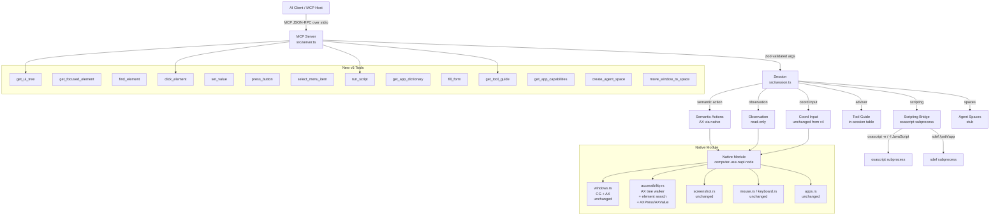

# Design Document: v5 Accessible UI Automation

## Overview

This design upgrades `computer-use-mcp` from v4.0.0 to v5.0.0. v4 made desktop control window-aware and introspectable: agents could enumerate windows, raise them, and confirm focus before sending input. The remaining bottleneck is the cost of the screenshot-parse-click loop itself. Filling a three-field email form in Mail still takes fifteen-plus tool calls because every interaction goes through pixel coordinates.

v5 collapses those loops by giving agents three faster-than-coordinates paths, in order of preference:

1. **Scripting Bridge (AppleScript / JXA)** — one call drives a scriptable app end-to-end (Mail, Safari, Numbers, Finder, Music, Messages, Notes, Calendar, Reminders, Keynote, Pages, System Events)
2. **Accessibility actions** — when no scripting dictionary exists (or the task is cross-app), the agent discovers elements by role and label via the AX tree, then calls `click_element`, `set_value`, `press_button`, `select_menu_item`, or `fill_form` in a single call instead of click-then-type cycles
3. **Coordinate-based input** — unchanged from v4; the fallback for apps with no script dictionary and no accessibility tree (Electron apps without `--force-accessibility`, canvas-only apps, games)

To make agents pick the right path, v5 also ships a `get_tool_guide` advisor, `get_app_capabilities` feature probe, and auto-targeting screenshots that no longer require the agent to pass `target_window_id` when a session window is already established.

Client-neutrality is preserved: every new capability is exposed as a standard MCP tool, so Claude Desktop, Codex, Cursor, Windsurf, VS Code MCP, and any stdio-compatible host pick it up with zero client-side code.

### Design Decisions

- **AX tree walker lives in Rust, not the session layer.** The NAPI module already owns all `AXUIElement` calls for `activate_window`. Extending those FFI declarations is cheaper than adding a separate subprocess, and keeps latency at ~10ms per tree instead of the 150ms+ a Python/Swift helper would cost. All AX calls are synchronous and bounded: the session layer owns the timeout.
- **Cap trees at depth 10 / 500 nodes by default.** Full AX trees on complex apps (e.g. Safari with 40 tabs, Mail with a large message list) can exceed 5,000 nodes and blow past 50 KB of JSON. The default cap keeps a tree under ~30 KB. Agents that need more pass an explicit `max_depth`.
- **`osascript` via spawned subprocess for scripting.** Embedding `OSAScript` in-process via NAPI is possible but adds ~15 MB to the native module and complicates the sandbox story. `osascript` is 10–30 ms per call; bounded by a session-level timeout. We accept the subprocess hop for scripting because scripting is the *less frequent* high-leverage path, not the hot loop.
- **Semantic tools default to strict focus (keyboard-style) for writes, best-effort for reads.** `click_element` / `press_button` default to `best_effort` (parity with `left_click`). `set_value` / `fill_form` default to `strict` (parity with `type`/`key`) because wrong-target text corruption is the primary failure mode the feedback from v4 testing surfaced.
- **Auto-targeting screenshots are read-only state use.** `screenshot` reads the current `TargetState.windowId` but does not write it. This preserves Property 1 from v4 (observation tools never mutate state) while removing the token cost of always specifying the window.
- **Agent Spaces use Mission Control private APIs, with graceful degradation.** macOS has no public Space API. We attempt the private `CGSManagedDisplay` / `CGSSpace` SPIs where available; if the macOS version blocks them (tightened in macOS 15), the tool returns a structured error with `supported: false` so agents can fall back. This is *not* a hard failure — agents can still work in the user's current Space.
- **Scripting dictionaries are cached per-session.** Parsing `.sdef` output for a large app (Numbers, Safari) takes 80–150 ms. The `ScriptingDictionaryCache` inside the session keeps parsed dictionaries keyed by `bundleId` for the process lifetime. Invalidated only if the app is relaunched (PID change).
- **No backward-compat shims for v4.** The codebase has no external consumers relying on private session APIs. Tool names and schemas from v4 are preserved; all v5 additions are additive.

## Architecture

The v5 architecture preserves the four-layer structure from v4 and adds two new subsystems to the session layer (`ScriptingBridge` and `ToolGuide`), one new Rust module (`accessibility.rs`), and a light `spaces.rs` stub.



### Data Flow: Semantic Form Fill (the motivating scenario)

```
Agent sends: { tool: "fill_form",
               args: { window_id: 12345,
                       fields: [
                         { role: "AXTextField", label: "To:",      value: "ops@example.com" },
                         { role: "AXTextField", label: "Subject:", value: "Deploy window" },
                         { role: "AXTextArea", label: "",          value: "Proceeding at 14:00 UTC." },
                       ] } }
  → Zod validates
  → Session resolves window 12345 → bundleId "com.apple.mail"
  → Session applies focus_strategy: strict (default for fill_form)
  → Session confirms Mail is frontmost + window 12345 on-screen
  → For each field:
      → native.setElementValue(windowId, role, label, value)
      → on miss: collect into `failures` array, continue
  → Session updates TargetState { bundleId, windowId, establishedBy: 'keyboard' }
  → Returns: { succeeded: 3, failed: 0, failures: [] }
```

Cost comparison vs. v4: **1 tool call + 1 focus check** instead of **6+ (click field → type → click field → type → ...)**.

### Data Flow: Scripting-First Automation

```
Agent sends: { tool: "get_app_capabilities", args: { bundle_id: "com.apple.mail" } }
  → Session checks ScriptingDictionaryCache; miss
  → Spawns: sdef /Applications/Mail.app
  → Parses top-level suites: ["Standard Suite", "Mail", "Message"]
  → Checks accessibility: native.getFrontmostApp() + listWindows(bundle_id)
  → Returns: { bundle_id, scriptable: true, suites: [...], accessible: true, topLevelCount: 2 }

Agent sends: { tool: "run_script",
               args: { language: "applescript", timeout_ms: 5000,
                       script: 'tell application "Mail" to make new outgoing message with properties {subject:"Deploy window", content:"Proceeding at 14:00 UTC.", visible:true}' } }
  → Session spawns: osascript -e <script> with 5s timeout
  → Captures stdout / stderr / exit code
  → TargetState unchanged (scripting does not retarget)
  → Returns: { content: [{ type: "text", text: "message id 42" }] }
```

Cost comparison vs. v4 equivalent: **1 tool call** instead of **~12 (open Mail → activate → list windows → activate window → click "New Message" → click To → type → ...)**.

## Components and Interfaces

### Native Module Extensions (`native/src/`)

#### New File: `accessibility.rs`

Extends the existing AX FFI declarations in `windows.rs` with tree traversal, element search, and semantic actions. Reuses the `AXUIElementRef`, `AXUIElementCopyAttributeValue`, `AXUIElementPerformAction`, and `AXUIElementSetAttributeValue` declarations already present.

```rust
/// Return a depth-limited JSON tree of the window's AX hierarchy.
/// Each node: { role, label, value, bounds, actions, children }
/// Stops at max_depth (default 10) or node_limit (500).
#[napi]
pub fn get_ui_tree(window_id: u32, max_depth: Option<i32>) -> napi::Result<serde_json::Value>

/// Return the currently focused AX element or null. Includes windowId of the
/// owning window. Reads AXFocusedUIElement on the system-wide element.
#[napi]
pub fn get_focused_element() -> napi::Result<serde_json::Value>

/// Depth-first search within window_id. Returns an array of matching elements
/// with path (indices from root), bounded by max_results (default 25).
#[napi]
pub fn find_element(
    window_id: u32,
    role: Option<String>,
    label: Option<String>,
    value: Option<String>,
    max_results: Option<i32>,
) -> napi::Result<serde_json::Value>

/// Find element by (role, label) in window; perform the named AX action.
/// Returns { performed: bool, reason?: string, bounds?: CGRect }.
/// If the element doesn't support the action, returns reason: "unsupported_action"
/// so the session layer can fall back to coordinate click.
#[napi]
pub fn perform_action(
    window_id: u32,
    role: String,
    label: String,
    action: String,
) -> napi::Result<serde_json::Value>

/// Find element by (role, label) in window; set AXValue.
/// Returns { set: bool, reason?: string }.
/// reason = "read_only" when AXUIElementIsAttributeSettable is false.
#[napi]
pub fn set_element_value(
    window_id: u32,
    role: String,
    label: String,
    value: String,
) -> napi::Result<serde_json::Value>

/// Walk the app's AXMenuBar and return the nested menu structure.
/// Shape: [{ title, enabled, items: [{ title, enabled, shortcut?, submenu? }] }]
#[napi]
pub fn get_menu_bar(bundle_id: String) -> napi::Result<serde_json::Value>

/// Find menu item by (menu, [submenu], item) and AXPress it.
/// Returns { pressed: bool, reason?: string }
/// reason = "menu_not_found" | "item_not_found" | "item_disabled"
#[napi]
pub fn press_menu_item(
    bundle_id: String,
    menu: String,
    item: String,
    submenu: Option<String>,
) -> napi::Result<serde_json::Value>
```

##### AX Tree Walker Algorithm

```text
node(ax_elem, depth):
    if depth > max_depth or node_count >= 500: return { truncated: true }
    role   = AXUIElementCopyAttributeValue(ax_elem, "AXRole")
    label  = AXUIElementCopyAttributeValue(ax_elem, "AXTitle")
         ?? AXUIElementCopyAttributeValue(ax_elem, "AXDescription")
    value  = AXUIElementCopyAttributeValue(ax_elem, "AXValue")
    pos    = AXUIElementCopyAttributeValue(ax_elem, "AXPosition")
    size   = AXUIElementCopyAttributeValue(ax_elem, "AXSize")
    acts   = AXUIElementCopyActionNames(ax_elem)
    kids   = AXUIElementCopyAttributeValue(ax_elem, "AXChildren")
    return {
        role, label, value,
        bounds: { x, y, width, height },
        actions: acts,
        children: kids.map(k => node(k, depth + 1))
    }
```

Pruning rules:
- Skip `AXUnknown` elements' children (often pane-separator cruft)
- Collapse groups with exactly one child and no label (`AXGroup` that wraps a single `AXButton`)
- Truncate `AXValue` strings to 500 characters (long text bodies shouldn't bloat the tree)

##### Starting the Walk from a `window_id`

To get from `CGWindowID` (CoreGraphics) to `AXUIElementRef` (Accessibility), reuse the matching logic from `activate_window` in `windows.rs`:

1. Find owning PID via `CGWindowListCopyWindowInfo`
2. `AXUIElementCreateApplication(pid)`
3. Fetch `AXWindows` attribute, match by title + position/size
4. Return the matched `AXUIElementRef` as the walk root

Factor this into a private helper `ax_window_for_cg_window(window_id: u32) -> Option<AXUIElementRef>` shared between `get_ui_tree`, `find_element`, `perform_action`, and `set_element_value`.

##### Permission Errors

AX calls return `kAXErrorNotAuthorized` when Accessibility permission is not granted. Detect this once and return a structured NAPI error:

```json
{ "error": "accessibility_permission_denied",
  "hint": "Grant Accessibility permission in System Settings > Privacy & Security > Accessibility" }
```

#### New File: `spaces.rs`

Mission Control Spaces SPIs are private and macOS-version-sensitive. Ship a minimal stub that:

1. Dynamically resolves `CGSGetActiveSpace`, `CGSAddWindowsToSpaces`, `CGSRemoveWindowsFromSpaces`, and `CGSManagedDisplaySetCurrentSpace` via `dlsym` on `CoreGraphics` / `SkyLight`.
2. If any symbol is missing, returns `{ supported: false, reason: "api_unavailable" }` to the session layer.
3. When available, creates a new Space, assigns windows, and returns a synthetic `space_id`.

This is Best Effort per Requirements 11/12 — the acceptance criteria accept `isError: true` with a clear message when the API is blocked.

```rust
#[napi]
pub fn create_agent_space() -> napi::Result<serde_json::Value>
// → { supported: true, space_id: 4, created: true }
// → { supported: false, reason: "api_unavailable" }

#[napi]
pub fn move_window_to_space(window_id: u32, space_id: i32) -> napi::Result<serde_json::Value>
// → { moved: true }
// → { moved: false, reason: "api_unavailable" | "window_not_found" | "space_not_found" }
```

#### Updated `native/src/lib.rs`

```rust
mod apps;
mod display;
mod keyboard;
mod mouse;
mod screenshot;
mod windows;
mod accessibility;   // new
mod spaces;          // new
```

### Updated NativeModule TypeScript Interface (`src/native.ts`)

```typescript
export interface AXElement {
  role: string
  label: string | null
  value: string | null
  bounds: { x: number; y: number; width: number; height: number }
  actions: string[]
  children?: AXElement[]
  path?: number[]
  windowId?: number
  truncated?: boolean
}

export interface NativeModule {
  // ... all v4 methods unchanged ...

  // v5: Accessibility
  getUiTree(windowId: number, maxDepth?: number): AXElement
  getFocusedElement(): AXElement | null
  findElement(
    windowId: number,
    role?: string,
    label?: string,
    value?: string,
    maxResults?: number,
  ): AXElement[]
  performAction(
    windowId: number,
    role: string,
    label: string,
    action: string,
  ): { performed: boolean; reason?: string; bounds?: { x: number; y: number; width: number; height: number } }
  setElementValue(
    windowId: number,
    role: string,
    label: string,
    value: string,
  ): { set: boolean; reason?: string }
  getMenuBar(bundleId: string): Array<{ title: string; enabled: boolean; items: MenuItem[] }>
  pressMenuItem(
    bundleId: string,
    menu: string,
    item: string,
    submenu?: string,
  ): { pressed: boolean; reason?: string }

  // v5: Spaces (best effort)
  createAgentSpace(): { supported: boolean; spaceId?: number; reason?: string }
  moveWindowToSpace(windowId: number, spaceId: number): { moved: boolean; reason?: string }
}

export interface MenuItem {
  title: string
  enabled: boolean
  shortcut?: string
  submenu?: MenuItem[]
}
```

### Session Layer (`src/session.ts`)

#### New Scripting Bridge

A small, self-contained module within the session:

```typescript
// In-session helper; not exposed outside the session module.
async function runScript(
  language: 'applescript' | 'javascript',
  script: string,
  timeoutMs: number,
): Promise<{ stdout: string; stderr: string; code: number; timedOut: boolean }> {
  const args = language === 'javascript' ? ['-l', 'JavaScript', '-e', script] : ['-e', script]
  return spawnBounded('osascript', args, timeoutMs)
}
```

`spawnBounded` wraps `execFile` with a `setTimeout` kill switch. On timeout, SIGKILL the process and return `{ timedOut: true }`. Default timeout: 30 s (Requirement 8.4). The session layer enforces the max timeout (never more than 120 s, to protect the MCP host).

Scripting dictionary cache:

```typescript
interface ScriptingDictionary {
  bundleId: string
  suites: Array<{
    name: string
    commands: Array<{ name: string; description?: string }>
    classes: Array<{ name: string; properties?: string[] }>
  }>
}

const dictionaryCache = new Map<string, { pid: number; dict: ScriptingDictionary }>()

async function getAppDictionary(
  bundleId: string,
  suite?: string,
): Promise<ScriptingDictionary | { error: string }> {
  const cached = dictionaryCache.get(bundleId)
  const pid = n.listRunningApps().find(a => a.bundleId === bundleId)?.pid
  if (cached && cached.pid === pid) return cached.dict

  const path = await findAppPath(bundleId)
  if (!path) return { error: 'app_not_found' }
  const sdef = await spawnBounded('sdef', [path], 10_000)
  if (sdef.code !== 0) return { error: 'not_scriptable' }

  const dict = parseSdefXml(sdef.stdout)
  if (pid) dictionaryCache.set(bundleId, { pid, dict })

  if (suite) {
    return { bundleId, suites: dict.suites.filter(s => s.name === suite) }
  }
  // Summarized: commands/classes by name only (no properties)
  return {
    bundleId,
    suites: dict.suites.map(s => ({
      name: s.name,
      commands: s.commands.map(c => ({ name: c.name })),
      classes: s.classes.map(c => ({ name: c.name })),
    })),
  }
}
```

`.sdef` files are XML; parse with a minimal regex-based extractor for `<suite>`, `<command>`, `<class>` element names. No XML dependency required.

#### New Tool Guide

A static lookup table + heuristics, not an LLM call:

```typescript
const TOOL_GUIDE_TABLE: Array<{
  pattern: RegExp                      // matches task_description
  recommendedBundles?: string[]        // bundles that make this task scripting-friendly
  approach: 'scripting' | 'accessibility' | 'keyboard' | 'coordinate'
  toolSequence: string[]
  explanation: string
}> = [
  {
    pattern: /\b(send|compose|reply).*(email|mail|message)\b/i,
    recommendedBundles: ['com.apple.mail'],
    approach: 'scripting',
    toolSequence: ['get_app_capabilities', 'run_script'],
    explanation: 'Mail is scriptable. Use AppleScript `make new outgoing message` for a one-call send.',
  },
  {
    pattern: /\b(fill|enter).+(form|field)\b/i,
    approach: 'accessibility',
    toolSequence: ['get_ui_tree', 'fill_form'],
    explanation: 'Batch set fields by AX label — one call instead of click+type per field.',
  },
  {
    pattern: /\b(open|navigate|visit).*(url|website|http)\b/i,
    recommendedBundles: ['com.apple.Safari', 'com.google.Chrome'],
    approach: 'scripting',
    toolSequence: ['run_script'],
    explanation: 'Safari/Chrome are scriptable. `tell app "Safari" to open location <url>`.',
  },
  {
    pattern: /\b(spreadsheet|cell|row|column|numbers)\b/i,
    recommendedBundles: ['com.apple.iWork.Numbers'],
    approach: 'scripting',
    toolSequence: ['get_app_dictionary', 'run_script'],
    explanation: 'Numbers is deeply scriptable. Read/write cells via AppleScript.',
  },
  // ... 6–8 more entries for common categories
  {
    pattern: /.*/,          // fallback
    approach: 'accessibility',
    toolSequence: ['get_ui_tree', 'find_element', 'click_element'],
    explanation: 'No specific match — try AX-based discovery first, fall back to coordinate click.',
  },
]

function getToolGuide(taskDescription: string): {
  approach: string
  toolSequence: string[]
  explanation: string
  bundleIdHints?: string[]
} {
  for (const entry of TOOL_GUIDE_TABLE) {
    if (entry.pattern.test(taskDescription)) {
      return {
        approach: entry.approach,
        toolSequence: entry.toolSequence,
        explanation: entry.explanation,
        bundleIdHints: entry.recommendedBundles,
      }
    }
  }
  // Fallback handled by the final `.*` entry above
  throw new Error('unreachable')
}
```

This is explicitly not an LLM call — deterministic, fast (~0.1 ms), no network.

#### Updated Target Resolution for Window ID in Semantic Tools

v5 semantic tools take `window_id` as a first-class parameter (not `target_window_id`). When present, treat it identically to `target_window_id` for resolution:

```typescript
function resolveTarget(args: Record<string, unknown>): { bundleId?: string; windowId?: number } {
  // v5: window_id is first-class for AX-based tools; target_window_id for coord tools.
  const wid = (typeof args.window_id === 'number' ? args.window_id
            : typeof args.target_window_id === 'number' ? args.target_window_id
            : undefined)
  if (wid != null) {
    const win = n.getWindow(wid)
    if (!win) throw new WindowNotFoundError(wid)
    return { bundleId: win.bundleId ?? undefined, windowId: win.windowId }
  }
  if (typeof args.target_app === 'string' && args.target_app.length > 0) {
    return { bundleId: args.target_app }
  }
  return { bundleId: targetState?.bundleId, windowId: targetState?.windowId }
}
```

#### Updated Screenshot Auto-Targeting

```typescript
case 'screenshot': {
  // ... existing provider/width/quality resolution ...

  // v5: auto-target session window when no explicit target given.
  let windowId = typeof args.target_window_id === 'number' ? args.target_window_id : undefined
  let app = typeof args.target_app === 'string' && args.target_app.length > 0 ? args.target_app : undefined

  if (windowId === undefined && app === undefined && targetState?.windowId != null) {
    // Verify the session window is still on-screen
    const win = n.getWindow(targetState.windowId)
    if (win?.isOnScreen) {
      windowId = targetState.windowId
    } else {
      // Stale — clear the windowId from targetState but keep bundleId
      if (targetState) {
        targetState = { ...targetState, windowId: undefined }
      }
    }
  }

  // ... rest unchanged ...
}
```

Auto-targeting reads but does not write to `targetState` (Property 1 preserved). Clearing a stale `windowId` is a *cleanup*, not a retarget — it does not change the target app.

#### New Tool Dispatch Cases

```typescript
case 'get_ui_tree': {
  const wid = num('window_id', -1)
  if (wid < 0) throw new Error('Invalid window_id')
  const maxDepth = typeof args.max_depth === 'number' ? args.max_depth : undefined
  const tree = n.getUiTree(wid, maxDepth)
  return ok(JSON.stringify(tree))
}

case 'get_focused_element': {
  return ok(JSON.stringify(n.getFocusedElement()))
}

case 'find_element': {
  const wid = num('window_id', -1)
  if (wid < 0) throw new Error('Invalid window_id')
  const role      = typeof args.role      === 'string' ? args.role      : undefined
  const label     = typeof args.label     === 'string' ? args.label     : undefined
  const value     = typeof args.value     === 'string' ? args.value     : undefined
  const maxRes    = typeof args.max_results === 'number' ? args.max_results : undefined
  if (!role && !label && !value) {
    throw new Error('find_element requires at least one of: role, label, value')
  }
  return ok(JSON.stringify(n.findElement(wid, role, label, value, maxRes)))
}

case 'click_element': {
  const target = resolveTarget({ window_id: args.window_id })
  const strategy = getStrategy('click_element', args)  // defaults to best_effort
  await ensureFocusV4(target, strategy)

  const role  = str('role')
  const label = str('label')
  const wid   = target.windowId!
  const result = n.performAction(wid, role, label, 'AXPress')

  if (!result.performed) {
    if (result.reason === 'unsupported_action' && result.bounds) {
      // Fallback: coordinate click at element center
      const cx = Math.round(result.bounds.x + result.bounds.width / 2)
      const cy = Math.round(result.bounds.y + result.bounds.height / 2)
      n.mouseMove(cx, cy); await sleep(50); n.mouseClick(cx, cy, 'left', 1)
      updateTargetState(target, 'pointer')
      return ok(`Clicked (${role} "${label}") via coordinates (${cx}, ${cy})`)
    }
    // Not found → return error with similar labels
    return similarLabelsError(wid, label, `No element matches role="${role}" label="${label}"`)
  }
  updateTargetState(target, 'pointer')
  return ok(`Clicked ${role} "${label}"`)
}

case 'set_value': {
  const target = resolveTarget({ window_id: args.window_id })
  const strategy = getStrategy('set_value', args)      // defaults to strict
  await ensureFocusV4(target, strategy)

  const role  = str('role')
  const label = str('label')
  const value = str('value')
  const result = n.setElementValue(target.windowId!, role, label, value)

  if (!result.set) {
    if (result.reason === 'read_only') {
      return { content: [{ type: 'text', text: `Element ${role} "${label}" is read-only` }], isError: true }
    }
    return similarLabelsError(target.windowId!, label, `No element matches role="${role}" label="${label}"`)
  }
  updateTargetState(target, 'keyboard')
  return ok(`Set ${role} "${label}" = ${JSON.stringify(value)}`)
}

case 'press_button': {
  const target = resolveTarget({ window_id: args.window_id })
  const strategy = getStrategy('press_button', args)   // defaults to best_effort
  await ensureFocusV4(target, strategy)

  const label = str('label')
  const result = n.performAction(target.windowId!, 'AXButton', label, 'AXPress')

  if (!result.performed) {
    if (result.reason === 'disabled') {
      return { content: [{ type: 'text', text: `Button "${label}" is disabled` }], isError: true }
    }
    return similarLabelsError(target.windowId!, label, `No button matches "${label}"`, 'AXButton')
  }
  updateTargetState(target, 'pointer')
  return ok(`Pressed "${label}"`)
}

case 'select_menu_item': {
  const bundleId = str('bundle_id')
  const menu     = str('menu')
  const item     = str('item')
  const submenu  = typeof args.submenu === 'string' ? args.submenu : undefined

  // Ensure app is frontmost (menu bar only responds to frontmost app)
  await ensureFocusV4({ bundleId }, 'strict')

  const result = n.pressMenuItem(bundleId, menu, item, submenu)
  if (!result.pressed) {
    // Return menu structure for recovery
    const bar = n.getMenuBar(bundleId)
    return {
      content: [{ type: 'text', text: JSON.stringify({
        error: result.reason ?? 'menu_item_not_found',
        bundle_id: bundleId, menu, item, submenu,
        availableMenus: bar.map(m => m.title),
      }) }],
      isError: true,
    }
  }
  updateTargetState({ bundleId }, 'activation')
  return ok(`Selected ${bundleId} → ${menu}${submenu ? ` → ${submenu}` : ''} → ${item}`)
}

case 'fill_form': {
  const target = resolveTarget({ window_id: args.window_id })
  const strategy = getStrategy('fill_form', args)      // defaults to strict
  await ensureFocusV4(target, strategy)

  const fields = args.fields as Array<{ role: string; label: string; value: string }>
  if (!Array.isArray(fields)) throw new Error('fields must be an array')

  let succeeded = 0
  const failures: Array<{ role: string; label: string; reason: string }> = []
  for (const f of fields) {
    const r = n.setElementValue(target.windowId!, f.role, f.label, f.value)
    if (r.set) succeeded++
    else failures.push({ role: f.role, label: f.label, reason: r.reason ?? 'not_found' })
  }

  if (succeeded > 0) updateTargetState(target, 'keyboard')

  return ok(JSON.stringify({
    succeeded,
    failed: failures.length,
    failures,
  }))
}

case 'run_script': {
  const lang = args.language === 'javascript' ? 'javascript' : 'applescript'
  const script = str('script')
  const timeoutMs = typeof args.timeout_ms === 'number' ? Math.min(args.timeout_ms, 120_000) : 30_000
  const r = await runScript(lang, script, timeoutMs)

  if (r.timedOut) {
    return { content: [{ type: 'text', text: `script timed out after ${timeoutMs}ms` }], isError: true }
  }
  if (r.code !== 0) {
    return { content: [{ type: 'text', text: r.stderr || `script exited ${r.code}` }], isError: true }
  }
  return ok(r.stdout.trimEnd())
}

case 'get_app_dictionary': {
  const bundleId = str('bundle_id')
  const suite = typeof args.suite === 'string' ? args.suite : undefined
  const dict = await getAppDictionary(bundleId, suite)
  if ('error' in dict) {
    return { content: [{ type: 'text', text: dict.error }], isError: true }
  }
  return ok(JSON.stringify(dict))
}

case 'get_tool_guide': {
  const task = str('task_description')
  return ok(JSON.stringify(getToolGuide(task)))
}

case 'get_app_capabilities': {
  const bundleId = str('bundle_id')
  const running = n.listRunningApps().find(a => a.bundleId === bundleId)

  // Scriptability — try dictionary fetch
  let scriptable = false
  let suites: string[] = []
  const dict = await getAppDictionary(bundleId)
  if (!('error' in dict)) {
    scriptable = true
    suites = dict.suites.map(s => s.name)
  }

  // Accessibility — check if app has windows and (running) AX is reachable
  const wins = n.listWindows(bundleId)
  const accessible = wins.length > 0

  return ok(JSON.stringify({
    bundle_id: bundleId,
    scriptable,
    suites,
    accessible,
    topLevelCount: wins.length,
    running: Boolean(running),
    hidden: running?.isHidden ?? false,
  }))
}

case 'create_agent_space': {
  const r = n.createAgentSpace()
  if (!r.supported) {
    return { content: [{ type: 'text', text: JSON.stringify({
      error: 'spaces_api_unavailable',
      reason: r.reason,
      workaround: 'Use Control+Arrow to move between user Spaces, or run the agent in the user\'s current Space.',
    }) }], isError: true }
  }
  return ok(JSON.stringify({ space_id: r.spaceId, created: true }))
}

case 'move_window_to_space': {
  const wid   = num('window_id', -1)
  const spaceId = num('space_id', -1)
  const r = n.moveWindowToSpace(wid, spaceId)
  if (!r.moved) {
    return { content: [{ type: 'text', text: JSON.stringify({
      error: r.reason ?? 'move_failed',
    }) }], isError: true }
  }
  return ok(JSON.stringify({ window_id: wid, space_id: spaceId, moved: true }))
}
```

#### Default Focus Strategy Update

```typescript
function defaultStrategy(tool: string): FocusStrategy {
  const keyboardTools = ['type', 'key', 'hold_key', 'set_value', 'fill_form']
  if (keyboardTools.includes(tool)) return 'strict'
  return 'best_effort'
}
```

Semantic tools slot in here; `set_value`/`fill_form` inherit `strict` because they write text, `click_element`/`press_button` inherit `best_effort` because they're clicks.

#### `similarLabelsError` Helper

Fuzzy match to help agents recover from label typos:

```typescript
function similarLabelsError(
  windowId: number,
  label: string,
  message: string,
  roleFilter?: string,
): ToolResult {
  const all = n.findElement(windowId, roleFilter, undefined, undefined, 500)
  const ranked = all
    .map(e => ({ e, d: levenshtein(e.label ?? '', label) }))
    .sort((a, b) => a.d - b.d)
    .slice(0, 5)
    .map(x => ({ role: x.e.role, label: x.e.label, value: x.e.value }))
  return {
    content: [{ type: 'text', text: JSON.stringify({ error: message, similar: ranked }) }],
    isError: true,
  }
}
```

Levenshtein implemented inline (~20 lines, no dependency).

### Server Layer (`src/server.ts`)

#### New Tool Registrations

```typescript
// Accessibility observation (no TargetState mutation)
tool('get_ui_tree', 'Get the accessibility tree for a window. Walk UI by role/label instead of pixels.', {
  window_id: z.number().int(),
  max_depth: z.number().int().positive().max(20).optional(),
})
tool('get_focused_element', 'Get the currently focused UI element (where typed text will go)', {})
tool('find_element', 'Search UI elements in a window by role, label, or value. At least one criterion required.', {
  window_id: z.number().int(),
  role: z.string().optional().describe('AX role e.g. AXButton, AXTextField, AXStaticText'),
  label: z.string().optional().describe('AX label (title or description)'),
  value: z.string().optional().describe('AX value'),
  max_results: z.number().int().positive().max(100).optional(),
})

// Semantic actions
tool('click_element', 'Click a UI element by role and label. More reliable than pixel clicks.', {
  window_id: z.number().int(),
  role: z.string(),
  label: z.string(),
  focus_strategy: focusStrategyParam,
})
tool('set_value', 'Set a UI element\'s value directly (e.g. text field). Faster than click+type.', {
  window_id: z.number().int(),
  role: z.string(),
  label: z.string(),
  value: z.string(),
  focus_strategy: focusStrategyParam,
})
tool('press_button', 'Press a button by its label.', {
  window_id: z.number().int(),
  label: z.string(),
  focus_strategy: focusStrategyParam,
})
tool('select_menu_item', 'Select an app menu item programmatically.', {
  bundle_id: z.string(),
  menu: z.string(),
  item: z.string(),
  submenu: z.string().optional(),
})
tool('fill_form', 'Set multiple UI element values in one call. Drastically reduces round-trips for forms.', {
  window_id: z.number().int(),
  fields: z.array(z.object({
    role: z.string(),
    label: z.string(),
    value: z.string(),
  })),
  focus_strategy: focusStrategyParam,
})

// Scripting bridge
tool('run_script', 'Execute AppleScript or JXA (JavaScript for Automation). Fast path for scriptable apps (Mail, Safari, Finder, Numbers).', {
  language: z.enum(['applescript', 'javascript']),
  script: z.string(),
  timeout_ms: z.number().int().positive().max(120_000).optional(),
})
tool('get_app_dictionary', 'Get a scriptable app\'s dictionary (suites, commands, classes).', {
  bundle_id: z.string(),
  suite: z.string().optional().describe('Limit to a single suite; omit for top-level summary'),
})

// Strategy advisor
tool('get_tool_guide', 'Recommend the best automation approach for a task. Call before committing to screenshot-and-click.', {
  task_description: z.string(),
})
tool('get_app_capabilities', 'Discover what automation approaches work for an app: scriptable? accessible? running?', {
  bundle_id: z.string(),
})

// Spaces (best effort)
tool('create_agent_space', 'Create a dedicated macOS Space for the agent (isolates from user\'s workspace). Best effort — not available on all macOS versions.', {})
tool('move_window_to_space', 'Move a window to a specific Space.', {
  window_id: z.number().int(),
  space_id: z.number().int(),
})
```

#### Updated Tool Descriptions (Requirement 16)

```typescript
tool('type', 'Type text into the focused app. Prefer `set_value` or `fill_form` for form fields — AX-based writes are more reliable.', { /* ... */ })
tool('key', 'Press a key combination. Tab/Shift+Tab navigate between form fields; keyboard shortcuts are often faster than coordinate clicks.', { /* ... */ })
tool('screenshot', 'Capture the screen or a specific window. Prefer `get_ui_tree` or `find_element` to discover elements — visual parsing should be a fallback.', { /* ... */ })
```

#### Version Bump

```typescript
const server = new McpServer({ name: 'computer-use', version: '5.0.0' })
```

### Client Layer (`src/client.ts`)

Adds 14 typed methods, one per new tool:

```typescript
export interface ComputerUseClient {
  // ... all v4 methods ...

  // Accessibility
  getUiTree(windowId: number, maxDepth?: number): Promise<ToolResult>
  getFocusedElement(): Promise<ToolResult>
  findElement(windowId: number, criteria: {
    role?: string; label?: string; value?: string; maxResults?: number
  }): Promise<ToolResult>

  // Semantic actions
  clickElement(windowId: number, role: string, label: string, opts?: { focusStrategy?: FocusStrategy }): Promise<ToolResult>
  setValue(windowId: number, role: string, label: string, value: string, opts?: { focusStrategy?: FocusStrategy }): Promise<ToolResult>
  pressButton(windowId: number, label: string, opts?: { focusStrategy?: FocusStrategy }): Promise<ToolResult>
  selectMenuItem(bundleId: string, menu: string, item: string, submenu?: string): Promise<ToolResult>
  fillForm(windowId: number, fields: Array<{ role: string; label: string; value: string }>, opts?: { focusStrategy?: FocusStrategy }): Promise<ToolResult>

  // Scripting
  runScript(language: 'applescript' | 'javascript', script: string, timeoutMs?: number): Promise<ToolResult>
  getAppDictionary(bundleId: string, suite?: string): Promise<ToolResult>

  // Strategy
  getToolGuide(taskDescription: string): Promise<ToolResult>
  getAppCapabilities(bundleId: string): Promise<ToolResult>

  // Spaces
  createAgentSpace(): Promise<ToolResult>
  moveWindowToSpace(windowId: number, spaceId: number): Promise<ToolResult>
}
```

## Data Models

### AXElement

Returned by `get_ui_tree`, `get_focused_element`, `find_element`:

```typescript
interface AXElement {
  role: string                 // "AXButton", "AXTextField", "AXStaticText", "AXMenuItem", "AXGroup", ...
  label: string | null         // AXTitle or AXDescription (falls back between the two)
  value: string | null         // AXValue, truncated to 500 chars
  bounds: { x: number; y: number; width: number; height: number }  // logical pixels
  actions: string[]            // e.g. ["AXPress", "AXShowMenu"]
  children?: AXElement[]       // only present in tree results
  path?: number[]              // only present in find_element results — indices from root
  windowId?: number            // only present in get_focused_element
  truncated?: boolean          // present when tree hit depth/node cap
}
```

### FillFormResponse

```typescript
interface FillFormResponse {
  succeeded: number
  failed: number
  failures: Array<{ role: string; label: string; reason: 'not_found' | 'read_only' | string }>
}
```

### ToolGuideResponse

```typescript
interface ToolGuideResponse {
  approach: 'scripting' | 'accessibility' | 'keyboard' | 'coordinate'
  toolSequence: string[]                  // e.g. ["get_app_capabilities", "run_script"]
  explanation: string
  bundleIdHints?: string[]
}
```

### AppCapabilitiesResponse

```typescript
interface AppCapabilitiesResponse {
  bundle_id: string
  scriptable: boolean
  suites: string[]              // top-level suite names when scriptable
  accessible: boolean
  topLevelCount: number         // # of layer-0 windows
  running: boolean
  hidden: boolean
}
```

### ScriptingDictionary

```typescript
interface ScriptingDictionary {
  bundleId: string
  suites: Array<{
    name: string
    commands: Array<{ name: string; description?: string }>
    classes: Array<{ name: string; properties?: string[] }>
  }>
}
```

Summarized mode (no `suite` arg): `properties` and `description` omitted. Full mode (with `suite` arg): full details for the one named suite.

### AgentSpaceResponse

```typescript
interface AgentSpaceResponse {
  space_id: number
  created: boolean
}
// or on unsupported:
interface UnsupportedResponse {
  error: 'spaces_api_unavailable'
  reason: string
  workaround: string
}
```

## Correctness Properties

*A property is a characteristic or behavior that should hold true across all valid executions of a system — essentially, a formal statement about what the system should do. Properties serve as the bridge between human-readable specifications and machine-verifiable correctness guarantees.*

### Property 1: v5 observation tools never mutate TargetState

*For any* session state and *for any* call to a v5 observation tool (`get_ui_tree`, `get_focused_element`, `find_element`, `get_app_dictionary`, `get_tool_guide`, `get_app_capabilities`) with any combination of parameters, the session's TargetState after the call SHALL be identical to the TargetState before the call.

**Validates: Requirements 1.5, 2.4, 3.5, 10.4, 13.6, 14.4**

### Property 2: v5 observation tools never call mutating native methods

*For any* call to a v5 observation tool, the underlying native module SHALL NOT be called for any of: `mouseMove`, `mouseClick`, `mouseButton`, `mouseScroll`, `mouseDrag`, `keyPress`, `typeText`, `holdKey`, `activateApp`, `activateWindow`, `hideApp`, `unhideApp`, `performAction`, `setElementValue`, `pressMenuItem`. Only read-only methods (`getUiTree`, `getFocusedElement`, `findElement`, `getWindow`, `listRunningApps`, `listWindows`, `getFrontmostApp`, `getMenuBar`) are permitted.

**Validates: Requirements 1.5, 2.4, 3.5, 10.4, 13.6, 14.4**

### Property 3: Semantic mutating tools update TargetState with correct provenance

*For any* successful call to a semantic mutating tool, the TargetState after the call SHALL have an `establishedBy` field matching: `'pointer'` for `click_element` and `press_button`, `'keyboard'` for `set_value` and `fill_form` (when at least one field succeeded), `'activation'` for `select_menu_item`. The `bundleId` and `windowId` SHALL reflect the resolved target, and `establishedAt` SHALL be updated to the call time.

**Validates: Requirements 4.4, 5.4, 6.4, 7.5, 15.5**

### Property 4: `run_script` never mutates TargetState

*For any* call to `run_script` (success, failure, or timeout), the TargetState after the call SHALL be identical to the TargetState before the call, regardless of what the script itself does.

**Validates: Requirement 8.5**

### Property 5: `fill_form` partial failure semantics

*For any* call to `fill_form` with an array of `fields`, if one or more fields fail (element not found or read-only), the session SHALL still process remaining fields and return a response with `succeeded` (count of successful fields), `failed` (count of failed fields), and `failures` (array of `{ role, label, reason }`). The tool SHALL NOT return `isError: true` unless *all* fields fail AND no target could be resolved.

**Validates: Requirement 15.2, 15.3, 15.4**

### Property 6: v5 input tool schema completeness

*For any* v5 semantic mutating tool (`click_element`, `set_value`, `press_button`, `fill_form`), the MCP schema SHALL include `window_id` (required, number), the tool-specific fields, and `focus_strategy` (optional enum). `select_menu_item` SHALL include `bundle_id`, `menu`, `item`, and optional `submenu`. `run_script` SHALL include `language`, `script`, and optional `timeout_ms`.

**Validates: Requirements 4.1, 5.1, 6.1, 7.1, 8.1, 9.1, 15.1**

### Property 7: `fill_form` defaults to strict focus

*For any* `fill_form` call without an explicit `focus_strategy` argument, the effective strategy SHALL be `strict`. *For any* `set_value` call without an explicit `focus_strategy`, the effective strategy SHALL be `strict`.

**Validates: Requirements 5.5, 15.6**

### Property 8: Element not found returns structured similar-labels hint

*For any* call to `click_element`, `set_value`, `press_button`, or `fill_form` where the requested element cannot be located in the AX tree, the response SHALL be `isError: true` with a JSON payload containing `error` (string) and `similar` (array of up to 5 candidate elements with `role`, `label`, `value`). No element deeper than the tree's depth cap SHALL be considered a match.

**Validates: Requirements 4.3, 5.3, 6.2**

### Property 9: AX tree depth and node cap

*For any* `get_ui_tree` call, the returned tree SHALL contain at most 500 nodes and SHALL NOT exceed the effective `max_depth` (default 10). When the cap is hit, the tree node at the cut-off SHALL carry `truncated: true`. *For any* tree with more than 500 nodes available, the response SHALL include `truncated: true` at the root.

**Validates: Requirements 1.2, 1.6**

### Property 10: Screenshot auto-target read-only

*For any* `screenshot` call without `target_app` and without `target_window_id`, if the session TargetState contains a `windowId` referring to an on-screen window, the native `takeScreenshot` call SHALL receive that `windowId`. The TargetState SHALL NOT be modified by the screenshot call. If the session `windowId` refers to an off-screen/stale window, the session SHALL fall back to full-screen capture and clear only the `windowId` field from TargetState (not the full state).

**Validates: Requirements 17.1, 17.2, 17.3, 17.4**

### Property 11: `get_tool_guide` priority ordering

*For any* task description matching a scripting-friendly pattern (email compose, URL open, spreadsheet work), the returned `approach` SHALL be `"scripting"`. *For any* task matching form-fill patterns, the returned `approach` SHALL be `"accessibility"`. *For any* unmatched task, the fallback `approach` SHALL be `"accessibility"` (never `"coordinate"`).

**Validates: Requirements 13.2, 13.3, 13.4, 13.5**

### Property 12: `get_app_capabilities` accuracy

*For any* `get_app_capabilities` call with a scriptable `bundle_id`, the response SHALL include `scriptable: true` and at least one entry in `suites`. *For any* call with a non-scriptable or unknown `bundle_id`, the response SHALL include `scriptable: false` and `suites: []`. *For any* running app with at least one on-screen window, `accessible` SHALL be `true` and `topLevelCount` SHALL equal the number of returned windows. *For any* non-running app, `running` SHALL be `false`.

**Validates: Requirements 14.1, 14.2, 14.3**

### Property 13: `run_script` timeout enforcement

*For any* `run_script` call with an effective timeout of `T` ms, if the script has not completed after `T` ms, the session SHALL kill the `osascript` process and return `isError: true` with a message indicating timeout. The effective timeout SHALL be the minimum of the requested `timeout_ms` and 120,000 ms. When no `timeout_ms` is provided, the default SHALL be 30,000 ms.

**Validates: Requirements 8.3, 8.4, 9.3**

### Property 14: Spaces API unavailable degrades gracefully

*For any* `create_agent_space` or `move_window_to_space` call when the underlying private APIs are not available on the host macOS version, the response SHALL be `isError: true` with a JSON payload containing `error: 'spaces_api_unavailable'` and a `workaround` string. The session SHALL NOT throw, hang, or mutate state.

**Validates: Requirements 11.3, 12.4**

### Property 15: Server version reporting

The `McpServer` metadata SHALL report `version: '5.0.0'` in the server info returned during MCP handshake.

**Validates: Requirement 20.2**

## Error Handling

### Accessibility Permission Denied

When any AX call returns `kAXErrorNotAuthorized`:
- Native side returns a NAPI error with reason `accessibility_permission_denied`
- Session side catches and returns:
  ```json
  { "error": "accessibility_permission_denied",
    "hint": "Grant Accessibility permission: System Settings > Privacy & Security > Accessibility" }
  ```
- This is a terminal failure for all v5 AX tools until the user intervenes.

### Element Not Found

`click_element`, `set_value`, `press_button`, `fill_form`, `select_menu_item` all return structured hints on miss:

| Tool | Error shape |
|---|---|
| `click_element` / `set_value` / `press_button` | `{ error, similar: [{ role, label, value }] }` up to 5 candidates |
| `fill_form` | Per-field `failures` array with `reason: 'not_found' \| 'read_only'` |
| `select_menu_item` | `{ error, availableMenus: [...] }` showing what the agent *could* have chosen |

### Scripting Failures

| Case | Response |
|---|---|
| `osascript` exit code ≠ 0 | `isError: true` with `stderr` text |
| Script timeout | `isError: true` with `"script timed out after <N>ms"` |
| App not scriptable (`sdef` fails) | `get_app_dictionary` returns `{ error: 'not_scriptable' }` with `isError: true` |
| App not found on disk | `{ error: 'app_not_found' }` with `isError: true` |

### Spaces API Unavailable

See Property 14. The API probe runs once per session; if unavailable, both Space tools fast-path to the error response.

### Stale Session Window in Screenshot

Per Property 10: when auto-targeting via `targetState.windowId` finds a window that is no longer on-screen, the session falls back to full-screen capture and clears only the `windowId` field. The `bundleId` is preserved — the user/agent workflow is still anchored to that app.

## Testing Strategy

### Dual Testing Approach

- **Property-based tests**: Verify universal properties across generated inputs using `fast-check` (already a dev dependency, used in v4). Minimum 100 iterations per property.
- **Unit tests**: Verify specific examples, edge cases, error conditions, and integration points.
- **Integration tests (manual / CI-optional)**: Exercise native AX / `osascript` paths on real macOS.

### Property-Based Testing Configuration

- Library: `fast-check` 4.x (already installed)
- Minimum iterations: 100 per property test
- Tag format: `Feature: v5-accessible-ui-automation, Property {number}: {property_text}`
- Each correctness property maps to exactly one property-based test (except Property 15, a single-example schema check).

### Test Layers

#### Session Layer Tests (`test/session.test.mjs` — extend existing file)

The session layer remains the primary target for property-based testing. Extend the existing mock native module with v5 methods (`getUiTree`, `getFocusedElement`, `findElement`, `performAction`, `setElementValue`, `getMenuBar`, `pressMenuItem`, `createAgentSpace`, `moveWindowToSpace`).

The mock also needs to intercept `osascript` and `sdef` subprocess calls. Use an injectable `spawnBounded` function on `SessionOptions`:

```typescript
export interface SessionOptions {
  vision?: boolean
  provider?: string
  native?: NativeModule
  spawnBounded?: (cmd: string, args: string[], timeoutMs: number) =>
    Promise<{ stdout: string; stderr: string; code: number; timedOut: boolean }>  // v5 test seam
}
```

**Property tests (with mock native + mock spawner):**
- Property 1: v5 observation non-mutation — generate random sequences interleaving v5 observation tools and v4 mutating tools; assert TargetState only changes on v4 mutating tools
- Property 2: v5 observation never calls mutating native methods — assert `mock.calls` contains only read-only methods after each observation tool
- Property 3: Semantic mutating `establishedBy` — generate random successful calls; assert `establishedBy` matches category
- Property 4: `run_script` non-mutation — generate random scripts with random results; assert TargetState unchanged
- Property 5: `fill_form` partial failure — generate random fields mixing success/not_found/read_only; assert `succeeded + failed = fields.length` and `failures.length === failed`
- Property 6: Input tool schema completeness — enumerate v5 input tools in the `listTools` response; assert required keys present
- Property 7: `fill_form` / `set_value` default strict — call without `focus_strategy`, assert `strict` behavior observed (e.g. FocusFailure when target is not frontmost)
- Property 8: Similar labels — generate random element sets with a mis-labeled target; assert `similar` array contains the closest matches
- Property 9: Tree cap — generate synthetic trees with up to 1000 nodes; assert returned tree has ≤ 500 nodes and `truncated` flag set correctly
- Property 10: Screenshot auto-target — generate random `targetState` values; assert `takeScreenshot` receives the correct `windowId` (or undefined) and `targetState` is unchanged
- Property 11: Tool guide priority — generate random task descriptions; assert `approach` matches expected pattern-based result
- Property 12: App capabilities accuracy — generate random app states (scriptable/not, running/not, windows); assert response fields
- Property 13: Timeout enforcement — mock a slow `spawnBounded`; assert timeout kicks in at declared deadline
- Property 14: Spaces graceful degradation — mock `createAgentSpace` returning `supported: false`; assert error response shape

**Example-based unit tests:**
- AX tree permission denied → structured error
- `click_element` falls back to coord click on `unsupported_action`
- `set_value` on a read-only element returns clear error
- `select_menu_item` lists available menus when wrong `menu` given
- `fill_form` updates state to `keyboard` only when at least one field succeeds
- `get_app_dictionary` second call hits cache
- `get_app_dictionary` cache invalidation on PID change
- `run_script` stdout trimmed
- Auto-target screenshot with stale windowId clears only `windowId`, not `bundleId`

#### MCP Schema Tests (`test/stdio.test.mjs` — extend)

- All 14 new v5 tool names present in `listTools` (Requirement 21.1)
- Server version `5.0.0` (Property 15)
- `fill_form` schema has `fields` array of objects with role/label/value
- `run_script` schema has `language` enum
- `click_element`, `set_value`, `press_button`, `fill_form` have `window_id`
- Property 6: schema completeness (example-based complement)

#### Native Integration Tests (Manual / CI-optional)

Exercise real macOS:
- `getUiTree` on TextEdit window returns tree with `AXTextField` / `AXStaticText`
- `findElement(windowId, role="AXButton")` on Mail compose window returns 3+ buttons
- `performAction` on TextEdit "Close" button closes the document
- `setElementValue` on TextEdit text area types full text
- `pressMenuItem(bundle_id="com.apple.TextEdit", menu="File", item="New")` opens a new doc
- `osascript -e 'tell application "Finder" to get name of home folder'` returns the user name via `run_script`
- `getAppDictionary` on Mail returns ≥ 3 suites
- `createAgentSpace` returns either `supported: true` or structured error — never throws

#### Mock Native Module Extensions

```typescript
function createMockNative(overrides = {}) {
  // ... existing v4 mock ...

  // v5 additions
  const mockTree = {
    role: 'AXWindow', label: 'Main', value: null,
    bounds: { x: 0, y: 0, width: 800, height: 600 }, actions: [],
    children: [
      { role: 'AXTextField', label: 'To:', value: '', bounds: { /* ... */ }, actions: ['AXConfirm'] },
      { role: 'AXButton',    label: 'Send', value: null, bounds: { /* ... */ }, actions: ['AXPress'] },
    ],
  }
  let focusedElement = null
  const tree = new Map()  // windowId -> tree

  return {
    // ... existing ...
    getUiTree(windowId, maxDepth) { calls.push({ method: 'getUiTree', args: [windowId, maxDepth] }); return tree.get(windowId) ?? mockTree },
    getFocusedElement() { calls.push({ method: 'getFocusedElement' }); return focusedElement },
    findElement(windowId, role, label, value, maxResults) {
      calls.push({ method: 'findElement', args: [windowId, role, label, value, maxResults] })
      // flat filter of mockTree
      return []
    },
    performAction(windowId, role, label, action) {
      calls.push({ method: 'performAction', args: [windowId, role, label, action] })
      return { performed: true }
    },
    setElementValue(windowId, role, label, value) {
      calls.push({ method: 'setElementValue', args: [windowId, role, label, value] })
      return { set: true }
    },
    getMenuBar(bundleId) { calls.push({ method: 'getMenuBar', args: [bundleId] }); return [] },
    pressMenuItem(bundleId, menu, item, submenu) {
      calls.push({ method: 'pressMenuItem', args: [bundleId, menu, item, submenu] })
      return { pressed: true }
    },
    createAgentSpace() { calls.push({ method: 'createAgentSpace' }); return { supported: false, reason: 'mock' } },
    moveWindowToSpace(windowId, spaceId) { calls.push({ method: 'moveWindowToSpace', args: [windowId, spaceId] }); return { moved: false, reason: 'mock' } },
    // Test setters
    _setTree(windowId, tree) { tree.set(windowId, tree) },
    _setFocusedElement(el) { focusedElement = el },
    ...overrides,
  }
}

function mockSpawnBounded(responses) {
  // responses: Map<cmd+args key, { stdout, stderr, code, timedOut }>
  return async (cmd, args, timeoutMs) => {
    const key = `${cmd} ${args.join(' ')}`
    return responses.get(key) ?? { stdout: '', stderr: 'unexpected command', code: 1, timedOut: false }
  }
}
```

## Migration Notes

v5 is additive over v4. No existing tool names, schemas, or semantics change except:

- Version bump 4.0.0 → 5.0.0 in `package.json` and server metadata
- `screenshot` now auto-targets `targetState.windowId` when no explicit target — hosts that rely on screenshots always being full-screen after window operations should pass `target_app: ""` explicitly (unusual, but preserving the invariant matters for a few tests)
- Tool descriptions on `type`, `key`, and `screenshot` are updated to nudge agents toward AX-first patterns. No schema change, so MCP hosts won't break — they just see friendlier guidance.

Agents written against v4 continue to work; they just don't take advantage of v5's faster paths until they call the new tools.

## Non-Goals

- **Windows / Linux support.** macOS only, matching v1–v4.
- **Cross-session persistence of TargetState.** Each MCP session starts fresh.
- **LLM-based `get_tool_guide`.** The advisor is a static pattern table — deterministic, no network, no inference cost.
- **Full replication of each app's scripting dictionary.** `get_app_dictionary` returns a summary by default; agents request specific suites for depth.
- **Visual diff or OCR.** Screenshots remain raw JPEG; OCR is the agent's responsibility (they're already multimodal).
- **Undo/redo tracking.** No transaction log of tool calls.
- **Multi-user remote control.** Single local user, single local macOS session.
