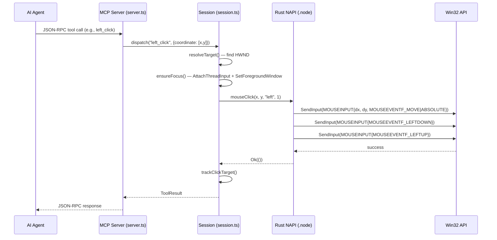

# Design Document: Windows Native Support

## Overview

This design adds native Windows support to `@zavora-ai/computer-use-mcp`, transforming it from a macOS-only MCP server into a cross-platform desktop automation tool. The core architectural principle is **performance-first**: every Windows API call goes through Rust via `windows-rs` with zero-overhead NAPI bindings, eliminating the Python interpreter overhead, COM marshaling layers, and subprocess spawning that bottleneck the reference `Windows-MCP` implementation.

### Performance Advantage Summary

| Operation | Windows-MCP (Python) | Our Target (Rust NAPI) | Speedup |
|---|---|---|---|
| Tool dispatch overhead | ~30-50ms (Python interp) | <1ms (direct NAPI) | 30-50x |
| Screenshot capture | ~200-670ms (dxcam+PIL) | <50ms (DXGI+native JPEG) | 4-13x |
| Mouse click | ~50ms (ctypes→SendInput) | <5ms (direct SendInput) | 10x |
| Keyboard per-char | ~20ms (SendKeys wrapper) | <1ms (SendInput Unicode) | 20x |
| UI tree walk | ~500ms (comtypes COM) | <100ms (direct COM FFI) | 5x |
| Clipboard round-trip | ~10ms (pywin32) | <2ms (direct Win32) | 5x |
| Memory baseline | ~150-200MB (Python+deps) | <50MB (Rust binary) | 3-4x |

### Design Rationale

The reference Windows-MCP uses Python with `comtypes`, `dxcam`, `PIL`, and `pywin32` — each adding a marshaling layer between Python and the Win32 API. Our Rust implementation calls Win32 functions directly through `windows-rs` FFI bindings compiled into the same NAPI `.node` addon. This eliminates:

1. **Python interpreter startup and dispatch** — each tool call in Windows-MCP pays ~30-50ms just for Python function dispatch. Our NAPI calls are native function pointers.
2. **COM marshaling through comtypes** — Windows-MCP's UIAutomation calls go Python → comtypes → COM → comtypes → Python. We call `IUIAutomation` COM interfaces directly from Rust.
3. **Subprocess spawning for PowerShell** — Windows-MCP spawns `subprocess.run()` with ~100ms overhead per call. We spawn PowerShell from Node.js `child_process` (same overhead) but eliminate it for all non-scripting operations.
4. **Image processing overhead** — Windows-MCP captures via dxcam (numpy array), converts to PIL Image, then JPEG-encodes in Python. We capture via DXGI, resize with a Rust image library, and JPEG-encode natively — all zero-copy where possible.
5. **GIL contention** — Python's GIL prevents true parallelism. Rust has no such limitation.

## Architecture

### Cross-Platform Module Structure

The system uses Rust's `#[cfg(target_os)]` conditional compilation to maintain a single source tree that produces platform-specific `.node` binaries.

```mermaid
graph TB
    subgraph "TypeScript Layer (platform-agnostic)"
        Server["server.ts<br/>MCP tool registration"]
        Session["session.ts<br/>Focus, targeting, dispatch"]
        Client["client.ts<br/>Typed API"]
        Native["native.ts<br/>Platform detection + loader"]
    end

    subgraph "Rust NAPI Module (native/src/)"
        Lib["lib.rs<br/>#[cfg] module includes"]
        
        subgraph "macOS (#[cfg(target_os = macos)])"
            MacMouse["mouse.rs — CGEvent"]
            MacKB["keyboard.rs — CGEvent"]
            MacShot["screenshot.rs — screencapture"]
            MacWin["windows.rs — CGWindowList"]
            MacApps["apps.rs — NSWorkspace"]
            MacAX["accessibility.rs — AXUIElement"]
            MacDisp["display.rs — CGDisplay"]
            MacSpaces["spaces.rs — CGS private"]
        end
        
        subgraph "Windows (#[cfg(target_os = windows)])"
            WinMouse["mouse.rs — SendInput"]
            WinKB["keyboard.rs — SendInput"]
            WinShot["screenshot.rs — DXGI/GDI"]
            WinWin["windows.rs — EnumWindows"]
            WinApps["apps.rs — Process/Shell"]
            WinAX["accessibility.rs — IUIAutomation"]
            WinDisp["display.rs — EnumDisplayMonitors"]
            WinSpaces["spaces.rs — IVirtualDesktopManager"]
            WinClip["clipboard.rs — OpenClipboard"]
        end
    end

    Server --> Session --> Native
    Native -->|macOS| MacMouse
    Native -->|Windows| WinMouse
    Lib --> MacMouse & WinMouse
```



### Data Flow: Tool Call on Windows



### Session Layer Platform Branching

The session layer (`session.ts`) uses `process.platform` checks at initialization to select platform-appropriate behavior. The branching is confined to a few well-defined points:

1. **Native module loading** (`native.ts`) — loads `computer-use-napi.win32-x64.node` or `computer-use-napi.darwin-arm64.node`
2. **Focus management** — `AttachThreadInput` + `SetForegroundWindow` on Windows vs `NSWorkspace.activateApp` on macOS
3. **Session lock** — Named mutex on Windows vs lock file on macOS
4. **Runloop pump** — `drainRunloop()` on macOS only (no equivalent needed on Windows)
5. **Scripting bridge** — PowerShell on Windows vs osascript on macOS
6. **`prepare_display`** — Minimize windows on Windows vs hide apps on macOS
7. **Identifier mapping** — Process names on Windows vs bundle IDs on macOS


## Components and Interfaces

### 1. Native Module Loader (`src/native.ts`)

The loader detects the platform and loads the correct `.node` binary. The `NativeModule` TypeScript interface remains identical on both platforms — Windows-specific differences are handled inside the Rust implementations.

**Key changes:**
- Remove the `if (process.platform !== 'darwin') throw` guard
- Add platform-specific binary path resolution: `computer-use-napi.${process.platform}-${process.arch}.node`
- The `NativeModule` interface gains no new methods — Windows implementations export the same NAPI function names

**Binary naming convention:**
- `computer-use-napi.darwin-arm64.node` (macOS Apple Silicon)
- `computer-use-napi.darwin-x64.node` (macOS Intel)
- `computer-use-napi.win32-x64.node` (Windows x64)

### 2. Rust Native Modules (`native/src/`)

Each module uses `#[cfg(target_os)]` to provide platform-specific implementations behind identical NAPI export signatures.

#### 2.1 `mouse.rs` — Mouse Input

**macOS (existing):** CGEvent API via `core-graphics` crate.

**Windows implementation:**
- **API:** `SendInput` with `MOUSEINPUT` structures via `windows-rs`
- **Coordinate normalization:** Convert logical (x, y) to absolute coordinates using `(x * 65535) / screen_width` for `MOUSEEVENTF_ABSOLUTE`
- **Move-and-settle:** Move cursor first, sleep 10ms, then click — matches the macOS 15ms settle pattern
- **Multi-monitor:** Use `GetSystemMetrics(SM_CXVIRTUALSCREEN)` for virtual screen dimensions
- **Performance:** Direct `SendInput` call — no Python ctypes marshaling. Target <5ms per click vs Windows-MCP's ~50ms

```rust
#[cfg(target_os = "windows")]
#[napi]
pub fn mouse_click(x: f64, y: f64, button: String, count: i32) -> napi::Result<()> {
    use windows::Win32::UI::Input::KeyboardAndMouse::*;
    // Normalize to absolute coordinates
    let screen_w = unsafe { GetSystemMetrics(SM_CXSCREEN) } as f64;
    let screen_h = unsafe { GetSystemMetrics(SM_CYSCREEN) } as f64;
    let abs_x = ((x * 65535.0) / screen_w) as i32;
    let abs_y = ((y * 65535.0) / screen_h) as i32;
    // Move first, then click
    send_mouse_input(abs_x, abs_y, MOUSEEVENTF_MOVE | MOUSEEVENTF_ABSOLUTE, 0);
    std::thread::sleep(Duration::from_millis(10));
    for i in 0..count {
        let (down, up) = match button.as_str() {
            "left" => (MOUSEEVENTF_LEFTDOWN, MOUSEEVENTF_LEFTUP),
            "right" => (MOUSEEVENTF_RIGHTDOWN, MOUSEEVENTF_RIGHTUP),
            "middle" => (MOUSEEVENTF_MIDDLEDOWN, MOUSEEVENTF_MIDDLEUP),
            _ => return Err(napi::Error::from_reason("Invalid button")),
        };
        send_mouse_input(abs_x, abs_y, down | MOUSEEVENTF_ABSOLUTE, 0);
        send_mouse_input(abs_x, abs_y, up | MOUSEEVENTF_ABSOLUTE, 0);
        if i < count - 1 { std::thread::sleep(Duration::from_millis(30)); }
    }
    Ok(())
}
```

**NAPI exports (identical on both platforms):**
- `mouse_move(x, y)` → `mouseMove`
- `mouse_click(x, y, button, count)` → `mouseClick`
- `mouse_button(action, x, y)` → `mouseButton`
- `mouse_scroll(dy, dx)` → `mouseScroll`
- `mouse_drag(x, y)` → `mouseDrag`
- `cursor_position()` → `cursorPosition`

#### 2.2 `keyboard.rs` — Keyboard Input

**macOS (existing):** CGEvent keyboard events with macOS key code map.

**Windows implementation:**
- **API:** `SendInput` with `KEYBDINPUT` structures
- **Unicode input:** Use `KEYEVENTF_UNICODE` with `wScan` set to the UTF-16 code unit — handles all characters without virtual key code mapping
- **Key combination parsing:** Same `combo.split('+')` pattern as macOS, but maps to Windows virtual key codes (`VK_CONTROL`, `VK_MENU` for Alt, `VK_LWIN` for Command/Super)
- **Modifier mapping:** `command`/`super` → `VK_LWIN`, `option` → `VK_MENU`, `control` → `VK_CONTROL`, `shift` → `VK_SHIFT`
- **Long text optimization:** For strings >100 chars, use clipboard paste (`WriteClipboard` + `Ctrl+V`) to avoid per-character SendInput overhead
- **Performance:** Direct SendInput with Unicode scan codes — no Python `SendKeys` wrapper. Target <1ms per character vs Windows-MCP's ~20ms

**Key code map (Windows VK codes):**
```rust
static WIN_KEY_MAP: OnceLock<HashMap<&'static str, u16>> = OnceLock::new();
fn win_key_code_map() -> &'static HashMap<&'static str, u16> {
    WIN_KEY_MAP.get_or_init(|| {
        let mut m = HashMap::new();
        m.insert("return", VK_RETURN.0); m.insert("enter", VK_RETURN.0);
        m.insert("tab", VK_TAB.0); m.insert("space", VK_SPACE.0);
        m.insert("backspace", VK_BACK.0); m.insert("delete", VK_DELETE.0);
        m.insert("escape", VK_ESCAPE.0); m.insert("esc", VK_ESCAPE.0);
        // Modifiers
        m.insert("command", VK_LWIN.0); m.insert("cmd", VK_LWIN.0);
        m.insert("super", VK_LWIN.0); m.insert("win", VK_LWIN.0);
        m.insert("shift", VK_SHIFT.0); m.insert("control", VK_CONTROL.0);
        m.insert("ctrl", VK_CONTROL.0); m.insert("option", VK_MENU.0);
        m.insert("alt", VK_MENU.0);
        // Letters a-z → VK_A..VK_Z (0x41..0x5A)
        for (i, c) in ('a'..='z').enumerate() {
            m.insert(/* static str for c */, (0x41 + i as u16));
        }
        // ... function keys, navigation keys, digits, symbols
        m
    })
}
```

#### 2.3 `screenshot.rs` — Screenshot Capture

**macOS (existing):** Shells out to `screencapture` + `sips` for resize/quality.

**Windows implementation — DXGI Desktop Duplication (primary path):**
- **API:** `IDXGIOutputDuplication::AcquireNextFrame` → `ID3D11Texture2D` → map to CPU memory → JPEG encode
- **Pipeline:** Acquire frame → copy to staging texture → map → resize (if needed) → JPEG encode → base64 → return
- **JPEG encoding:** Use the `image` crate's JPEG encoder (pure Rust, no external dependency) or `turbojpeg` for maximum speed
- **Zero-copy:** The DXGI frame buffer is mapped directly; we read pixels from the mapped pointer without intermediate allocations
- **Hash dedup:** Same `DefaultHasher` approach as macOS — hash the JPEG bytes, compare with `previous_hash`
- **Window capture:** Use `PrintWindow` API for per-window capture when `window_id` is specified

**GDI BitBlt fallback (for RDP, VMs, older GPUs):**
- **API:** `CreateCompatibleDC` → `CreateCompatibleBitmap` → `BitBlt` → read DIB bits
- **Trigger:** When `IDXGIOutputDuplication` returns `DXGI_ERROR_NOT_CURRENTLY_AVAILABLE` or `DXGI_ERROR_UNSUPPORTED`
- **Performance:** ~20-50ms slower than DXGI but still faster than Windows-MCP's PIL path

**Multi-monitor:** `EnumDisplayMonitors` to get monitor rects, create DXGI output duplication per adapter/output, composite or select based on `display` parameter.

**Performance target:** <50ms full pipeline (capture + resize + JPEG encode + base64) vs Windows-MCP's 200-670ms.

#### 2.4 `windows.rs` — Window Enumeration and Management

**macOS (existing):** `CGWindowListCopyWindowInfo` + AXUIElement for activation.

**Windows implementation:**
- **Enumeration:** `EnumWindows` callback collecting `HWND`, filtering by `IsWindowVisible` and `GetWindowLong(GWL_EXSTYLE)` to exclude tool windows
- **Window info:** `GetWindowText` for title, `GetWindowThreadProcessId` for PID, `GetWindowRect`/`DwmGetWindowAttribute(DWMWA_EXTENDED_FRAME_BOUNDS)` for bounds
- **Process name resolution:** `OpenProcess` + `QueryFullProcessImageName` to get the executable path from PID
- **Activation:** `AttachThreadInput` + `SetForegroundWindow` + `BringWindowToTop` — the same triple-attach pattern used by Windows-MCP's `bring_window_to_top`
- **Restore from minimized:** `ShowWindow(hwnd, SW_RESTORE)` before `SetForegroundWindow`
- **Display mapping:** `MonitorFromWindow` to determine which monitor contains a window

**NAPI exports:**
- `list_windows(process_name?)` → `listWindows`
- `get_window(hwnd)` → `getWindow`
- `get_cursor_window()` → `getCursorWindow`
- `activate_window(hwnd, timeout_ms?)` → `activateWindow`
- `activate_app(process_name, timeout_ms?)` → `activateApp`
- `get_frontmost_app()` → `getFrontmostApp`

#### 2.5 `apps.rs` — Application Lifecycle

**macOS (existing):** `NSWorkspace` for app enumeration, activation, hide/unhide.

**Windows implementation:**
- **Process enumeration:** `CreateToolhelp32Snapshot` + `Process32First`/`Process32Next` to list processes, filtered to those with visible windows via `EnumWindows`
- **Start Menu discovery:** Shell `IShellFolder` for `shell:AppsFolder` enumeration, or PowerShell `Get-StartApps` fallback
- **App launch:** `CreateProcess` for exe paths, `ShellExecute` for Start Menu AppIDs
- **Hide (minimize):** `EnumWindows` for target process → `ShowWindow(hwnd, SW_MINIMIZE)` for each
- **Unhide (restore):** `EnumWindows` for target process → `ShowWindow(hwnd, SW_RESTORE)` for each
- **`prepare_display`:** Minimize all non-target windows instead of macOS's `NSRunningApplication.hide`
- **No runloop drain needed:** Windows doesn't have the macOS CFRunLoop stale-KVO problem. `drainRunloop()` is a no-op on Windows.

#### 2.6 `accessibility.rs` — UI Automation

**macOS (existing):** AXUIElement tree walking, element search, Invoke/Value patterns.

**Windows implementation:**
- **COM initialization:** `CoInitializeEx(COINIT_MULTITHREADED)` at module load via `OnceLock`
- **Root object:** `CoCreateInstance<IUIAutomation>` → singleton cached in `OnceLock`
- **Tree walking:** `IUIAutomation::ElementFromHandle(hwnd)` → `IUIAutomationTreeWalker::GetFirstChildElement` / `GetNextSiblingElement` with depth limit and 500-node cap
- **Element search:** `IUIAutomation::CreatePropertyCondition` for ControlType, Name, Value → `FindAll` with `TreeScope_Descendants`
- **Invoke pattern:** `IUIAutomationElement::GetCurrentPattern<IUIAutomationInvokePattern>` → `Invoke()`
- **Value pattern:** `IUIAutomationElement::GetCurrentPattern<IUIAutomationValuePattern>` → `SetValue()`
- **Toggle pattern:** For checkboxes — `IUIAutomationTogglePattern::Toggle()`
- **Menu navigation:** Walk `MenuBar` → `MenuItem` tree using `IUIAutomationElement::FindFirst` with Name conditions
- **Control type mapping:** Windows `UIA_ButtonControlTypeId` → role string "AXButton", `UIA_EditControlTypeId` → "AXTextField", etc.
- **Performance:** Direct COM vtable calls from Rust — no Python comtypes marshaling. Target <100ms for a 500-node tree vs Windows-MCP's ~500ms.

**Control type to role string mapping table:**

| Windows ControlType | Role String | macOS Equivalent |
|---|---|---|
| UIA_ButtonControlTypeId | AXButton | AXButton |
| UIA_EditControlTypeId | AXTextField | AXTextField |
| UIA_TextControlTypeId | AXStaticText | AXStaticText |
| UIA_CheckBoxControlTypeId | AXCheckBox | AXCheckBox |
| UIA_ComboBoxControlTypeId | AXComboBox | AXComboBox |
| UIA_ListControlTypeId | AXList | AXList |
| UIA_ListItemControlTypeId | AXCell | AXCell |
| UIA_MenuControlTypeId | AXMenu | AXMenu |
| UIA_MenuItemControlTypeId | AXMenuItem | AXMenuItem |
| UIA_MenuBarControlTypeId | AXMenuBar | AXMenuBar |
| UIA_TabControlTypeId | AXTabGroup | AXTabGroup |
| UIA_TabItemControlTypeId | AXRadioButton | AXRadioButton |
| UIA_TreeControlTypeId | AXOutline | AXOutline |
| UIA_TreeItemControlTypeId | AXRow | AXRow |
| UIA_WindowControlTypeId | AXWindow | AXWindow |
| UIA_GroupControlTypeId | AXGroup | AXGroup |
| UIA_SliderControlTypeId | AXSlider | AXSlider |
| UIA_ProgressBarControlTypeId | AXProgressIndicator | AXProgressIndicator |
| UIA_ScrollBarControlTypeId | AXScrollBar | AXScrollBar |
| UIA_ToolBarControlTypeId | AXToolbar | AXToolbar |
| (other) | AXUnknown | AXUnknown |

#### 2.7 `display.rs` — Display Information

**Windows implementation:**
- **API:** `EnumDisplayMonitors` callback + `GetMonitorInfo` for dimensions + `GetDpiForMonitor` for scale factor
- **Primary monitor:** `MonitorFromPoint(POINT{0,0}, MONITOR_DEFAULTTOPRIMARY)`
- **Physical pixels:** `GetDpiForMonitor` returns DPI; scale = DPI / 96.0; pixelWidth = width * scale

#### 2.8 `spaces.rs` — Virtual Desktop Support

**Windows implementation:**
- **API:** `IVirtualDesktopManager` COM interface (public, stable API) for `IsWindowOnCurrentVirtualDesktop` and `GetWindowDesktopId`
- **Internal API:** `IVirtualDesktopManagerInternal` (undocumented, build-dependent GUIDs) for `GetDesktops`, `GetCurrentDesktop`, desktop names
- **Build-dependent GUIDs:** Different interface IDs for Windows 10 (19041+), Windows 11 22H2 (22621+), and Windows 11 24H2 (26100+) — same approach as Windows-MCP's `vdm/core.py`
- **Desktop names:** Read from registry `HKCU\Software\Microsoft\Windows\CurrentVersion\Explorer\VirtualDesktops\Desktops\{GUID}\Name`
- **Fallback:** When COM interfaces are unavailable (Windows Server), return a single "Default Desktop" entry with `supported: false`

#### 2.9 `clipboard.rs` — Clipboard Operations

**Windows implementation:**
- **Read:** `OpenClipboard(NULL)` → `GetClipboardData(CF_UNICODETEXT)` → `GlobalLock` → read UTF-16 → `GlobalUnlock` → `CloseClipboard`
- **Write:** `OpenClipboard(NULL)` → `EmptyClipboard` → `GlobalAlloc(GMEM_MOVEABLE)` → `GlobalLock` → write UTF-16 → `GlobalUnlock` → `SetClipboardData(CF_UNICODETEXT)` → `CloseClipboard`
- **Retry logic:** If `OpenClipboard` fails (clipboard locked by another process), retry up to 3 times with 50ms delay
- **Performance:** Direct Win32 calls — target <2ms round-trip vs Windows-MCP's ~10ms through pywin32

#### 2.10 `lib.rs` — Module Root

```rust
#[cfg(target_os = "macos")]
mod accessibility;  // AXUIElement implementation
#[cfg(target_os = "windows")]
mod accessibility;  // IUIAutomation implementation

// Same pattern for all modules — each file contains both
// #[cfg(target_os = "macos")] and #[cfg(target_os = "windows")] blocks,
// or separate files are selected via cfg in lib.rs

mod apps;
mod clipboard;
mod display;
mod keyboard;
mod mouse;
mod screenshot;
mod spaces;
mod windows;
```

### 3. Session Layer Adaptations (`src/session.ts`)

#### 3.1 Platform Detection

```typescript
const IS_WINDOWS = process.platform === 'win32'
const IS_MACOS = process.platform === 'darwin'
```

#### 3.2 Focus Management on Windows

The `ensureFocusV4` function branches on platform:

- **macOS:** `n.activateApp(bundleId)` → poll `n.getFrontmostApp()` until match
- **Windows:** `n.activateApp(processName)` which internally uses `AttachThreadInput` + `SetForegroundWindow` + `BringWindowToTop`

The `prepare_display` strategy on Windows minimizes non-target windows (via `ShowWindow(SW_MINIMIZE)`) instead of hiding apps (macOS `NSRunningApplication.hide`). The response payload carries `minimizedHwnds` instead of `hiddenBundleIds`.

#### 3.3 Session Lock on Windows

- **macOS:** Lock file at `/tmp/.computer-use-mcp.lock` with PID-based stale detection
- **Windows:** Lock file at `%TEMP%\.computer-use-mcp.lock` with the same PID-based stale detection logic. Named mutexes (`Global\computer-use-mcp-session`) are an alternative but lock files provide better cross-platform code sharing.

The `acquireLockOnce` function works identically on both platforms — Node.js `fs.openSync` with `O_CREAT | O_EXCL` is cross-platform. The only change is the default lock path.

#### 3.4 Runloop Pump

On macOS, the session pumps `CFRunLoop` via `n.drainRunloop()` on a 1ms interval to keep NSWorkspace KVO fresh. On Windows, this is unnecessary — `drainRunloop()` is a no-op export. The pump interval is simply not started on Windows.

#### 3.5 PowerShell Scripting Bridge

The `run_script` tool on Windows:
1. Accepts `language: "powershell"` (rejects "applescript" and "javascript" with a platform error)
2. Encodes the script as Base64 UTF-16LE
3. Spawns `pwsh` (PowerShell 7) or `powershell` (5.1) with `-NoProfile -EncodedCommand`
4. Prepares a complete environment block by supplementing missing variables from the Windows Registry (same approach as Windows-MCP's `_prepare_env()`)
5. Returns stdout with exit code

#### 3.6 Identifier Mapping

The session layer normalizes identifiers transparently:
- `target_app` parameter: treated as bundle ID on macOS, process name (e.g., "notepad.exe") on Windows
- `window_id` parameter: CGWindowID (u32) on macOS, HWND (usize cast to number) on Windows
- `bundle_id` in tool schemas: on Windows, the session accepts process names in the same parameter

### 4. New Tool Implementations

#### 4.1 FileSystem Tool (Cross-platform, Node.js)

Implemented in TypeScript using Node.js `fs` and `path` modules — no Rust needed. Registered in `server.ts` as a Windows-only tool (on macOS, returns "use shell commands or osascript").

**Operations:** read, write, copy, move, delete, list, search, info
**Path resolution:** Relative paths resolve from `os.homedir() + '/Desktop'` on Windows

#### 4.2 Registry Tool (Windows-only, PowerShell)

Implemented via PowerShell commands dispatched through the session's `spawnBounded`:
- `Get-ItemProperty` for reads
- `Set-ItemProperty` / `New-ItemProperty` for writes
- `Remove-ItemProperty` / `Remove-Item` for deletes
- `Get-ChildItem` for listing

Accepts PowerShell-format paths (`HKCU:\Software\...`).

#### 4.3 Notification Tool (Windows-only, PowerShell)

Uses PowerShell to invoke the Windows toast notification API:
```powershell
[Windows.UI.Notifications.ToastNotificationManager, ...]::CreateToastNotifier($appId)
```

#### 4.4 Scrape Tool (Cross-platform, Node.js)

Uses Node.js `fetch` (built-in since Node 18) for HTTP requests. Content extraction via `markdownify`-equivalent in TypeScript or a lightweight HTML-to-text converter. DOM extraction delegates to the browser via UI Automation on Windows.

#### 4.5 MultiSelect / MultiEdit Tools (Session-layer orchestration)

Implemented in the session layer by composing existing primitives:
- **MultiSelect:** Loop over coordinates, hold Ctrl if `press_ctrl`, click each
- **MultiEdit:** Loop over coordinate-text pairs, click then type each

### 5. Build System Design

#### 5.1 `Cargo.toml` Changes

```toml
[package]
name = "computer-use-napi"
version = "1.0.0"
edition = "2021"

[lib]
crate-type = ["cdylib"]

[dependencies]
napi = { version = "2", features = ["napi9", "serde-json"] }
napi-derive = "2"
serde = { version = "1", features = ["derive"] }
serde_json = "1"
base64 = "0.22"

[target.'cfg(target_os = "macos")'.dependencies]
core-graphics = "0.24"
core-graphics-types = "0.2"
core-foundation = "0.10"
objc = "0.2"

[target.'cfg(target_os = "windows")'.dependencies]
windows = { version = "0.58", features = [
    "Win32_UI_Input_KeyboardAndMouse",
    "Win32_UI_WindowsAndMessaging",
    "Win32_UI_Accessibility",
    "Win32_Graphics_Dxgi",
    "Win32_Graphics_Dxgi_Common",
    "Win32_Graphics_Direct3D11",
    "Win32_Graphics_Gdi",
    "Win32_System_Com",
    "Win32_System_Threading",
    "Win32_System_ProcessStatus",
    "Win32_System_Diagnostics_ToolHelp",
    "Win32_System_DataExchange",
    "Win32_System_Memory",
    "Win32_System_Ole",
    "Win32_Foundation",
    "Win32_Security",
    "Win32_Storage_FileSystem",
] }
image = { version = "0.25", default-features = false, features = ["jpeg"] }

[build-dependencies]
napi-build = "2"
```

#### 5.2 `build.rs` Changes

```rust
extern crate napi_build;
fn main() {
    napi_build::setup();
    #[cfg(target_os = "macos")]
    {
        println!("cargo:rustc-link-lib=framework=AppKit");
        println!("cargo:rustc-link-lib=framework=CoreGraphics");
        println!("cargo:rustc-link-lib=framework=CoreFoundation");
        println!("cargo:rustc-link-lib=framework=ApplicationServices");
        println!("cargo:rustc-link-lib=framework=ImageIO");
    }
    // Windows: windows-rs handles linking automatically via its build script
}
```

#### 5.3 CI Matrix

```yaml
strategy:
  matrix:
    include:
      - os: macos-14        # Apple Silicon
        target: aarch64-apple-darwin
        artifact: computer-use-napi.darwin-arm64.node
      - os: macos-13        # Intel
        target: x86_64-apple-darwin
        artifact: computer-use-napi.darwin-x64.node
      - os: windows-latest  # x64
        target: x86_64-pc-windows-msvc
        artifact: computer-use-napi.win32-x64.node
```

#### 5.4 Package Structure

```
@zavora-ai/computer-use-mcp/
├── dist/                          # TypeScript compiled output
├── computer-use-napi.darwin-arm64.node
├── computer-use-napi.darwin-x64.node
├── computer-use-napi.win32-x64.node
├── package.json                   # os: ["darwin", "win32"]
└── README.md
```

### 6. Performance Benchmarking Strategy

#### 6.1 Benchmark Harness Design

A benchmark suite that runs identical operations on both our Rust NAPI server and the Python Windows-MCP reference, producing a comparison table.

**Benchmark runner:** A Node.js script that:
1. Starts our MCP server in-process
2. Starts Windows-MCP as a subprocess (Python)
3. Runs each benchmark operation N times (default: 100)
4. Records timestamps with `performance.now()` (sub-ms precision)
5. Computes median, p95, p99 latencies
6. Outputs a markdown comparison table

**Benchmark operations:**

| Benchmark | Method | Target |
|---|---|---|
| Screenshot (full screen) | `screenshot` tool call → measure until base64 returned | <50ms |
| Screenshot (single window) | `screenshot` with `target_window_id` | <40ms |
| Mouse click | `left_click` tool call → measure until SendInput returns | <5ms |
| Mouse move | `mouse_move` tool call | <2ms |
| Key press (single) | `key` tool call with "a" | <2ms |
| Type text (100 chars) | `type` tool call with 100-char string | <100ms |
| UI tree (500 nodes) | `get_ui_tree` on a complex window | <100ms |
| Find element | `find_element` with role+label | <50ms |
| Clipboard write+read | `write_clipboard` then `read_clipboard` | <2ms |
| Tool dispatch overhead | Time from JSON-RPC parse to native function entry | <1ms |
| Memory baseline | RSS after server start, no operations | <50MB |

**CI integration:** The benchmark runs on Windows CI runners as a post-build step. Results are saved as a JSON artifact and can be rendered into a README comparison table.

```typescript
// benchmarks/compare.ts
interface BenchmarkResult {
  operation: string
  server: 'rust-napi' | 'windows-mcp'
  samples: number
  median_ms: number
  p95_ms: number
  p99_ms: number
}
```


## Data Models

### Platform-Normalized Window Info

The `WindowRecord` interface is shared across platforms. On Windows, the underlying identifiers differ but the TypeScript shape is identical:

```typescript
// Shared interface — same on both platforms
export interface WindowRecord {
  windowId: number        // CGWindowID on macOS, HWND (as number) on Windows
  bundleId: string | null // Bundle ID on macOS, process name (e.g. "notepad.exe") on Windows
  displayName: string     // Localized app name on macOS, window title on Windows
  pid: number             // Process ID (same on both)
  title: string | null    // Window title (same on both)
  bounds: AXBounds        // { x, y, width, height } — logical pixels on both
  isOnScreen: boolean     // Visible on macOS, IsWindowVisible on Windows
  isFocused: boolean      // Frontmost PID match on macOS, GetForegroundWindow match on Windows
  displayId: number       // CGDisplayID on macOS, HMONITOR (as number) on Windows
}
```

### Windows-Specific TargetState

The `TargetState` interface in the session layer uses platform-appropriate identifiers:

```typescript
export interface TargetState {
  bundleId?: string       // macOS: "com.apple.Safari", Windows: "msedge.exe"
  windowId?: number       // macOS: CGWindowID, Windows: HWND
  establishedBy: 'activation' | 'pointer' | 'keyboard'
  establishedAt: number
}
```

### FocusFailure Payload (Windows Adaptation)

```typescript
interface FocusFailure {
  error: 'focus_failed'
  requestedBundleId: string       // Process name on Windows
  requestedWindowId: number | null // HWND on Windows
  frontmostBefore: string | null  // Process name of foreground window before attempt
  frontmostAfter: string | null   // Process name of foreground window after attempt
  targetRunning: boolean
  targetHidden: boolean           // On Windows: all windows minimized
  targetWindowVisible: boolean | null
  activationAttempted: boolean
  suggestedRecovery: 'activate_window' | 'unhide_app' | 'open_application'
}
```

### UI Tree Node Structure (Windows)

The JSON shape returned by `get_ui_tree` is identical on both platforms. The Windows implementation maps UIAutomation properties to the same fields:

```typescript
export interface AXElement {
  role: string          // Mapped from UIA ControlType (see mapping table above)
  label: string | null  // UIA Name property
  value: string | null  // UIA Value pattern value, or ValueValue property
  bounds: AXBounds      // UIA BoundingRectangle
  actions: string[]     // Mapped from supported UIA patterns: Invoke→"AXPress", Value→"AXSetValue", Toggle→"AXPress"
  children?: AXElement[]
  path?: number[]       // For find_element results
  truncated?: boolean
}
```

### Platform Tool Metadata

The `ToolMeta` type adapts `focusRequired` labels for Windows:

```typescript
// On macOS: focusRequired uses 'cgevent', 'ax', 'scripting', 'none'
// On Windows: the same labels are used for consistency (agents don't need to branch)
// The underlying mechanism differs:
//   'cgevent' → SendInput on Windows (requires foreground window)
//   'ax' → IUIAutomation on Windows (works on any visible window)
//   'scripting' → PowerShell on Windows
//   'none' → no target needed (same on both)
```

### Benchmark Result Schema

```typescript
interface BenchmarkSuite {
  timestamp: string
  platform: 'win32' | 'darwin'
  arch: string
  results: BenchmarkComparison[]
}

interface BenchmarkComparison {
  operation: string
  rustNapi: { median_ms: number; p95_ms: number; p99_ms: number; samples: number }
  reference: { median_ms: number; p95_ms: number; p99_ms: number; samples: number } | null
  speedup: number | null  // reference.median / rustNapi.median
}
```


## Correctness Properties

*A property is a characteristic or behavior that should hold true across all valid executions of a system — essentially, a formal statement about what the system should do. Properties serve as the bridge between human-readable specifications and machine-verifiable correctness guarantees.*

### Property 1: NAPI Export Parity

*For any* function name exported by the macOS NAPI module, the Windows NAPI module SHALL also export a function with the same name, and vice versa. The set of exported NAPI function names SHALL be identical on both platforms.

**Validates: Requirements 1.4, 14.4**

### Property 2: Key Combination Parsing Round-Trip

*For any* valid key combination string (composed of supported modifier names and key names joined by "+"), parsing the string into a sequence of virtual key codes and then formatting back to a normalized string SHALL produce an equivalent key combination. Specifically, the set of modifier keys and the main key SHALL be preserved through the round-trip, though ordering of modifiers may be normalized.

**Validates: Requirements 3.2, 3.5**

### Property 3: Screenshot Structural Invariants

*For any* successful screenshot capture (on either platform), the returned result SHALL satisfy: width > 0, height > 0, mimeType equals "image/jpeg", hash is a 16-character hexadecimal string, and when `unchanged` is false, the base64 field decodes to a byte sequence beginning with the JPEG SOI marker (0xFF 0xD8).

**Validates: Requirements 4.5**

### Property 4: Screenshot Hash Idempotence

*For any* screenshot taken of a stable (unchanging) screen, capturing the screenshot twice and passing the first capture's hash as `previous_hash` to the second capture SHALL result in the second capture returning `unchanged: true` with the same hash value.

**Validates: Requirements 4.6**

### Property 5: Clipboard Text Round-Trip

*For any* valid Unicode string (excluding null characters), writing the string to the clipboard via `write_clipboard` and then immediately reading via `read_clipboard` SHALL return a string equal to the original.

**Validates: Requirements 5.1, 5.2**

### Property 6: PowerShell Command Encoding Round-Trip

*For any* valid PowerShell command string, encoding it as Base64 UTF-16LE and then decoding the Base64 back to UTF-16LE and converting to a UTF-8 string SHALL produce the original command string.

**Validates: Requirements 13.3**

### Property 7: MCP Tool Surface Parity

*For any* tool name in the cross-platform tool set (as defined in Requirement 17.1), the MCP server SHALL register that tool on both macOS and Windows, and the tool's Zod schema SHALL be identical on both platforms.

**Validates: Requirements 17.1**

### Property 8: FileSystem Write-Read Round-Trip

*For any* valid UTF-8 string content and any valid file path, writing the content to the file via the FileSystem tool's "write" mode and then reading it back via the "read" mode SHALL return the original content.

**Validates: Requirements 25.1, 25.3**

## Error Handling

### Platform-Specific Error Strategy

Errors are categorized into three tiers with consistent handling across platforms:

**Tier 1: Platform Unavailability**
When a macOS-only tool (e.g., `get_app_dictionary`, `list_menu_bar`) is called on Windows, the server returns:
```json
{
  "isError": true,
  "content": [{"type": "text", "text": "{\"error\": \"platform_unsupported\", \"tool\": \"get_app_dictionary\", \"platform\": \"win32\", \"suggestion\": \"Use get_ui_tree to discover application structure on Windows.\"}"}]
}
```

Similarly, Windows-only tools (`filesystem`, `registry`, `notification`) return equivalent errors on macOS with suggestions for macOS alternatives.

**Tier 2: Permission / Access Errors**
- **Windows UIPI (User Interface Privilege Isolation):** When UI Automation is blocked because the target app runs at a higher integrity level, the error includes: `"error": "uipi_blocked", "suggestion": "Run the MCP server with elevated privileges or target a non-elevated application."`
- **Windows COM errors:** All HRESULT failures are converted to descriptive strings using `windows-rs`'s `Error::message()` method, never exposing raw hex codes.
- **macOS Accessibility permission:** Existing behavior preserved — structured error with remediation hint.

**Tier 3: Transient / Race Condition Errors**
- **Stale HWND:** When a window handle becomes invalid between resolution and action, return `"error": "window_not_found"` with the HWND value.
- **Clipboard lock:** After 3 retries with 50ms delay, return `"error": "clipboard_locked", "retries": 3`.
- **Focus race:** `FocusFailure` payload with `suggestedRecovery` — identical schema on both platforms.

### COM Exception Handling Pattern (Windows)

All Windows COM calls follow this pattern in Rust:
```rust
fn safe_com_call<T>(result: windows::core::Result<T>, context: &str) -> napi::Result<T> {
    result.map_err(|e| {
        let msg = e.message().to_string_lossy();
        napi::Error::from_reason(format!("{context}: {msg} (HRESULT: {:#010x})", e.code().0))
    })
}
```

## Testing Strategy

### Dual Testing Approach

The testing strategy combines unit tests, property-based tests, and integration tests to achieve comprehensive coverage across both platforms.

### Property-Based Tests (fast-check)

Property-based tests use the `fast-check` library (already in devDependencies) with a minimum of 100 iterations per property. Each test references its design document property.

**Configuration:**
```typescript
import fc from 'fast-check'

// Feature: windows-native-support, Property 2: Key Combination Parsing Round-Trip
fc.assert(
  fc.property(
    fc.constantFrom(...VALID_KEY_COMBOS),
    (combo) => {
      const parsed = parseKeyCombo(combo)
      const formatted = formatKeyCombo(parsed)
      return normalizeCombo(formatted) === normalizeCombo(combo)
    }
  ),
  { numRuns: 100 }
)
```

**Property test inventory:**

| Property | Test File | Iterations | What Varies |
|---|---|---|---|
| P1: NAPI Export Parity | `test/pbt-exports.test.mjs` | 100 | Function names from interface |
| P2: Key Combo Round-Trip | `test/pbt-keyboard.test.mjs` | 100 | Random valid key combos |
| P3: Screenshot Invariants | `test/pbt-screenshot.test.mjs` | 100 | Width, quality, target params |
| P4: Screenshot Hash Idempotence | `test/pbt-screenshot.test.mjs` | 20 | (Fewer — each is a real capture) |
| P5: Clipboard Round-Trip | `test/pbt-clipboard.test.mjs` | 100 | Random Unicode strings |
| P6: PS Encoding Round-Trip | `test/pbt-powershell.test.mjs` | 100 | Random command strings |
| P7: Tool Surface Parity | `test/pbt-tools.test.mjs` | 100 | Tool names from expected set |
| P8: FS Write-Read Round-Trip | `test/pbt-filesystem.test.mjs` | 100 | Random file content strings |

### Unit Tests

Unit tests cover specific examples and edge cases that don't need property-based coverage:

- **Key code mapping completeness:** All listed key names (a-z, 0-9, f1-f12, navigation, special) resolve to valid VK codes
- **Modifier name mapping:** "command"→VK_LWIN, "option"→VK_MENU, "control"→VK_CONTROL
- **Unrecognized key error:** Invalid key names throw with the key name in the error message
- **Platform error messages:** macOS-only tools return correct error on Windows and vice versa
- **Control type mapping:** Each UIA ControlType maps to the expected role string
- **Session lock lifecycle:** Acquire → release → acquire succeeds; acquire → acquire throws LockError
- **Coordinate normalization:** Known (x, y) values produce correct absolute coordinates

### Integration Tests (CI-only)

Integration tests run on platform-specific CI runners and verify end-to-end behavior:

- **Windows CI:** Screenshot returns valid JPEG, mouse_move changes cursor position, key_press generates input, clipboard round-trips text, UI tree returns nodes for a known application (Notepad), MCP server starts and lists expected tools
- **macOS CI:** Existing 78-test suite passes without modification
- **Cross-platform CI:** Both runners verify the same MCP tool list (minus platform-specific tools)

### Smoke Tests

Quick verification that the server starts and basic operations work:

```typescript
// test/smoke-windows.test.mjs
const server = createComputerUseServer()
const client = await connectInProcess(server)
const tools = await client.listTools()
assert(tools.length >= 45, 'Expected at least 45 tools')
const shot = await client.screenshot()
assert(!shot.isError, 'Screenshot should succeed')
await client.close()
```

### Benchmark Tests

The benchmark suite (described in the Performance Benchmarking Strategy section) runs as a separate CI step on Windows runners, producing comparison data against the Windows-MCP reference. Benchmark results are saved as CI artifacts but do not gate the build — they are informational.

