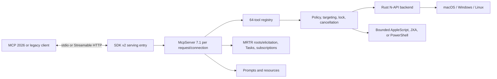
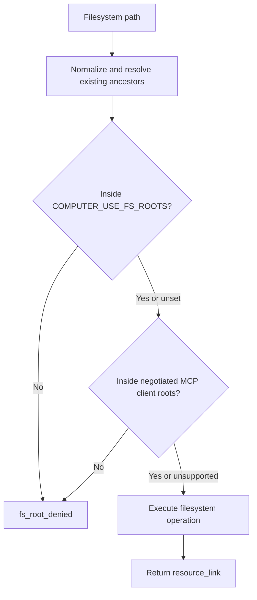

# computer-use-mcp

Cross-platform desktop automation for MCP clients on macOS, Windows, and Linux. The server exposes 64 stable v7 tools for screenshots, input, applications, windows, accessibility, scripting, files, processes, registry operations, and virtual desktops.

Version 7.1 keeps the v7 tool API intact while serving both MCP 2026-07-28 and legacy 2025 clients with the exact `@modelcontextprotocol/*` 2.0.0 SDK packages. Node.js 20 or newer is required. Clients that do not support the modern stateless protocol continue to receive the existing v7 behavior.

## What changed in 7.1

- MCP client roots constrain filesystem tools and filesystem resources.
- Resources support subscriptions and `notifications/resources/updated`.
- Successful filesystem operations return readable MCP resource links.
- Sanitized MCP logging reports lifecycle and tool outcomes without arguments, results, secrets, clipboard contents, or screenshots.
- Approval elicitation identifies the exact tool, target, operation, path, destination, process, registry value, or bounded script involved.
- Tools have human-readable discovery titles.
- Prompt application arguments support MCP completion.
- Dynamic v7 profile changes emit `notifications/tools/list_changed` through the SDK.
- Stateless MCP 2026-07-28 requests use `server/discover`, per-request identity/capability envelopes, cache hints, in-band multi-round-trip input, and `subscriptions/listen`.
- The official `io.modelcontextprotocol/tasks` extension is implemented for selected long-running read-only tools, including polling, cancellation, TTLs, routing headers, and caller isolation.
- A fetch-shaped stateless HTTP handler and a loopback-only HTTP runner are included alongside stdio.
- The former v8 preview surface, packages, contracts, migration commands, and remote supervisor have been removed.

## Installation

Requires Node.js 20 or newer.

```bash
npx -y @zavora-ai/computer-use-mcp@7.1.0
```

Example MCP configuration:

```json
{
  "mcpServers": {
    "computer-use": {
      "command": "npx",
      "args": ["-y", "@zavora-ai/computer-use-mcp@7.1.0"]
    }
  }
}
```

For local Streamable HTTP, run:

```bash
npx -y --package @zavora-ai/computer-use-mcp@7.1.0 computer-use-mcp-http
# http://127.0.0.1:3100/mcp
```

The bundled runner refuses non-loopback binds and validates `Host` and `Origin`. Remote deployments should embed the fetch-shaped handler behind verified OAuth middleware.

The npm package selects the matching optional native package for:

- macOS arm64 and x64
- Windows arm64 and x64
- Linux arm64 and x64

## Permissions

On macOS, grant the terminal or MCP host Screen Recording and Accessibility permission. Automation permission may also be requested when `run_script` controls another application.

On Windows, the server uses UI Automation, `SendInput`, PowerShell, and native window APIs. Run at the same integrity level as the applications being automated.

On Linux, screenshot and input support depend on the active X11/Wayland environment and installed backend. Run `doctor` to obtain machine-specific remediation.

## Architecture



Filesystem authority is the intersection of operator configuration and client-declared roots:



See [docs/ARCHITECTURE.md](docs/ARCHITECTURE.md) for protocol lifecycles and extension points.
See [docs/releases/v7.1.0.md](docs/releases/v7.1.0.md) for the complete release notes, compatibility boundary, verification evidence, and upgrade guidance.

## MCP protocol capabilities

| Capability | Behavior | Compatibility |
|---|---|---|
| Stateless 2026 transport | `server/discover`, no initialization/session requirement, identity and capabilities on every request; stdio and fetch-shaped Streamable HTTP | 2025 initialization remains supported |
| Roots | 2026 uses in-band `input_required`/`roots/list`; legacy requests roots after initialization and on `roots/list_changed` | Ignored when the client does not advertise roots |
| Resource subscriptions | 2026 uses `subscriptions/listen`; legacy uses resource subscribe/unsubscribe | Reads still work without subscribing |
| Resource updates | Emits updates after known state changes, including screenshots, desktop mutations, filesystem writes, and profile changes | Advisory; failures never fail tool calls |
| Logging | Emits sanitized initialization, roots, approval, and tool-completion events | Deprecated in 2026 but retained for legacy compatibility |
| Elicitation | 2026 returns an exact-scope in-band form request with signed request state; legacy uses `elicitation/create` | Falls back to `approval_required` when unsupported |
| Tasks extension | Server-directed tasks for `wait` ≥2s, `scrape`, `get_ui_tree`, `get_app_dictionary`, and vision-enabled `snapshot`; supports `tasks/get`, `tasks/update`, and `tasks/cancel` | Only returned when the request opts into `io.modelcontextprotocol/tasks`; polling is the default |
| Resource links | Filesystem success results reference `computer://filesystem/{encodedPath}` | Existing text content is preserved |
| List changed | Runtime profile enable/disable operations notify the client | Initial profiles remain unchanged |
| Completion | Completes application IDs in relevant prompts and paths in the filesystem template | Empty suggestions on unsupported/unreadable state |
| Annotations | All 64 tools expose all four standard behavior hints; resources expose assistant audience and priority | Hints are descriptive, never authorization |
| Cache hints | Discovery/list operations are private-cacheable for 30 seconds; live resource reads are not cached | 2026 only |

Task status notifications are optional in the extension and are not advertised; clients poll at `pollIntervalMs`. Sampling, MCP Apps, and authentication extensions are not advertised: this server does not need model delegation or an embedded UI, and remote authentication must be supplied by the embedding host rather than simulated. Legacy roots, logging, and elicitation remain available during the protocol deprecation window.

Tasks require an extension-aware host. The core `@modelcontextprotocol/client` 2.0.0 client negotiates MCP 2026-07-28 but intentionally rejects the extension-only `resultType: "task"`; do not advertise `io.modelcontextprotocol/tasks` from that client unless the host adds a Tasks extension codec. Clients that omit the extension capability always receive the ordinary synchronous `CallToolResult` shape.

## Resources

| URI | Description |
|---|---|
| `computer://display/main` | Main display dimensions and scale |
| `computer://windows` | Visible windows |
| `computer://frontmost` | Frontmost application |
| `computer://policy` | Redacted policy and audit status |
| `computer://profile/tools` | Tools available in the configured maximum profile |
| `computer://screenshot/latest` | Most recent cached screenshot; never captures on read |
| `computer://filesystem/{path}` | Root-confined file or directory content, limited to 1 MiB for files |

## Prompts

- `diagnose-desktop` — inspect permissions and configuration.
- `fill-form` — accessibility-first form filling.
- `script-first` — prefer scripting over physical input.
- `safe-desktop-task` — policy-aware desktop automation.

## Tool groups

The full profile exposes 64 tools:

- Observation: `screenshot`, `zoom`, `cursor_position`, `get_display_size`, `list_displays`, `get_frontmost_app`, `list_windows`, `list_running_apps`, `get_window`, `get_cursor_window`, `snapshot`.
- Pointer and keyboard: `left_click`, `right_click`, `middle_click`, `double_click`, `triple_click`, `mouse_move`, `left_click_drag`, `left_mouse_down`, `left_mouse_up`, `scroll`, `type`, `key`, `hold_key`, `multi_select`, `multi_edit`.
- Accessibility: `get_ui_tree`, `get_focused_element`, `find_element`, `click_element`, `set_value`, `press_button`, `select_menu_item`, `fill_form`, `list_menu_bar`.
- Applications and windows: `open_application`, `activate_app`, `activate_window`, `resize_window`, `hide_app`, `unhide_app`.
- Scripting and advice: `run_script`, `get_app_dictionary`, `get_tool_guide`, `get_app_capabilities`, `get_tool_metadata`.
- Clipboard and virtual pointer: `read_clipboard`, `write_clipboard`, `agent_pointer`, `openai_computer`.
- System operations: `filesystem`, `process_kill`, `registry`, `notification`, `scrape`.
- Virtual desktops: `list_spaces`, `get_active_space`, `create_agent_space`, `move_window_to_space`, `remove_window_from_space`, `destroy_space`.
- Administration: `doctor`, `policy_status`, `wait`.

Use MCP `tools/list` for the authoritative schemas and annotations.

## Tool selection

Prefer the least disruptive mechanism:

1. Direct filesystem or system tools.
2. AppleScript, JXA, or PowerShell through `run_script`.
3. Accessibility/UI Automation tools.
4. Coordinate mouse and keyboard input.

Use `get_tool_guide` and `get_app_capabilities` before unfamiliar workflows. Supply `target_app` or `target_window_id` for physical input whenever possible.

## Profiles

`COMPUTER_USE_PROFILE` defines the maximum authority available to the process:

| Profile | Intended surface |
|---|---|
| `core` | Common observation, input, application, and window tools |
| `ax` | Core plus accessibility tools |
| `scripting` | Core plus scripting and filesystem tools |
| `windows-admin` | Scripting plus process, registry, notification, and desktop administration |
| `full` | All 64 tools; default for compatibility |

Embedded hosts may set a narrower active v7 profile through `onRegistry`. The active profile can never expand beyond the maximum profile, and changes generate MCP tool-list notifications.

## Configuration

| Variable | Purpose |
|---|---|
| `COMPUTER_USE_PROFILE` | Maximum tool profile; defaults to `full` |
| `COMPUTER_USE_ACTIVE_PROFILE` | Initial visible v7 profile within the maximum |
| `COMPUTER_USE_FS_ROOTS` | Comma-separated filesystem allow-list; combined with MCP client roots |
| `COMPUTER_USE_ALLOWED_APPS` | Optional application allow-list |
| `COMPUTER_USE_BLOCKED_APPS` | Application deny-list |
| `COMPUTER_USE_REQUIRE_APPROVAL` | Require approval for mutations |
| `COMPUTER_USE_REQUIRE_APPROVAL_FOR` | Comma-separated tools requiring approval |
| `COMPUTER_USE_APPROVAL_TOKEN` | Headless per-call approval token |
| `COMPUTER_USE_ELICITATION` | Enable host form elicitation when supported |
| `COMPUTER_USE_AUDIT_LOG` | JSONL audit destination |
| `COMPUTER_USE_STRUCTURED_CONTENT` | Set `false` for legacy text-only results |
| `COMPUTER_USE_LEGACY_FOCUS_TAG` | Restore legacy focus suffixes in descriptions |
| `COMPUTER_USE_VISION` | Set `false` for text-only operation |
| `COMPUTER_USE_PROVIDER` | Default screenshot sizing profile |
| `COMPUTER_USE_NATIVE_PATH` | Explicit native module override |
| `COMPUTER_USE_SCRIPT_ENV_ALLOWLIST` | Environment names explicitly allowed into script subprocesses |
| `COMPUTER_USE_REQUEST_STATE_SECRET` | Stable secret for HMAC-signed 2026 multi-round-trip state; random per process when unset |
| `COMPUTER_USE_MAX_TASKS` | Maximum concurrent Tasks extension jobs per authenticated/client identity; default `16` |
| `COMPUTER_USE_TASK_TTL_MS` | Task retention window; default `3600000` |
| `COMPUTER_USE_TASK_POLL_INTERVAL_MS` | Suggested client polling interval; default `1000` |
| `COMPUTER_USE_HTTP_HOST` | Loopback address for the bundled HTTP runner; default `127.0.0.1` |
| `COMPUTER_USE_HTTP_PORT` | Port for the bundled HTTP runner; default `3100` |

## Library use

```typescript
import { createComputerUseServer } from '@zavora-ai/computer-use-mcp/server'

const server = createComputerUseServer({
  profile: 'full',
  activeProfile: 'core',
  onRegistry(registry) {
    // Host-controlled and automatically emits tools/list_changed after connect.
    registry.setActiveProfile('ax')
  },
})
```

The typed client is available from `@zavora-ai/computer-use-mcp/client`.

Stateless HTTP embedding:

```typescript
import { createComputerUseHttpHandler } from '@zavora-ai/computer-use-mcp/server'

const handler = createComputerUseHttpHandler({ profile: 'full' })

// Pass only authInfo produced by a real verifier. The handler never trusts
// an Authorization header on its own.
const response = await handler.fetch(request, { authInfo })
```

## Security

This server can control the desktop and execute scripts with the permissions of its process. Treat the `full` profile as high privilege.

- Set `COMPUTER_USE_FS_ROOTS`, even when the client supplies roots.
- Require approval for destructive filesystem, process, registry, scripting, and external actions.
- Prefer stdio. The separate HTTP command opens only a loopback listener; remote serving requires an embedding host with authentication and authorization.
- Treat unauthenticated task IDs as bearer capabilities. Authenticated HTTP tasks are additionally bound to `authInfo.clientId`.
- Do not rely on MCP annotations as an authorization boundary.
- `computer://screenshot/latest` is cache-only.
- MCP logs intentionally exclude arguments, results, secrets, clipboard contents, scripts, and image bytes.

See [SECURITY.md](SECURITY.md) for the threat model and disclosure process.

## Development

```bash
npm ci
npm run build:ts
npm test
```

The v7.1.0 release gate additionally installs the packed tarball without optional native packages, imports every public entry point, tests both MCP protocol eras, and verifies all six platform package manifests. See the [v7.1.0 release record](docs/releases/v7.1.0.md).

Native development requires the Rust toolchain and platform SDK:

```bash
npm run build:native
```

The release gate runs TypeScript compilation, Node tests, native builds on the supported target matrix, package-content verification, packed-install checks, SBOM generation, and build provenance attestation.

## License

MIT © James Karanja Maina / Zavora Technologies Ltd.
