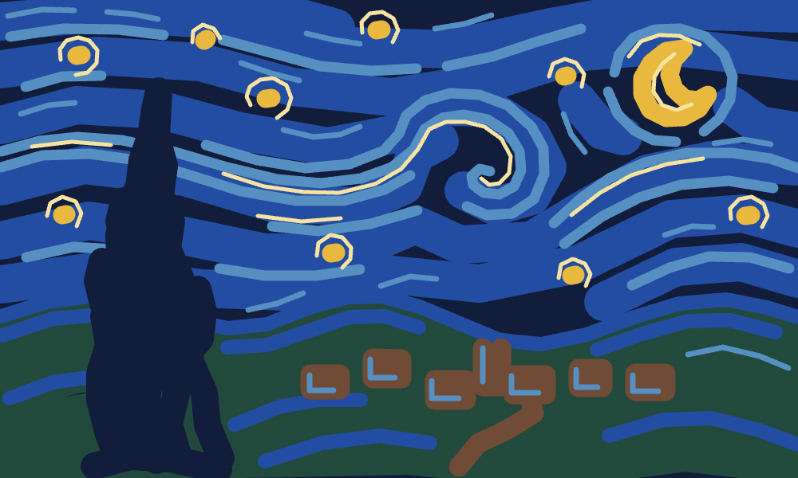
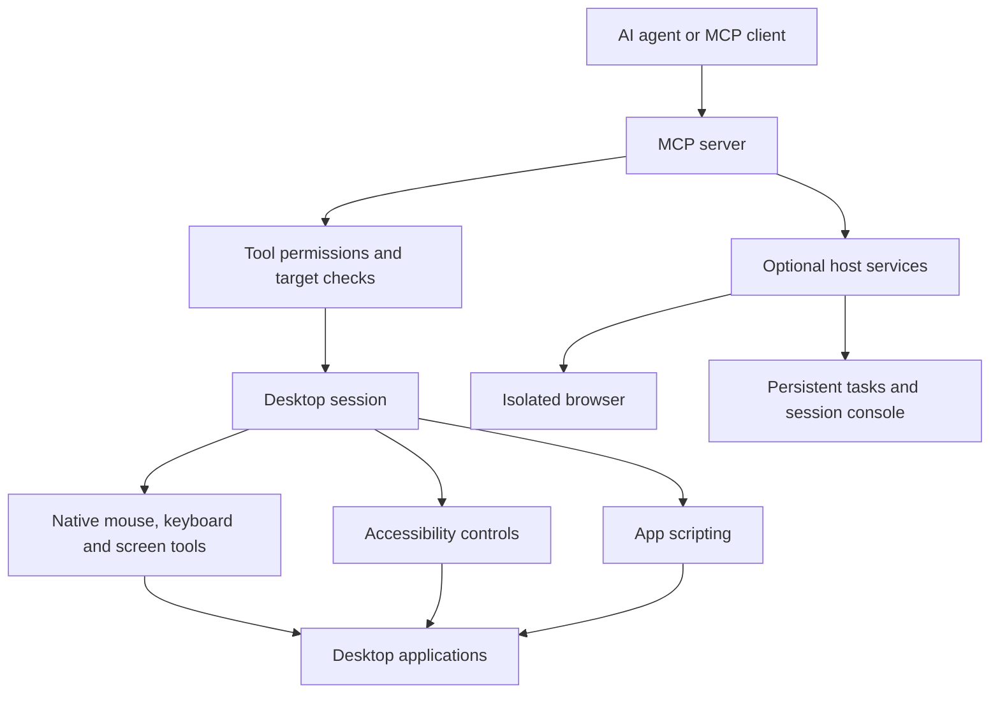

# Computer Use MCP

Give an AI agent the ability to discover apps, understand their controls, and work
on a desktop. Computer Use MCP connects MCP-compatible agents to native tools on
**macOS, Windows and Linux**.

Use app scripting and accessibility controls when available, and screenshots,
mouse and keyboard input when the interface requires them.

## See it paint



**Astra painted this through real mouse strokes.** The agent used the OpenAI
Responses API to operate the bundled paint studio through this MCP: 105 strokes,
seven colors and 15 model calls, followed by a verified PNG export. The result is
an original Van Gogh-inspired landscape made through native pointer events.

```sh
# From a clone of this repository, after the setup below:
npm install --prefix agents/openai-agent
npx playwright install chromium
export OPENAI_API_KEY=your-key
node agents/openai-agent/showcase.mjs paint --studio --turns 24 --tokens 200000
```

This makes paid API calls. The recorded run used 191,734 input and 3,274 output
tokens. [Run the demos and read their limits](agents/openai-agent/README.md).

## See it read


**Thirty-eight seconds, ten fields, no answer key.** The invoice on the left is
drawn on a canvas, so its text never reaches the accessibility tree — the only way
to read it is to look. DeepSeek Flash reads it from screenshots, types each value
through the accessibility API, and presses Verify; the local host scores the
entries and tells it only which ones are wrong. This run scored 10 of 10 on the
first Verify, over 12 model calls and 23 tool calls, at a 94% prompt-cache hit
rate. Every entry is recorded with its `isTrusted` flag, so a submission that was
not typed through the UI is refused.

```sh
npm install --prefix agents/deepseek-agent
npx playwright install chromium
export DEEPSEEK_API_KEY=your-key
node agents/deepseek-agent/showcase.mjs --seed 7             # the run above
node agents/deepseek-agent/showcase.mjs --receipt random     # a real receipt from the web
```

[Full-resolution capture](docs/assets/deepseek-ledger-run.mp4) ·
[how it works, and what it cannot fake](agents/deepseek-agent/README.md)

## Set up your agent

Requires **Node.js 20+** and an interactive desktop. The published package bundles
native modules for macOS, Windows and Linux, on x64 and arm64.

Add this to your agent's MCP server configuration:

```json
{
  "mcpServers": {
    "computer-use": {
      "command": "npx",
      "args": ["-y", "@zavora-ai/computer-use-mcp"]
    }
  }
}
```

For a client with a different configuration format, use `npx` as the command and
`-y @zavora-ai/computer-use-mcp` as its arguments. See [agent configuration](AGENTS.md)
for client-specific examples. No model API key is needed by the MCP server itself.

Before using desktop tools:

| Platform | Setup |
|---|---|
| macOS | Grant the host Accessibility and Screen Recording access. App scripting may also request Automation access. |
| Windows | Run in a signed-in desktop session. Protected or elevated windows may need matching privileges. |
| Linux | Use a graphical session with the required X11/Wayland utilities. Accessibility support needs AT-SPI. See [platform details](docs/ARCHITECTURE.md). |

Ask your agent to run `doctor` to check capabilities. Office must be installed and
activated separately; its folder-access prompts are normal setup requirements.
Downloads is not guaranteed to bypass those prompts.

## What it can do

| Capability | Examples |
|---|---|
| Discover applications | Find installed and running apps, identify their targets, and choose an automation approach. |
| Read the interface | Capture a window, zoom into a region, inspect accessibility controls and find a button or field. |
| Operate applications | Click controls, fill forms, select menus, type text, drag paths and use keyboard shortcuts. |
| Use app scripting | AppleScript/JXA on macOS and PowerShell on Windows. |
| Manage desktop work | Target individual windows, switch focus, read/write the clipboard and inspect displays. |
| Build agent hosts | Add persistent desktop sessions, verified workflows, an MCP App console, isolated browser contexts and supervised runtimes. |

The default profile exposes **65 tools**. Set `COMPUTER_USE_PROFILE=core` for a
smaller starting set; `ax`, `scripting`, `windows-admin` and `full` are also
available. Optional host services add their own tools.

Try asking your agent:

- “Find my installed Office apps and explain how you can automate them.”
- “Open a new text document, write a short meeting agenda and save it.”
- “Inspect this application's controls and fill out the form I describe.”
- “Create a new painting with a swirling night sky and export it.”

Always specify the intended app or window. Prefer connectors, APIs or filesystem
operations for work that does not need a desktop. Platform and application
support varies; an available tool is not a promise that every app exposes usable
controls.

## Use it from code

```js
import { createComputerUseServer } from '@zavora-ai/computer-use-mcp'
import { connectInProcess } from '@zavora-ai/computer-use-mcp/client'

const client = await connectInProcess(createComputerUseServer())
try {
  const apps = await client.discoverApplications({
    query: 'office',
    include_capabilities: true,
  })
  console.log(apps.content)
} finally {
  await client.close()
}
```

[Application examples](examples/README.md) · [AI agent examples](agents/README.md)
· [Responses showcases](agents/openai-agent/README.md)

## Architecture



The TypeScript server handles tool requests, permissions and cancellation. A Rust
native module connects to the operating system. Optional host services provide
longer-lived sessions and isolated execution. Results return to the agent so it
can observe, act and verify.

For protocol details, deployment controls and the full component diagram, see
[Architecture](docs/ARCHITECTURE.md) and the [host integration guide](docs/STRATEGY.md).
Legacy MCP clients remain supported; newer protocol features are opt-in.

## Develop locally

```sh
git clone https://github.com/zavora-ai/computer-use-mcp.git
cd computer-use-mcp
npm ci
npm run build:ts
npm test
```

For live desktop use from a clone, install Rust and build your platform's native
module: `npm run build:native` on macOS, `npm run build:native:win` on Windows x64,
or `npm run build:native:linux` on Linux. Windows arm64 has `build:native:win:arm64`.
The packaged npm install does not require a local Rust build.

`npm run smoke` checks the local desktop; `npm run test:browser` tests a disposable
browser fixture. These live checks need their documented platform prerequisites.
[Development scripts](scripts/README.md) lists the maintained commands.

## Documentation and support

- [v7.2.0 release notes and rollout checklist](docs/releases/v7.2.0.md)
- [Tool usage and agent setup](AGENTS.md)
- [Architecture and platform support](docs/ARCHITECTURE.md)
- [Sessions, Tasks, browser isolation and supervision](docs/STRATEGY.md)
- [Token and interaction efficiency](docs/EFFICIENCY.md)
- [Security and reporting vulnerabilities](SECURITY.md)
- [Report a bug or request a feature](https://github.com/zavora-ai/computer-use-mcp/issues)

MIT licensed. Desktop access can change real applications and files; configure
permissions and target applications deliberately. The bundled HTTP server is
loopback-only. Exposing a remote endpoint requires host-owned authentication.
