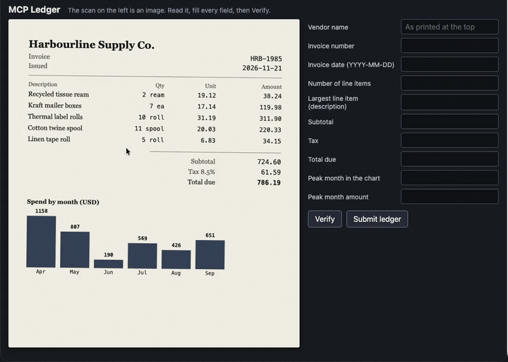

# DeepSeek Flash vision agent

Three ways to point DeepSeek's `deepseek-flash` model at a real desktop through
`computer-use-mcp`:

- **`vision.mjs`** — computer-use-mcp captures, DeepSeek looks. One model call,
  no tool calling. Describe a screen, transcribe a window, read a chart, or diff
  two captures.
- **`agent.mjs`** — DeepSeek drives the desktop with the full MCP tool surface and
  sees the results as images.
- **`showcase.mjs`** — the long-running one. A local ledger app shows a receipt
  whose text exists **only as pixels**, and the agent has to read it and type it
  into the form beside it, verifying and correcting until every field is right.

Both `agent.mjs` and `showcase.mjs` use DeepSeek's OpenAI-compatible Chat
Completions endpoint (`https://api.deepseek.com`), so the official `openai` SDK
works unchanged.

## Setup

```sh
npm run build:ts                      # from the repository root
npm install --prefix agents/deepseek-agent
npx playwright install chromium       # the showcase only
export DEEPSEEK_API_KEY=your-key
```

## The ledger showcase



*Sped up 3x from a 38-second run. [Full-resolution capture](../../docs/assets/deepseek-ledger-run.mp4).*

```sh
node agents/deepseek-agent/showcase.mjs                       # synthetic, scored
node agents/deepseek-agent/showcase.mjs --receipt random      # a real receipt from the web
node agents/deepseek-agent/showcase.mjs --seed 42 --turns 40
node agents/deepseek-agent/showcase.mjs --prompt "Read only the totals block and fill subtotal, tax and total."
```

The recorded run, `--seed 7`:

```
status: completed · 10 of 10 fields correct · accuracy 1.0 · Verify passed first try
12 model calls · 23 tool calls · 10 images · 38 seconds
97,300 prompt tokens — 91,520 cache hits (94.1%)
trustedEntry: true · untrustedEvents: 0 · unobservedFields: []
```

`record.mjs` reproduces the capture. It records the real screen but crops to the
ledger window, so nothing else on the desktop is written to the file, and it crops
the browser toolbar away because the app URL carries the one-shot host token.

```sh
node agents/deepseek-agent/record.mjs --seed 7 --turns 30
```

It is prompt-driven: nothing in the runner knows the answers, the field order, or
when to stop. `--prompt` replaces the objective outright, and only the facts the
agent cannot guess — the window id and the field labels — are appended.

### Why it cannot be faked

| Property | How |
|---|---|
| The values must be *seen* | The receipt is drawn on a canvas, so its text never enters the DOM and never reaches the accessibility tree. A run asserts this by scanning the tree for the answers. |
| The agent cannot grade itself | Scoring lives in the local host. `Verify` returns which fields are wrong, never what they should be. |
| The entries must be typed | Every edit is recorded with its `isTrusted` flag and the value at that moment. Assigning `input.value` fires no event and shows up as an unobserved mutation; a script-dispatched event shows up as untrusted. Submission is refused either way. |
| The task must be answerable | A test generates 200 receipts and asserts every requested field appears in the drawn pixels. It was added after it caught a real bug: `peak_amount` was being asked for while the chart printed no values. |

Artifacts land in `showcase-output/ledger-*/`: `ledger-scan.png`,
`ledger-entries.json`, `events.jsonl`, `report.json`.

### Real receipts

`--receipt random` pulls a genuine receipt from Wikimedia Commons — supermarket
tapes, restaurant bills, fuel, laundry, postal — in whatever language and
condition it happens to be in. Images are fetched at run time rather than bundled,
and the licence, author and description page are recorded in the artifact, which
is what CC BY / CC BY-SA require.

There is no answer key for an arbitrary photograph, so this mode is an
*extraction* run: `Verify` reports how many fields are filled, the values are
recorded for review, and the report is marked `scored: false`. The field set
changes too — a photographed receipt has a currency and a payment method, but no
bar chart.

## Vision tasks

```sh
cd agents/deepseek-agent
node vision.mjs describe                       # what is on screen right now
node vision.mjs read                           # transcribe the focused window
node vision.mjs chart                          # read a chart region as JSON
node vision.mjs compare                        # what changed over three seconds
node vision.mjs url --url https://…/photo.jpg  # an image DeepSeek fetches itself
```

## Agent loop

```sh
node agent.mjs "Open Calculator, compute 42 * 58, and tell me the result"
```

`DEEPSEEK_MODEL`, `DEEPSEEK_BASE_URL` and `DEEPSEEK_IMAGE_DETAIL` override the
defaults. Ctrl-C aborts and closes the session. This makes paid API calls and
drives your real desktop; read [the tool priority guidance](../../AGENTS.md) first.

## Four things about this API that shape the code

**1. Images go in user messages only.** An image in a `system` or `assistant`
message is a 400. MCP tools *return* screenshots, and the OpenAI convention is to
answer a tool call in a `tool` message — so that convention cannot be followed
directly.

**2. Tool replies cannot be interrupted.** Every `tool` message answering an
assistant's `tool_calls` must follow it with nothing in between, or the API
rejects the transcript with *"insufficient tool messages following tool_calls
message"*. Combined with (1), the only shape that satisfies both is: answer every
call first, then carry that turn's images in one trailing user message. That is
what `appendToolResults` does, and a live run failed on exactly this before it
did.

**3. Prefix caching is automatic, and history rewriting defeats it.** DeepSeek
caches prompt prefixes on disk and bills a hit at a fraction of a miss, but only
on a *full* prefix match — after `A + B`, a request for `A + C` misses. So this
agent never edits an earlier message. When a request grows past
`--compact-above`, it opens a **new segment** with the same stable prefix plus a
progress note, rather than pruning images out of the middle. The recorded run
holds a 92% hit rate across 12 calls because of this.

**4. `deepseek-flash` reasons before answering, and reasoning is billed against
`max_tokens`.** Set it too low and you get `finish_reason: "length"` with *empty
content* and no tool call — which looks exactly like a model that chose to say
nothing. Both entry points now detect that and say so. Reasoning tokens are
reported separately in `usage.reasoningTokens`.

## Detail, cost, and the 1280px capture width

DeepSeek rescales every image before inference — up if it is under roughly
544×544, down to roughly the pixel count of 1300×1300 if larger — and caps each
image at **1024 tokens**. A 4K screenshot and a 1300px one therefore cost the
same, so `provider: 'deepseek-flash'` captures at 1280px wide.

| detail | Effect | Use for |
|---|---|---|
| `low` | Downscaled to 512×512 | Layout, "which app is in front", change detection |
| `original` / `high` | Original pixels | Small text, transcription, charts |
| `auto` | Currently `original` | Default |

`detail` is ignored for images referenced by `file_id`.

## Limits enforced before the request

Checked locally so a breach is a clear local error instead of a 400:

| Limit | Value |
|---|---|
| Formats | JPEG, PNG, GIF, WebP (detected from content, not filename) |
| Inline image (base64) | 32 MiB |
| Files API image | 64 MiB |
| Request body | 48 MiB |
| Images per request | 600 |
| Longest side | 8192 px, or 4096 px once a request holds 15+ images |
| External URL length | 8192 characters |

`uploadImage` covers the Files API path for an image reused across many requests —
uploaded once, then referenced by a short `file_id` that also keeps the cached
prefix byte-stable. Note the purpose is **`user_data`**; the API rejects
`vision`, which the docs do not spell out.

The legacy model name `deepseek-v4-flash-vision-exp` still resolves to the current
Flash model, but prefer `deepseek-flash`.

## Tests

`test/deepseek-agent.test.mjs` and `test/deepseek-ledger.test.mjs` run as part of
`npm test`. They make no network request, need no API key, and load no native
module — the model client, the MCP client, and `fetch` are all fakes.
