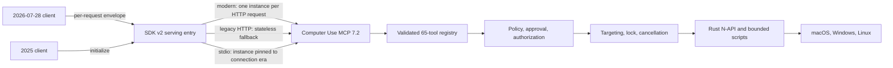
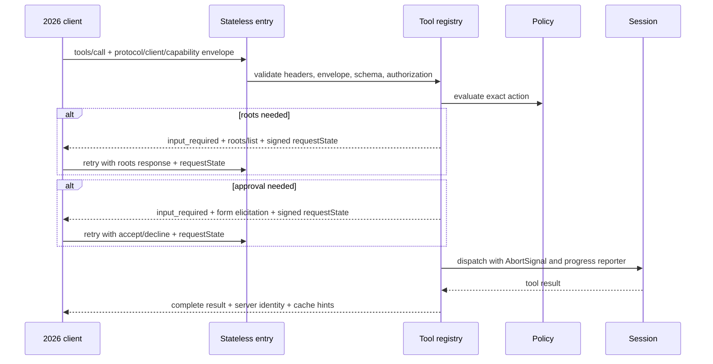
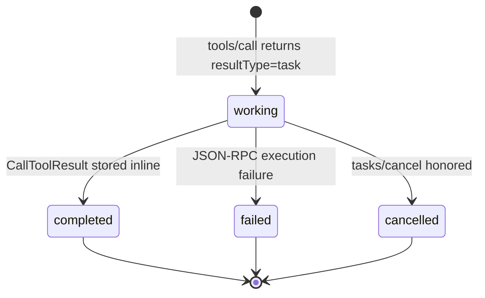
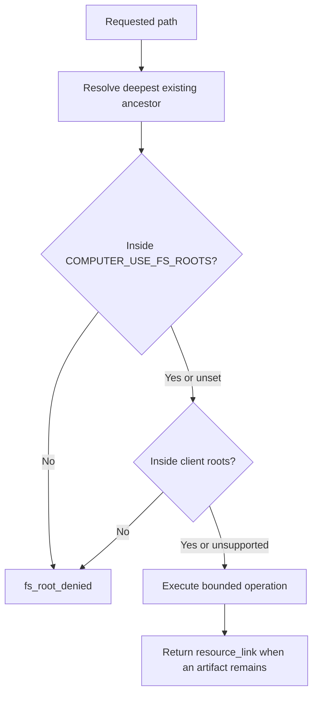
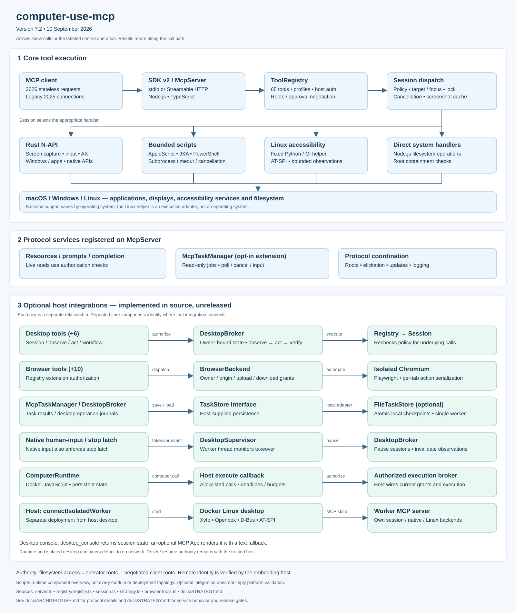

# computer-use-mcp 7.2 architecture

## Compatibility boundary

Version 7.2 preserves all 64 v7 tool names and input schemas and adds application discovery as the 65th tool. Protocol negotiation is independent of that tool API:

- MCP 2026-07-28 uses stateless requests, `server/discover`, per-request client identity/capabilities, in-band multi-round-trip input, and `subscriptions/listen`.
- MCP 2025-11-25 and earlier continue through the SDK's legacy initialization path.
- `@modelcontextprotocol/server`, `client`, `core`, and `node` are pinned to 2.0.0. Node.js 20 is the minimum runtime.

The fetch-shaped handler is the primary embeddable HTTP surface. The bundled Node HTTP command is loopback-only and applies `Host` and `Origin` validation. It never converts an unverified bearer header into `authInfo`; a remote embedding host must verify OAuth and pass the resulting identity explicitly.

## Modern request flow

The request-state token is HMAC authenticated, expires after ten minutes, and binds the method, client identity, tool name, and canonical argument hash. A response cannot approve a different call. Set `COMPUTER_USE_REQUEST_STATE_SECRET` when retries must survive a process restart; otherwise a random process-local key is used.

## Tasks extension

The server advertises `io.modelcontextprotocol/tasks`. Task creation is server-directed and occurs only when the current request opts in. The selected operations are long-running and read-only: `wait` at least two seconds, `scrape`, `get_ui_tree`, `get_app_dictionary`, and vision-enabled `snapshot`.

The process-wide store is shared by per-request HTTP server instances, so a handle remains pollable across stateless exchanges. IDs contain 192 random bits. Authenticated tasks are bound to `authInfo.clientId`; without authentication, possession of the unguessable ID is the bearer credential. There is deliberately no `tasks/list`. `Mcp-Name` must equal `taskId` for HTTP lifecycle requests. TTL cleanup and per-owner concurrency limits bound retention and work. `tasks/update` accepts extension acknowledgements, although the selected tools resolve Roots/elicitation MRTR before task creation and therefore do not normally enter `input_required`.

The TypeScript SDK 2.0.0 core codec still classifies the old `tasks/*` vocabulary as removed core methods and does not yet supply an extension runtime. A narrow transport bridge handles only `tasks/get`, `tasks/update`, and `tasks/cancel`; normal requests, discovery, envelopes, MRTR, and subscriptions remain SDK-owned. Both HTTP and stdio paths have conformance tests for this seam.

The matching SDK client likewise does not decode the extension-only `resultType: "task"`. An extension-aware host must own that codec and the polling loop. A stock SDK client remains compatible by omitting the Tasks extension from its per-request capabilities, which makes every selected tool execute synchronously.

Task notifications through `subscriptions/listen` are optional and are not advertised. Polling at `pollIntervalMs` is the supported status path.

## Resources and subscriptions

The six fixed desktop resources and `computer://filesystem/{path}` are subscribable. Legacy connections use resource subscribe/unsubscribe. Modern clients use `subscriptions/listen`; the serving entry owns acknowledgement-first SSE, filter matching, subscription IDs, keepalives, capacity limits, and teardown.

| State event | Updated resources |
|---|---|
| Successful screenshot | `computer://screenshot/latest` |
| Successful desktop mutation | `computer://frontmost`, `computer://windows` |
| Successful filesystem operation | Corresponding filesystem resource URI |
| Active profile change | `computer://profile/tools` plus `tools/list_changed` |

Notifications are advisory. Failure to deliver one cannot change a tool result. Resource declarations and returned contents carry assistant-audience/priority annotations.

## Filesystem authority

Filesystem authority is the intersection of operator configuration and client roots. Modern roots arrive through MRTR; legacy roots are refreshed after initialization. Every resource read repeats containment checks.

Files are limited to 1 MiB per MCP resource read; directory listings are limited to 1,000 entries.

## Capability and extension decisions

| Surface | Status | Reason |
|---|---|---|
| Tools, prompts, resources, completion | Implemented | Product-facing discovery and execution |
| Tool/resource annotations | Implemented | All tools have four boolean behavior hints; resources have audience/priority |
| Structured output | Implemented for stable priority results | Text compatibility remains authoritative for variable legacy results |
| MRTR roots and form elicitation | Implemented | Stateless, bounded input without a reverse request channel |
| Cache hints and per-response server identity | Implemented | Safe private discovery caching and response attribution |
| `subscriptions/listen` | Implemented by SDK entry | Modern push source for change notifications |
| Tasks extension | Implemented | Durable within the server process; polling/cancel/update supported |
| Legacy logging/roots/elicitation | Retained | Compatibility during the 2026 deprecation window |
| Sampling | Not advertised | Deprecated in 2026 and unnecessary for deterministic desktop operations |
| MCP Apps | Not advertised | No server-owned interactive UI resource |
| Auth extensions | Not advertised by the local server | Authentication belongs to the remote embedding host; false auth claims are forbidden |

## Logging and privacy

Logging is retained for legacy clients even though it is deprecated in 2026. Events contain the event name, tool name, outcome, duration, root count, and approval classification. They exclude tool arguments, results, file and clipboard contents, scripts, tokens, screenshots, and accessibility values.

## Extension points

- `createComputerUseHttpHandler` exposes the stateless fetch-shaped endpoint.
- `ServerOptions.authorizeToolCall` performs host authorization immediately before dispatch.
- `ServerOptions.onRegistry` permits host-controlled narrowing of the visible v7 profile.
- `SessionOptions.getClientRoots` supplies live legacy roots; modern calls carry roots per request.
- `ToolRegistry.afterToolCall` centralizes safe logging, resource updates, and result decoration.

None of these hooks grants model-callable authority by itself.

## Component diagram

