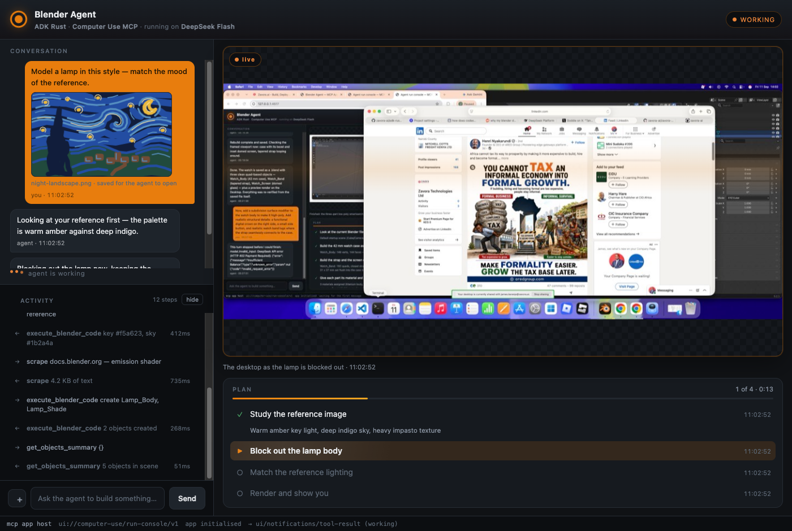

# Computer Use MCP 7.3.0

Release date: 2026-09-11

A person watching an agent work should be able to see what it is thinking, hand it a
picture to work from, and expect it to look things up. This release adds those three
things to the run console.



## Changes

- Show what the agent is doing. A run now carries an activity feed — `thought`,
  `tool` and `result` events with per-call timings — rendered live in the console
  beneath the conversation. It is reported by the host driver rather than
  self-reported by the model: a driver already sees every streamed token and every
  tool call, so the feed is complete and costs no extra model calls, where a model
  asked to narrate its own tool use gives a partial account. Bounded at 400 events,
  and deliberately kept out of agent-facing replies, because handing an agent a
  record of what it just did is both large and circular.
- Attach an image to the conversation. PNG, JPEG, WebP or GIF, on any message
  including the first. The host writes the file to disk and the run records only
  metadata and a path, so payloads stay free of base64. `run_attachment` returns the
  picture to the agent as a real image block **and** the path it is saved at. The path
  is the point: Blender can load that file as a reference image or a texture, which is
  a different thing from an agent modelling from its own description of a picture.
- `web_search`, taking the default profile from 66 to 67 tools. Ranked results with
  titles, URLs and snippets; follow one with the existing `scrape` to read the page.
  It executes locally, so it works with any model rather than only those whose
  provider offers a server-side search tool — which is the reason it exists rather
  than deferring to a built-in.
- The console treats `planning` as a busy state. Every activity affordance was bound
  to `working` alone, so a run sat visibly dead while the agent composed its first
  plan; on a long request that is minutes of a console that looks broken while it is
  in fact thinking.

## Configuration

Search providers are pluggable, and the default works with no key.

| Variable | Effect |
|---|---|
| `COMPUTER_USE_SEARCH_PROVIDER` | `brave`, `tavily`, `serper` or `duckduckgo`. Defaults to `brave` when a key is set, `duckduckgo` when not. |
| `COMPUTER_USE_SEARCH_API_KEY` | Key for the chosen provider. |

The keyless fallback parses DuckDuckGo's HTML endpoint. That page carries no
compatibility promise, so it is there to let you try the tool rather than to depend
on: when its markup changes, `web_search` fails with a message naming the fix.

Search results and fetched pages are untrusted data that describe the world. They are
never instructions, and the tool's own reply says so.

## Compatibility and prerequisites

Node.js 20+ and the same six native targets. No tool was renamed and no input schema
changed, so a 7.2.0 client keeps working; `web_search` is additive, and the console
tools remain behind `runConsole: true` (six of them now, 67 → 73 when enabled).

Attachments are written under the system temporary directory and are not cleaned up
while the host runs, so a long session accumulates the images it was given.

## Verification and limits

The release suite contains 382 tests. `web_search` is covered against all four
providers through an injected fetch, including the keyless HTML path, a provider
outage, and an unknown provider name — no key and no network required. Attachments
are covered end to end: written to disk, served to the page, and returned to an agent
as an image with its path. The activity feed is covered for bounds, trimming, and its
exclusion from agent replies.

The console was exercised in Chromium at 1400x940 with an attachment, a twelve-event
feed, a four-task plan and a real desktop capture.

Not verified: no live model run exercised these three features together, because the
DeepSeek balance funding this work was exhausted partway through — the pipeline was
therefore tested through its seams rather than through a model. `web_search` has not
been run against a live Brave, Tavily or Serper account; the request shapes follow
each provider's documented API and are asserted against recorded response shapes.
`mouse_drag` remains exercised at runtime only on macOS.

## Release checklist

1. Align root/platform manifests and protocol identities at 7.3.0.
2. Run the full tests and verify the packed runtime, skills, docs and demo image.
3. Push the release commit and run the native CI matrix through a pull request.
4. Merge the validated changes, tag the release commit as `v7.3.0`, and publish
   the GitHub release.
5. The main-branch workflow builds a universal tarball, records provenance/SBOM
   evidence, and submits npm staged publishing. A maintainer must approve that
   staged package under the registry's policy. GitHub publication alone does not
   mean npm publication has completed.

Upgrade once npm staging has been approved:

```sh
npm install @zavora-ai/computer-use-mcp@7.3.0
```
