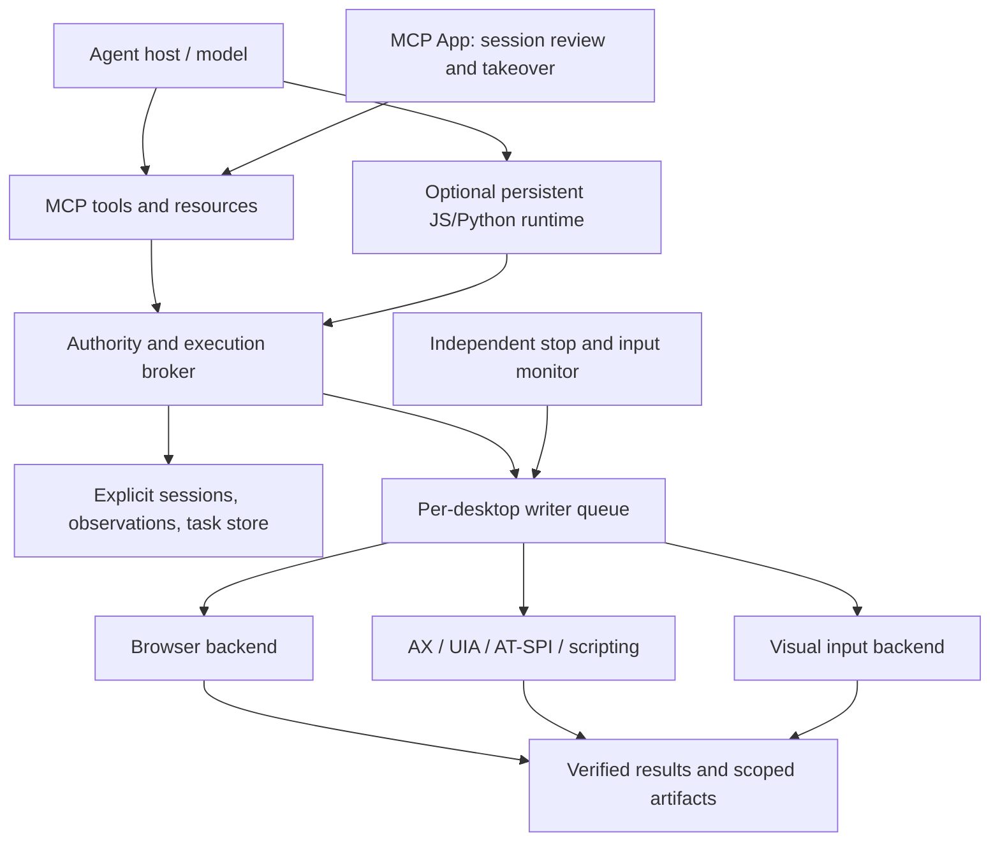

# Computer-use MCP: repository review and competitive strategy

Reviewed September 8, 2026. Repository: `@zavora-ai/computer-use-mcp` 7.1.0, commit `c9f14d0`.

## Assessment

The strongest opportunity is to build a dependable, model-independent execution platform for computer-use agents. The repository already has substantial native control, semantic accessibility, scripting, policy, and MCP infrastructure. Its next gains should come from preserving observations, enforcing execution boundaries, maintaining explicit session state, and verifying outcomes.

It cannot establish that it exceeds OpenAI's overall computer-use performance by counting tools. OpenAI provides both models and an integrated host experience; this repository primarily provides the execution layer. A defensible competitive claim needs a controlled comparison using the same model, task set, permissions, and budgets. OpenAI models can also be customers of this execution layer.

My recommended order is: fix correctness and authority gaps; modernize the OpenAI integration; introduce explicit desktop sessions and reliable observations; build a portable MCP App; add durable workflows and browser integration; publish independent end-to-end evaluations.

## Scope and evidence

I reviewed the TypeScript server, registry, HTTP entry, resources, Tasks implementation, policy, locking, targeting, input and screenshot handlers, accessibility and scripting paths, relevant Rust backends, agent examples, architecture/release documentation, and CI configuration. This is a targeted architectural and code review, not an exhaustive audit of every native function.

Validation performed:

- `npm test`: **208 passed, 0 failed, 0 skipped**, approximately 132 seconds, including the TypeScript build.
- Focused local reproductions using mocked native modules and disposable filesystem fixtures confirmed the action-mapping, lock, resource-authority, Tasks approval, and HTTP screenshot-cache findings below.
- No paid model calls, live desktop mutations, production deployments, or external writes were needed.
- Existing tests are useful regression coverage, but passing them does not establish live macOS/Windows/Linux task success or competitive parity. I did not independently rerun the historical native demonstrations in the release record.

This review records the pre-implementation findings. The subsequent efficiency implementation is described at the end; other architectural changes remain recommendations.

## What the current ecosystem actually provides

### MCP core, extensions, Apps, and Tasks

MCP 2026-07-28 changes the transport and request model: stateless requests carry identity and capabilities, discovery is optional, HTTP routing uses method/name headers, list results have cache hints, and Multi Round-Trip Requests (MRTR) support in-band input. Application state can still exist behind explicit handles. Roots, sampling, and logging are deprecated with a compatibility window; this is not a reason to remove legacy client support immediately. The repository already addresses much of this revision. [Official July 2026 release](https://blog.modelcontextprotocol.io/posts/2026-07-28/).

An MCP extension is a negotiated protocol addition. The official extension catalog includes Apps, Tasks, and authorization extensions such as client credentials and enterprise-managed authorization. These solve different problems. Advertising support should reflect working behavior and tested negotiation, not intended roadmap features. [Extensions overview](https://modelcontextprotocol.io/extensions/overview).

MCP Apps adds server-provided HTML interfaces inside supporting hosts. It uses `ui://` resources, the `text/html;profile=mcp-app` MIME type, `_meta.ui.resourceUri`, and an iframe-to-host JSON-RPC bridge over `postMessage`. Sandboxing and declared CSP constrain the component. Tool visibility can distinguish model-facing and app-facing operations. These are UI and routing mechanisms; they do not independently prove user approval or grant OS access. [MCP Apps specification](https://github.com/modelcontextprotocol/ext-apps/blob/main/specification/2026-01-26/apps.mdx).

MCP Tasks is now the `io.modelcontextprotocol/tasks` extension. A capable server can return a task handle when the client opts in. Clients poll `tasks/get`; input goes through `tasks/update`; cancellation uses `tasks/cancel`. Terminal results are returned inline. The current design has no `tasks/list`; do not accidentally implement the older experimental 2025 lifecycle as the modern contract. [Tasks overview](https://modelcontextprotocol.io/extensions/tasks/overview).

MRTR input before task creation and input during a running task are distinct mechanisms. A task that needs input must retain the outstanding request and resume through its own lifecycle, rather than simply retrying the initial RPC. Notifications are optional, and cancellation is cooperative. [Stable Tasks specification](https://tasks.extensions.modelcontextprotocol.io/specification/2026-07-28/tasks).

### OpenAI API and desktop experience

OpenAI's current computer-use API guide recommends code execution for GPT-6 Astra: a persistent environment receives scripts and returns text and images. The structured `computer` tool remains an alternative, using ordered action batches and screenshots. Existing function or MCP interfaces can still be used. This is materially broader than the original screenshot/single-action CUA integration. [Computer-use API guide](https://developers.openai.com/api/docs/guides/tools-computer-use).

The integration recipes document mouse buttons, modifiers, object-shaped drag points, action execution, screenshot scaling, and persistent runtime considerations. Preserving these semantics is necessary for an adapter to claim compatibility. The caller supplies the actual browser/desktop environment. [Integration recipes](https://developers.openai.com/api/docs/guides/tools-computer-use-integration).

The desktop product adds user-facing capabilities around execution: application approvals, browser integration, macOS background operation, and stopping/taking over work. Windows requires the active visible desktop. Selected macOS configurations support explicitly enabled locked use. These product features should not be assumed to appear automatically when an API client enables a computer tool. [Desktop Computer Use](https://learn.chatgpt.com/docs/computer-use), [local security and locked-device behavior](https://learn.chatgpt.com/docs/enterprise/chatgpt-work-local-security).

OpenAI also provides an integrated browser and controlled CDP developer access for DOM, console, network, and performance inspection. Its browser extension connects existing browser profiles and tabs, with website access controls. [Browser documentation](https://learn.chatgpt.com/docs/browser), [browser extension](https://learn.chatgpt.com/docs/chrome-extension).

The former Apps SDK documentation now redirects into OpenAI's Plugins documentation. Its current UI guidance starts with the open MCP Apps standard and uses optional `window.openai` additions where needed. A portable MCP App is therefore a sound investment; a UI tied only to proprietary aliases would be a weaker foundation. [OpenAI MCP UI guidance](https://developers.openai.com/plugins/build/chatgpt-ui).

## Strengths worth preserving

- A single tool catalog and validated registry coordinate names, schemas, profiles, and annotations.
- Rust N-API supports native desktop operations, with platform-specific backends and six build targets.
- Semantic AX/UIA interaction and AppleScript/JXA/PowerShell can avoid many fragile visual actions.
- Explicit window targeting, focus diagnostics, and recovery are more useful than bare coordinate injection.
- Screenshot caching, zoom, snapshot annotations, structured outputs, and a virtual pointer already provide observation building blocks.
- The native layer contains input-attribution and emergency-stop primitives; a supervisor can build on them.
- Legacy and modern MCP paths coexist, and the bundled HTTP server is deliberately loopback-only.
- Cross-platform CI and package checks provide a useful base for improving release confidence.

See [architecture](/Users/jameskaranja/Developer/projects/mcp-servers/computer-use-mcp/docs/ARCHITECTURE.md), [catalog](/Users/jameskaranja/Developer/projects/mcp-servers/computer-use-mcp/src/tool-catalog.ts), and [native activity support](/Users/jameskaranja/Developer/projects/mcp-servers/computer-use-mcp/native/src/activity.rs).

## Concrete findings

Priorities: P1 should precede expanded remote or concurrent use; P2 is significant functional or competitive work. Security impacts below depend on deployment and configured authority; they are not claims of unauthenticated Internet exposure of the loopback runner.

### F1 — P1: resource access does not share tool authorization

`authorizeToolCall` runs inside the tool registry. Resource handlers dispatch directly to the session or read files directly, so the hook does not govern equivalent access through `resources/read`.

Reproduction: with a host hook that throws for every tool, `tools/call(list_windows)` is denied, but `resources/read(computer://windows)` still returns window data from the injected session.

Fix: introduce a common request authorization context and explicit resource/completion/subscription authorization. Apply it to cached screenshots and future UI data as well as tools. Resource errors should remain errors, rather than becoming apparently valid text resources. Authorize both subscription creation and data delivery when permissions can change.

Evidence: [registry authorization](/Users/jameskaranja/Developer/projects/mcp-servers/computer-use-mcp/src/registry/registry.ts:367), [resource handlers](/Users/jameskaranja/Developer/projects/mcp-servers/computer-use-mcp/src/resources.ts:46).

Acceptance: denying a data capability blocks every representation of the same information, including tools, resources, completion, and cached artifacts.

### F2 — P1: modern filesystem resources skip client-roots negotiation

Modern filesystem tool calls ask for roots through MRTR. Filesystem resources instead use `ctx.getClientRoots()`, wired to the legacy controller. A modern per-request server has no initialized legacy roots state.

Reproduction: with an operator root containing a disposable fixture and a modern client advertising roots support, the filesystem tool returns `input_required`; directly reading the file resource returns its contents without requesting roots. Operator confinement still works, but the advertised intersection with client roots is not enforced on this path.

Fix: supply per-request authority to resources and completion. If client roots are part of the compatibility contract, resolve them before access. For the future API, prefer explicit operator/host-issued filesystem grants; deprecated client roots should not become the primary security boundary.

Evidence: [resource filesystem read](/Users/jameskaranja/Developer/projects/mcp-servers/computer-use-mcp/src/resources.ts:169), [modern roots handling](/Users/jameskaranja/Developer/projects/mcp-servers/computer-use-mcp/src/registry/registry.ts:301).

Acceptance: use distinct allowed and forbidden sibling directories in tests; exercise both protocol eras and every file access surface.

### F3 — P1: same-process writers can both acquire the desktop lock

The lock treats a file owned by the current PID as reclaimable. Two independent controllers in one process can therefore acquire the same path. Releasing the first removes the lock while the second still holds it. Within one controller, refcounting also cannot distinguish a legitimate nested dispatch from an unrelated concurrent call.

Reproduction: two controllers each reported `refcount === 1`; after releasing A, the file no longer existed while B remained active.

Fix: one execution coordinator per physical desktop, with an asynchronous queue and a request/lease identity. Permit reentrancy only for the same logical operation. Across processes, use ownership-checked leases or an OS locking primitive; never reclaim merely because the PID matches. Keep observation concurrency separate from input mutation.

Evidence: [lock implementation](/Users/jameskaranja/Developer/projects/mcp-servers/computer-use-mcp/src/session/lock.ts:35), [dispatch lock acquisition](/Users/jameskaranja/Developer/projects/mcp-servers/computer-use-mcp/src/session.ts:335).

Acceptance: simultaneous HTTP writers cannot interleave focus, clipboard, key, or mouse state; nested compatibility calls do not deadlock; stale recovery cannot remove a newer owner's lock.

### F4 — P1: Tasks approval flow enters an unresumable state

Task creation runs before `executeRegistered`. The copied task context discards `inputResponses` and request state. If policy then requests approval, the task becomes `input_required`. `tasks/update` records answered keys and deliberately changes the task to `failed`.

Reproduction: requiring approval for `get_ui_tree` and advertising Tasks plus form elicitation produced a task in `input_required`; accepting the approval produced `failed`. This contradicts the architecture statement that approvals resolve before task creation.

Fix: split validation/authorization/required input from execution, returning MRTR before creating a task where appropriate. For true mid-task input, persist a validated continuation and resume exactly once, bound to the same principal, arguments, and policy revision. Do not resolve this by rerunning side-effecting work from its beginning.

Evidence: [task context and execution](/Users/jameskaranja/Developer/projects/mcp-servers/computer-use-mcp/src/mcp-tasks.ts:187), [input handling](/Users/jameskaranja/Developer/projects/mcp-servers/computer-use-mcp/src/mcp-tasks.ts:270).

Acceptance: approve, decline, duplicate response, partial response, disconnect, and changed-authority cases all have specified outcomes.

### F5 — P1: OpenAI adapter changes action semantics

Focused pure-function reproductions found:

| Input | Actual translation |
|---|---|
| `click` with `button: "right"` | `left_click` |
| `click` with `keys: ["SHIFT"]` | Modifier discarded |
| `scroll_x: 0, scroll_y: 600` | Down by amount `1` |
| Drag path with `{x,y}` points | Rejected |
| Three-point curved drag | Reduced to start/end points |

The scrolling bug occurs because nullish coalescing chooses a defined zero horizontal delta. Beyond that bug, API pixel deltas and native scroll units need an explicit conversion contract. Simultaneous horizontal and vertical scrolling should not silently lose an axis.

A separate handler reproduction showed `actions: [null]` returns overall `ok: true` with an invalid-action summary. The optional final screenshot also does not propagate its `isError` flag into the returned batch result.

Fix: validate the full batch before mutation; normalize buttons, modifiers, finite coordinates, both axes, and full drag paths; reject unsupported semantics explicitly. Return trustworthy completion and partial-execution information. Release held keys/buttons in `finally` even on exceptions or cancellation.

Evidence: [action mapping](/Users/jameskaranja/Developer/projects/mcp-servers/computer-use-mcp/src/session/openai-compat.ts:68), [batch results](/Users/jameskaranja/Developer/projects/mcp-servers/computer-use-mcp/src/session/openai-handler.ts:40).

### F6 — P2: the OpenAI example loses both vision and schemas

The example replaces actual MCP input schemas with an empty object schema and converts image blocks into a short text marker. A screenshot-dependent agent therefore cannot inspect those screenshots. It also hardcodes GPT-4o, a macOS prompt, and a one-action-at-a-time strategy.

Fix: provide a current Responses API example that returns actual images, preserves `call_id` and conversation state, exposes accurate parameter schemas, and distinguishes completion, user input, errors, and turn exhaustion. Make the model and OS configurable. Offer both a code-runtime integration and a structured-action integration; retain a legacy example only if explicitly labeled and maintained.

Evidence: [schema loss](/Users/jameskaranja/Developer/projects/mcp-servers/computer-use-mcp/agents/openai-agent/agent.mjs:30), [image loss](/Users/jameskaranja/Developer/projects/mcp-servers/computer-use-mcp/agents/openai-agent/agent.mjs:104).

### F7 — P2: HTTP requests lose application session state

The default HTTP factory creates a fresh server and session per request. This loses target provenance, screenshot caches, and other session-local state between calls.

Reproduction: a mocked screenshot tool returns an image; the next modern HTTP request to `computer://screenshot/latest` returns `no_cached_screenshot`.

Fix: introduce explicit, owner-bound `desktopSessionId` handles. Separate stateless MCP request handling from persistent application sessions. Do not solve this with one unrestricted global session, which would mix clients' targets, artifacts, and authority. Lifecycle-owned cleanup should also remove per-session process listeners.

Evidence: [HTTP factory](/Users/jameskaranja/Developer/projects/mcp-servers/computer-use-mcp/src/server.ts:294), [session initialization](/Users/jameskaranja/Developer/projects/mcp-servers/computer-use-mcp/src/session.ts:154).

### F8 — P2: observation geometry is not carried through execution

Screenshot results expose the image and output dimensions, but no structured capture origin, source dimensions, scale transform, display identity, window bounds, or observation version. Input handlers use logical desktop coordinates directly. The OpenAI adapter also forwards image coordinates without a capture-specific transform.

Consequently, downscaled full-screen images and cropped window images require callers to reconstruct geometry themselves. A window moving between observation and action can invalidate even a previously correct calculation.

Fix: issue an `observationId` with capture geometry and a window/display generation. Support actions bound to that observation. Map image coordinates through a stored affine transform and reject stale observations. Test Retina/mixed-DPI displays, negative monitor origins, resized windows, crops, and zoom.

Evidence: [screenshot output](/Users/jameskaranja/Developer/projects/mcp-servers/computer-use-mcp/src/session/screenshot-handlers.ts:64), [input coordinates](/Users/jameskaranja/Developer/projects/mcp-servers/computer-use-mcp/src/session/input-handlers.ts:68).

### F9 — P2: task durability, ownership, and resource limits need stronger contracts

Tasks live in a process-local `Map`. They survive separate HTTP requests to the same process, not process restarts or arbitrary routing across replicas. Expiry deletes records without aborting active work. The concurrency quota does not bound completed-result memory, and unauthenticated accounting uses self-reported client names.

Authenticated ownership uses OAuth `clientId`, which is an application identity, not necessarily a user or tenant. Different users of one OAuth client can therefore share the same ownership key if a task handle is disclosed. This is a tenant-isolation concern, not evidence that task IDs can be guessed.

Fix: an injectable durable store and worker lifecycle; namespace by issuer, tenant, subject, client, and desktop session as appropriate. Bound total tasks, result bytes, active workers, and retention. Cancel or fence workers on expiry/shutdown. Preserve the specification's distinction between a completed tool error and a protocol failure.

Evidence: [task storage and owner](/Users/jameskaranja/Developer/projects/mcp-servers/computer-use-mcp/src/mcp-tasks.ts:83), [expiry](/Users/jameskaranja/Developer/projects/mcp-servers/computer-use-mcp/src/mcp-tasks.ts:263).

### F10 — P2: Linux support is uneven and should be discoverable

The Linux accessibility implementation is a stub. Reads can return an empty/truncated tree or no matches, while mutations return not-implemented errors. This can mislead an agent into interpreting unavailable accessibility as an application with no controls. Linux input attribution also explicitly has weaker guarantees, and native Wayland monitoring is unsupported.

Fix: return capability-level `unsupported` information immediately, then implement AT-SPI2 and compositor-specific input/capture support behind tested backends. Publish a feature matrix by OS, session type, and compositor rather than a single Linux check mark.

Evidence: [Linux accessibility](/Users/jameskaranja/Developer/projects/mcp-servers/computer-use-mcp/native/src/accessibility.rs:1), [input attribution](/Users/jameskaranja/Developer/projects/mcp-servers/computer-use-mcp/native/src/activity.rs:804).

## Capability comparison

The OpenAI columns refer to documented interfaces/product behavior, not an independent benchmark run.

| Area | OpenAI baseline | Repository today | Competitive opportunity |
|---|---|---|---|
| Visual decision-making | Supplied by the model | Supplied by whichever model calls MCP | Improve grounding and feedback for every model |
| Persistent code execution | Recommended API integration | OS scripting and many individual tools | Typed persistent runtime over a policy broker |
| Structured computer actions | Ordered batches with image feedback | Adapter exists, with semantic defects | Conformance-tested adapter |
| Semantic desktop control | Product implementation details are not fully public | AX/UIA plus scripting | Stable element references and verified semantic actions |
| Browser automation | Integrated browser, extension, controlled CDP | Desktop/browser scripts and scrape | First-class tab/DOM/browser backend |
| macOS background work | Documented product capability | Some scripting/AX can avoid focus; pointer path uses global input | Per-operation background capability and isolated sessions |
| Windows background work | Requires foreground desktop; VM suggested | Foreground desktop control | Managed isolated Windows workers |
| Linux | API can use a supplied Linux environment | Packaged backend, incomplete semantics | Honest, tested Linux desktop support |
| User oversight | Integrated approvals and takeover | Policy/elicitation plus native stop primitives | MCP App plus independent supervisor |
| Long-running work | Host/API orchestration exists; not synonymous with MCP Tasks | Opt-in process-local Tasks | Durable resumable operations across compatible hosts |
| Portability | OpenAI product/API ecosystem | Multiple MCP clients and model providers | Strong open execution contract |
| Proven superiority | Requires comparable evaluation | No measured head-to-head result from this review | Publish matched-model task results |

The API, browser, and desktop distinctions above follow the official sources in the ecosystem section. Repository assessments follow the inspected code and reproductions.

## Recommended architecture



### 1. A persistent, typed agent runtime

Expose a small interface for acquiring a permitted desktop, observing, locating elements, executing a short sequence, waiting for a condition, and verifying a result. Keep the existing 64 tools as a compatibility surface. The registry can generate runtime bindings and documentation so names and schemas do not drift.

Run generated code in a separate constrained process or appropriate OS sandbox. A language VM alone is not a complete security boundary. The runtime should reach the desktop only through brokered capabilities; a generic unrestricted `run_script` cannot enforce app/file grants for arbitrary code. Preserve variables if useful, but persist explicit workflow checkpoints separately from interpreter memory.

Example of the proposed API, not existing functionality:

```typescript
const desktop = await computer.session(sessionId);
const view = await desktop.observe({ windowId });
const save = view.find({ role: "button", name: "Save", exact: true });
await desktop.act({
  observationId: view.id,
  action: { type: "invoke", elementId: save.id },
  expect: { dialogClosed: true },
});
```

This can reduce model round trips without requiring blind long action sequences. Ambiguity, stale references, policy changes, and human input should stop the sequence at a defined boundary.

### 2. Observations and actions with explicit contracts

Unify AX/UIA/AT-SPI, optional OCR, and screenshots into a compact observation carrying stable scoped element references, timestamps, capture geometry, source provenance, and truncation details. Element references must expire or be revalidated; OS accessibility objects and runtime IDs are not permanently stable identities.

An action result should distinguish `executed`, `verified`, `partial`, `blocked`, and `unknown_outcome`. Include the last completed step and fresh evidence. Add condition-based waits for element state, dialog closure, application readiness, visual stability, and file completion. Start with deterministic predicates; model judgment remains useful for visual quality and ambiguous content.

A screenshot hash can save capture processing but returning the same image again does not necessarily save model tokens. Offer bounded deltas or an unchanged reference only when the host can still recover the associated observation. Adaptive resolution should preserve fine detail around the active control instead of permanently downscaling every application to 1024 pixels.

### 3. A focused MCP App for supervision

Build a session console showing the selected app/window, current observation, task status, last verified action, pending decision, and stop/takeover controls. Add visual selection when multiple windows or identically named controls would otherwise require several clarification turns.

Use one render/session tool linked to a versioned UI resource; keep ordinary input/data tools free of UI attachments. The component should update in place. Text and structured fallbacks must remain complete for CLI hosts. Negotiate `io.modelcontextprotocol/ui`; test both legacy initialization and modern per-request capabilities, including compatibility between the chosen Apps library and the repository's split SDK v2 packages.

App-only visibility can keep supervisor controls out of normal model discovery, but backend authorization must still establish the trusted user action. The model must not mint its own approval token or reset a physical emergency-stop latch. Closing an iframe must not accidentally leave an ungoverned desktop operation running.

The portable component is an oversight interface. It does not itself provide background OS input, remote desktop streaming, or authentication. Add transport-specific streaming later only if measured need justifies it.

### 4. Durable Tasks and workflow recovery

Make task storage injectable: local persistent storage for a workstation; database/queue storage for hosted workers. Persist the principal, desktop session, operation plan, checkpoints, pending input, result references, cancellation intent, and policy revision before acknowledging creation.

Use MCP Tasks for work whose duration justifies it. A fast accessibility lookup should not automatically incur a one-second poll delay. Prefer a short synchronous budget, promoting eligible read-only operations to Tasks if they exceed it. Eventually expose a bounded workflow operation as a task instead of taskifying every click.

For writes, add operation IDs and an execution journal. If the worker crashes after pressing Submit but before recording the result, the correct outcome is uncertain until verification. Do not promise exactly-once execution of arbitrary desktop actions. Resume from a verified checkpoint or ask for intervention; never automatically repeat a potentially completed external action.

Offer task notifications after polling is reliable. Client adapters should persist handles and distinguish `input_required`, terminal errors, expiration, and revocation. Approval UI must not hold the physical desktop writer lease while waiting for the user.

### 5. Browser integration and safe coexistence

Add a browser backend with explicit browser/profile/tab handles, semantic locators, navigation and frame awareness, screenshots, console/network inspection, and scoped upload/download handling. Support isolated Playwright contexts first; an extension for explicitly approved existing tabs can follow. A logged-in browser profile needs separate access decisions from a newly created test browser.

Route work through the most reliable permitted interface: connector/API, app scripting, browser DOM or native accessibility, then pixels. Keep the active backend visible in evidence so agents can understand what happened.

Background support must be reported per operation. A virtual pointer overlay only changes an indicator; it does not change where native mouse and keyboard events go. Use per-app background semantics where verified, otherwise acquire the foreground or use an isolated desktop worker. A VM/worker strategy is a more practical first investment than reproducing macOS locked-use machinery.

Wire existing native input attribution and emergency-stop primitives into an independent supervisor with a visible state and bounded stop latency. The supervisor must not depend on a blocked JavaScript event loop. On human takeover, invalidate queued coordinates and verify state before resuming.

### 6. Authority and privacy as execution features

Define grants for reading a window, interacting with an app, using an origin, reading/writing specific files, launching a process, and executing a script. A targetless call should resolve and authorize the actual target before acting. App allowlists currently depend on target resolution and do not make unrestricted scripting safe.

Bind approvals to the resolved operation and principal. The current static approval token is reusable, and signed MRTR state alone is not proof of one-time consumption. Add replay protection or operation deduplication for one-shot decisions. Revalidate authority at execution/resumption, and scope artifacts and task results to the same owner.

Accessibility value redaction is valuable, but screenshots, clipboard text, titles, and rendered documents are separate channels. Add scoped capture and optional redaction without claiming perfect secret detection. Treat app/web content as untrusted observations; it must not redefine tool authority or user intent.

## How to establish that the repository exceeds a baseline

Use three separate comparisons:

1. Same OpenAI model, same environment, official sample-style execution versus this repository: measures execution-layer improvement.
2. Same model, current repo versus new broker/runtime: measures whether the changes help.
3. Multiple models on the same repo: measures portability and the extent to which model quality dominates outcomes.

Keep visual-only and hybrid semantic/script evaluations separate. Record exact model, reasoning effort, prompts, task revision, initial state, allowed tools, step/time/token limits, and retries. Do not compare one system's scripted access with another system's screenshot-only result as if the conditions were equal.

Use a short deterministic regression suite on every change, a nightly live desktop suite, and a broader published benchmark before major releases. OSWorld-Verified supplies established execution-based tasks; OSWorld 2.0 adds long workflows, dynamic information, state tracking, and checkpoint-based evaluation. Windows Agent Arena provides Windows-specific application workflows. [OSWorld-Verified](https://osworld-v1.xlang.ai/), [OSWorld 2.0](https://osworld-v2.xlang.ai/), [Windows Agent Arena](https://github.com/microsoft/WindowsAgentArena).

Suggested initial release gates, which are targets rather than measured results:

| Metric | Proposed gate |
|---|---|
| Adapter conformance | Every documented supported action preserves semantics; unsupported cases fail explicitly |
| Writer isolation | No interleaving in deterministic same-process and cross-process stress cases |
| Authority | No denied data/action accessible through an alternative surface in the test corpus |
| Observation grounding | Correct transforms across the tested DPI/display/crop matrix; stale state rejected |
| Stop behavior | Measure p50/p95 and worst-case stop latency under busy native/runtime workloads |
| Recovery | No duplicate non-idempotent actions in injected crash/retry cases |
| User coexistence | Measure focus steals, cursor displacement, and clipboard interference |
| End-to-end quality | Higher paired task success at an equal budget; report confidence intervals |
| Efficiency | Lower median completion time and cost per successful task, without reduced correctness |

Final-state verification should inspect saved artifacts, application state, or test databases, not accept an agent's completion message as proof. Record failures as grounding, planning, execution, authority, environment, or verification errors so improvements can be attributed correctly.

## Delivery sequence

Effort bands below are rough engineering scope estimates, not delivery commitments. Native-platform and host-integration testing can dominate elapsed time.

| Order | Work | Size | Exit condition |
|---|---|---|---|
| 1 | Resource authority, roots parity, lock isolation, Tasks approval regression fixes | Medium | Reproductions become passing regressions; no broadening of access |
| 2 | OpenAI action adapter and current multimodal examples | Small–medium | Supported action corpus and image/schema preservation pass |
| 3 | Explicit sessions, observation IDs, transforms, lifecycle cleanup | Medium–large | HTTP retains scoped state; no cross-client leakage; stale clicks rejected |
| 4 | Verification predicates and per-desktop coordinator | Medium–large | Multi-step operations report verified/partial/unknown outcomes |
| 5 | MCP App session console | Medium | Works in two compatible hosts plus a text-only host |
| 6 | Durable Tasks, worker cancellation, task-aware client adapter | Medium–large | Restart/input/retry/revocation tests pass |
| 7 | Persistent runtime and first-class browser backend | Large | Matched-model end-to-end improvement demonstrated |
| 8 | Linux semantics and isolated worker orchestration | Large | Published platform capability and live-test matrix |

The best first product demonstration would be a multi-application workflow that survives a moved window, a temporary disconnection, and a user correction, then produces a verified artifact with a clear execution record. That demonstrates the reliability advantage agents and users need, while exercising the architecture that can make it repeatable.

## Token efficiency and UX efficiency: additional review

Both should be explicit product objectives. Optimize total tokens, cost, and human attention per verified successful task. Reducing one response while increasing retries is a regression.

### Measured catalog size

I instantiated each profile with a mock session and measured `JSON.stringify(await client.listTools()).length`:

| Profile | Tools | Serialized catalog characters |
|---|---:|---:|
| core | 27 | 33,077 |
| scripting | 30 | 37,011 |
| ax | 46 | 54,924 |
| full | 64 | 78,256 |

These are characters in the MCP discovery result, not token counts or necessarily the exact payload a host sends to a model. Hosts may omit metadata, cache discovery, or load tools lazily. Core is about 58% smaller than full by this measure, but excludes semantic tools that could save many interaction turns. A smaller static profile is therefore only a partial optimization.

### Recommended token improvements

1. **Load capabilities when needed.** Start with a small discovery/observation surface and defer detailed schemas by domain: windows, semantic controls, input, browser, scripting, and administration. Prefer host-native tool search when available. Keep selected schemas stable during a workflow and avoid one enormous union schema that merely relocates the same catalog. OpenAI's current tool-search guidance supports deferred MCP servers and namespaces. [Tool search guidance](https://developers.openai.com/api/docs/guides/tools-tool-search#use-namespaces-where-possible).

2. **Return task-relevant observations.** Query controls by role/name/region before returning a full tree. Add node/character budgets, a truncation indicator, continuation handles, and observation diffs. Keep full snapshots available when the UI is unfamiliar. Existing `find_element` and bounded trees are useful starting points.

3. **Avoid redundant model-visible data.** `okJson` emits the same payload in text and `structuredContent`; whether this costs duplicate tokens depends on the host. Preserve wire compatibility while teaching client adapters to select one authoritative model representation. Keep detailed diagnostics behind a reference where possible, but return actionable failure reasons immediately. [Result serialization](/Users/jameskaranja/Developer/projects/mcp-servers/computer-use-mcp/src/result.ts).

4. **Make screenshot reuse explicit.** The current unchanged-image path returns the previous image again. Add a compact unchanged response referencing a retained observation, with automatic refresh after host compaction or cache loss. Preserve a full-image fallback. JPEG byte compression does not itself guarantee fewer image tokens; image dimensions, model, and detail settings matter. [Vision token accounting](https://developers.openai.com/api/docs/guides/images-vision#calculating-costs).

5. **Execute and verify short semantic sequences locally.** Extend `fill_form`, scripting, and a typed runtime to combine finding, acting, waiting, and checking into one operation when the plan is known. Stop on ambiguous matches, stale state, or unexpected dialogs. Long blind batches trade fewer calls for expensive recovery.

6. **Keep waiting out of model turns.** A client/runtime can poll Tasks, await native events, or wait for a predicate without invoking the LLM. Return only meaningful changes, input requests, and final results. Prefer event-driven waits or bounded local polling over repeated screenshot-and-reason cycles.

7. **Retain compact task memory.** Store current target handles, completed steps, verified outcomes, pending constraints, and artifact references outside verbose history. Recover referenced evidence when needed; do not rely on an image or element handle that the host has discarded.

### Recommended UX improvements

- Make the operating mode visible: observing, background-capable, foreground control, waiting, paused, or complete. Do not make the user infer whether it is safe to use the mouse.
- Reuse existing scoped authorization while it remains valid. Present another decision only when scope or consequence changes. Keep approval validity and one-shot operation semantics explicit.
- Prefer verified background scripting/semantic operations, and group unavoidable foreground actions into short leases. Automatically restore agent-hidden windows and clipboard state only when doing so will not overwrite a subsequent user change.
- Let the user select the correct window/control visually in the MCP App when that resolves ambiguity faster than a chat exchange. Send only the selected scoped ID and essential context to the agent.
- Use one updating session card rather than a new widget for every action. Keep large previews and diagnostic logs outside model context unless needed. An MCP App does not automatically reduce tokens; its data flow must be designed to do so.
- Use a native stop/takeover mechanism independent of the iframe and the model. On takeover, invalidate pending actions and resume only from freshly verified state.
- Show useful progress: completed steps, current operation, and genuine blockers. Avoid repeated unchanged updates and estimated completion percentages without a basis.

### Prioritized efficiency experiments

| Experiment | Token/latency measure | UX measure |
|---|---|---|
| Deferred schemas | Uncached input tokens; schema-load calls | Time to first useful action |
| Scoped AX plus adaptive image crops | Observation tokens and retry rate | Correct target selection |
| Local action/wait/verify | Model round trips; reasoning/output tokens | Time to verified completion |
| Retained sessions and observation references | Repeated discovery/image tokens | Fewer restarts and repeated questions |
| Approval reuse and a session console | Avoided clarification turns | User decisions and attention seconds |
| Background routing and foreground leases | Recovery cost | Focus steals, cursor movement, clipboard collisions |

Run paired trials with the same model and tasks. Report total input, cached input, image, output/reasoning usage where exposed, LLM calls, elapsed time, and tokens/cost per successful completion. Measure human interventions and their duration separately. Initially target a substantial reduction in model round trips on deterministic form workflows without any reduction in success rate; establish actual percentages from a baseline before making product claims.

## Subsequent efficiency implementation

Implemented an opt-in `./efficiency` export with cached, bounded tool discovery, compact redacted accessibility trees, model-content projection, explicitly scoped retained-image references, and cancellable local element waits. The OpenAI example now uses Responses, real image outputs, original MCP schemas, lazy discovery, progress, and usage counters. Clipboard-backed typing preserves a different value copied during its paste delay. Existing MCP schemas and default result formats remain unchanged.

See [usage and limitations](../EFFICIENCY.md) and `npm run measure:efficiency`. Regression tests use mock desktop sessions and a mock Responses client; they do not establish real-world task success or billed token savings. The security findings, browser backend, MCP App UI, durable Tasks, and broader architecture above remain follow-up work.
