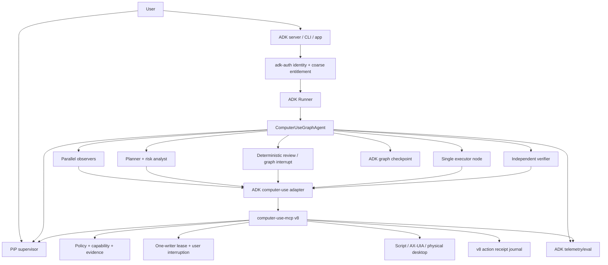

# ADK-Rust reference integration for computer-use-mcp v8

**Status:** Developer preview implemented; live cross-platform release evidence remains gated

**Research date:** 2026-07-13

**computer-use-mcp baseline:** v7.0.0 at `e199e41`

**ADK-Rust baseline:** local 2.0.0 development line at `eb68263e`, 126 commits after public tag `v1.0.0`; public crates/docs remain at 1.0.0 as of the research date

**Implementation update (2026-07-13):** `adk-computer-use` now ships the real
parallel-observe → preview → approval interrupt → sole executor → verify graph,
target reservations, receipt replay, cancellation ordering, verified
principal/tenant binding, typed v8 contracts, a live MCP example, and safety
evaluation. Pre-effect and post-commit crash points are separately injected and
prove exactly one physical mutation across retry. `adk-tool` preserves
structured text and real MCP image blocks. A canonical Rust-verified evaluation
receipt binds 15 executed tests, 8 named assertions, 12 source files, output and
source digests, two crash points, zero duplicate mutations, auth binding, and
multimodal evidence. ADK CI regenerates and uploads the receipt. The v8 release
evaluator accepts it only when a trusted release authority signs an `adk_graph`
statement over its digest; CI output cannot self-promote a release stage.

## Decision

Make ADK-Rust a major, first-party **reference orchestrator** for v8, but do not make it a required dependency of the computer-use safety kernel.

The division of responsibility should be explicit:

| Layer | Owns |
|---|---|
| `computer-use-mcp` v8 | Desktop capability truth, execution modes, policy decision, target evidence, leases, physical-user interruption, idempotent mutation, verification, and supervisor events. |
| ADK-Rust reference runtime | Reasoning, graph routing, multi-agent planning, durable workflow state, human review nodes, model/provider choice, identity propagation, telemetry, and evaluation. |
| PiP supervisor | Human-visible plan/action state, evidence preview, approval, pause, takeover, and stop. It is a client of both event streams, not the owner of policy. |

This makes the showcase credible. ADK-Rust proves that a sophisticated agent can use v8; v8 remains usable from Codex, Claude, Gemini, LangGraph, a custom host, or direct SDK code.

The provider boundary is now independently exercised outside ADK-Rust as
well: OpenAI, Anthropic, Gemini, and MCP wire actions converge on the same v8
action digest, while a packaged LangGraph-compatible node demonstrates the
same checkpoint-before-review and receipt-aware resume rules as the Rust
reference graph. This is intentional evidence that ADK-Rust is the flagship
orchestrator, not a privileged path around the v8 kernel.

The graph may now choose a host-supplied DOM/CDP `BrowserBridge` as another v8
actuator. ADK observers contribute browser-page evidence, but the executor must
still use the sole mutation node and the same preview, domain policy, review,
lease, receipt, and verification path. The bridge is never exposed as a raw MCP
tool, so a planner or specialist cannot bypass the executor by selecting it
directly; desktop and browser work remain one auditable action stream.

## Why ADK-Rust is a strong fit

The local framework already implements most orchestration primitives the reference application needs:

| v8 need | Implemented ADK-Rust primitive | Assessment |
|---|---|---|
| Stateful workflow | `adk-graph::GraphAgent`, conditional edges, cycles, reducers, fan-out/fan-in, deferred nodes | Strong fit. Use the graph as the authoritative orchestration topology. |
| Durable pause/resume | `Checkpointer`, SQLite checkpointer, `Interrupt`, `update_state`, resume, stream `Resumed` events | Strong foundation, subject to side-effect replay protection described below. |
| Parallel specialists | `ParallelAgent`, graph super-steps, `SharedState` | Useful for concurrent observation and planning. Never allow parallel agents to bypass the v8 mutation lease. |
| Deterministic stages | `SequentialAgent`, `ConditionalAgent`, `LoopAgent` with iteration bounds | Good for simple pipelines; use graph workflows for durable computer-use flows. |
| MCP client | `McpToolset`, stdio/HTTP support, reconnect, tool filtering, structured output schemas, elicitation | Good starting point, but needs a computer-use-specific multimodal and identity bridge. |
| User approval | Graph interrupts plus MCP form/URL elicitation | Directly maps to preview/approval/resume. Approval remains enforced by v8 policy. |
| Cancellation | `Runner::interrupt(session_id)` and per-session `CancellationToken` | Map immediately to `stop_session`/lease revocation; cancellation of reasoning alone is insufficient. |
| Identity and authorization | `adk-auth` JWT/OIDC/SSO, RBAC, scopes, auth bridge, audit sinks | Valuable enterprise layer, but current permissions are primarily agent/tool-name based and must be extended with v8 operation context. |
| Durable sessions | `adk-session` backends and encrypted sessions | Use for conversation/workflow state, not as a replacement for the v8 execution journal. |
| Observability | `adk-telemetry`, OpenTelemetry, SQLite traces | Map graph, agent, tool, v8 session/action, and lease IDs into one trace. Apply screenshot/secret redaction first. |
| Evaluation | `adk-eval` trajectory, rubric, trace, regression, latency/cost, and CI reports | Use for end-to-end task quality; v8’s deterministic safety corpus remains a separate release gate. |
| Provider choice | Gemini, OpenAI, Anthropic, local and OpenAI-compatible model adapters | Demonstrates that v8’s execution guarantees are independent of the planner model. |
| Distributed agents | A2A server/client and ACP integration | Useful after local one-writer correctness; remote agents may plan but do not receive direct desktop mutation authority. |

ADK-Rust’s public repository documents the stable 1.0.0 surface and the same core agent, graph, auth, MCP, session, telemetry, and evaluation direction. The 2.0.0 APIs in this document are development targets until published and semver-stabilized. [ADK-Rust repository](https://github.com/zavora-ai/adk-rust) [adk-graph documentation](https://docs.rs/adk-graph/latest/adk_graph/) [adk-auth documentation](https://docs.rs/adk-auth/latest/adk_auth/)

Targeted local validation with all features enabled passed **381 tests** across `adk-graph` and `adk-auth` (including 22 executed graph doctests), with zero failures. This validates the current graph/auth foundation, not the proposed computer-use bridge or exactly-once protocol; those require new cross-repository tests.

## Architecture



### The reference product

Create a separately packaged example/application, tentatively:

```text
integrations/adk-rust/
  computer-use-adk/             # reusable Rust adapter crate
  computer-use-agent/           # reference GraphAgent application
  computer-use-evals/           # task corpus and graders
  workflows/                    # serializable graph definitions
  policy/                       # example roles/scopes/policy mappings
```

The reusable adapter belongs in ADK-Rust or a small integration repository if cross-repository release coordination becomes painful. The `computer-use-mcp` repository should retain the protocol contract, conformance fixtures, reference policy, and launch documentation.

## Reference graph

The flagship workflow should be a graph, not a free-running LLM loop:

```mermaid
flowchart LR
  START --> DISCOVER["Discover capabilities"]
  DISCOVER --> OBSERVE["Observe once"]
  OBSERVE --> FAN["Parallel analysis"]
  FAN --> VIS["Visual analyst"]
  FAN --> SEM["AX/UIA analyst"]
  FAN --> CAP["Background-capability analyst"]
  VIS --> JOIN["Merge evidence"]
  SEM --> JOIN
  CAP --> JOIN
  JOIN --> PLAN["Planner"]
  PLAN --> PREVIEW["preview_action"]
  PREVIEW --> ROUTE{"Policy / mode result"}
  ROUTE -->|"allowed"| LEASE["Acquire or queue lease"]
  ROUTE -->|"approval required"| HITL["Graph interrupt + PiP approval"]
  ROUTE -->|"foreground required"| MODE["Ask user or replan"]
  ROUTE -->|"denied"| REPLAN["Bounded replan"]
  HITL --> LEASE
  MODE --> LEASE
  REPLAN --> PLAN
  LEASE --> EXEC["execute_action with action_id"]
  EXEC --> VERIFY["Independent postcondition verifier"]
  VERIFY --> DONE{"Satisfied?"}
  DONE -->|"yes"| END
  DONE -->|"recoverable"| REPLAN
  DONE -->|"unsafe / budget exhausted"| STOP["Stop with evidence"]
```



Only `EXEC` may request a mutating v8 operation. Every other node receives a filtered observation/preview toolset. This is defense in depth: model instructions, ADK tool filtering, `adk-auth`, and v8 policy all agree that planning agents cannot mutate.

### Agent roles

| Agent/node | Tools | Concurrency | Output |
|---|---|---|---|
| Capability scout | `get_execution_capabilities`, app/window discovery | Parallel/read-only | Candidate backends and interference levels. |
| Visual analyst | snapshot/zoom/evidence read | Parallel/read-only | Candidate targets grounded to observation IDs. |
| Semantic analyst | UI tree/find/read operations | Parallel/read-only | Roles, labels, bounds, and semantic action candidates. |
| Planner | No direct mutation; `preview_action` only | Single after fan-in | Ordered actions with postconditions, budgets, and fallback boundaries. |
| Risk reviewer | Policy preview and untrusted-content signals | Parallel with planner validation | Approval recommendation; never grants approval itself. |
| Executor | `execute_action`, lease/session control | Exactly one mutation node per desktop | Signed/hashed execution receipt. |
| Verifier | Fresh observation and postcondition tools | Read-only after execution | Pass, bounded replan, or terminal failure. |

Do not assign one sub-agent per low-level tool. Specialize by reasoning responsibility and restrict the tool surface.

## Identity and authorization with adk-auth

`adk-auth` should provide authenticated principal identity and coarse entitlement; the v8 policy engine should decide the context-sensitive desktop operation.

Recommended scopes:

```text
computer:observe
computer:plan
computer:execute:background
computer:execute:foreground
computer:approve
computer:takeover
computer:remote
computer:audit:read
```

Recommended role examples:

| Role | Typical grants | Explicit restrictions |
|---|---|---|
| `viewer` | observe, plan | No execution or approval. |
| `operator` | observe, background execution, request foreground | Cannot approve its own sensitive action. |
| `approver` | review evidence and approve scoped action envelopes | No automatic desktop mutation. |
| `owner` | configure policy, takeover, emergency stop, audit access | Still subject to hard platform and secret-safety rules. |
| `remote_operator` | scoped remote observation/steering | No foreground execution unless host user grants a short-lived capability. |

### Required auth bridge work

Current `Permission` variants cover a named tool, all tools, a named agent, or all agents. Current `ScopeGuard` checks static scopes declared by the tool. That is not sufficient to distinguish `execute_action` observing a window from sending a message, deleting a file, or typing into a password field.

Add an operation-aware authorization callback at the adapter boundary:

```rust
pub struct ComputerUseAuthContext {
    pub principal_id: String,
    pub tenant_id: Option<String>,
    pub session_id: String,
    pub execution_group_id: String,
    pub requested_mode: ExecutionMode,
    pub action_class: ActionClass,
    pub target_app: Option<String>,
    pub target_window: Option<String>,
    pub policy_digest: String,
}
```

The adapter forwards identity and granted scopes; v8 re-evaluates the exact action envelope. Never translate `computer:execute:foreground` into a blanket approval token. Approval grants must bind to the action digest, active policy digest, target, maximum risk, mode, expiry, and principal. ADK graph resume checks both digests before lease acquisition; v8 checks them again before execution.

For local stdio, obtain principal identity from the launching host or explicit configuration. Do not accept a model-supplied `principal_id` as authenticated identity. For HTTP, use the ADK JWT request context and the v8 remote sidecar’s authorization context; require the two identities to match or have an explicit delegation chain.

## MCP and multimodal bridge requirements

The generic `McpToolset` preserves input/output schemas and structured content, supports filtering, reconnect, and elicitation. It does not yet preserve computer-use results with sufficient fidelity:

1. When structured content exists, the wrapper returns `{ "output": structured }` and drops adjacent image content.
2. Without structured content, image results become a text marker containing byte count and MIME type rather than model-visible image data.
3. MCP annotations are not retained as a complete ADK-side capability object.
4. The current experimental task path infers long-running behavior and models task polling through tool calls; do not make v8 correctness depend on it until tested against the selected MCP specification and server implementation.

Implement `ComputerUseMcpToolset` or generalize ADK’s tool-result type so it preserves:

- `structuredContent` as typed JSON;
- every image as inline multimodal content or an `adk-artifact` handle with MIME type and hash;
- resource links and evidence IDs;
- MCP `_meta`, tool annotations, and output schema where policy/scheduling needs them;
- cancellation and progress notifications;
- elicitation metadata including action/approval digest;
- v8 supervisor events without polling screenshots continuously.

The adapter should expose the v8 high-level facade to planners by default. Low-level coordinate tools belong only in a recovery profile and still traverse the v8 transaction path.

## Exactly-once physical effects

Graph checkpointing is necessary but not sufficient. Consider a crash after `execute_action` changes the desktop but before ADK saves the next graph checkpoint. On resume, the graph may call the action again.

v8 must implement an idempotency/receipt protocol below ADK:

```rust
pub struct ExecutionRequest {
    pub session_id: String,
    pub action_id: String,
    pub attempt: u32,
    pub action_digest: String,
    pub expected_observation_id: String,
}

pub enum ExecutionReceiptStatus {
    Committed,
    Rejected,
    Interrupted,
    Indeterminate,
}
```

Rules:

- The same `(session_id, action_id, action_digest)` returns the original receipt and never repeats the physical action.
- Reuse of an `action_id` with a different digest is rejected.
- The receipt is durably committed at the closest possible boundary to execution.
- An `indeterminate` outcome never auto-retries a physical or externally consequential action; the graph routes to fresh observation and human review.
- ADK stores the v8 receipt ID in graph state. v8 stores the ADK thread/checkpoint correlation in its event journal.

This protocol is a prerequisite for durable resume, reconnect, remote steering, and multi-agent queues.

## Cancellation and takeover mapping

Cancellation must propagate in both directions:

| Trigger | ADK action | v8 action |
|---|---|---|
| PiP pause | Interrupt/park graph at a safe boundary | Revoke lease and stop pending mutation first. |
| PiP emergency stop | Cancel runner session | Native emergency stop and lease revocation; do not wait for graph shutdown. |
| Physical user input | Record interruption and route graph to `paused_by_user` | Revoke cooperative/foreground lease immediately. |
| ADK timeout/cancellation | Stop graph/tool future | Abort v8 action/session and wait for terminal receipt. |
| MCP disconnect | Park graph and checkpoint | Expire lease; recovered session remains paused. |
| User takeover | Interrupt graph, checkpoint intent/evidence | Return foreground control and restoration status. |

The v8 stop path is authoritative because it is closest to injected input. `Runner::interrupt` stops future reasoning/events but cannot by itself guarantee that native actuation has stopped.

## Showcase workflows

### 1. Non-invasive report assembly

Goal: demonstrate honest background execution.

1. Parallel observers inspect a source app and a document app.
2. Capability scout proves the selected read/write operations are background-safe.
3. Planner produces a preview with `interference: none`.
4. Executor writes through scripting or semantic APIs while the user continues working elsewhere.
5. Verifier reads back the result and the PiP shows evidence without obtaining desktop-control permission.

Success: zero focus changes, physical pointer movement, injected keystrokes, or foreground app changes.

### 2. Supervised cross-app workflow

Goal: demonstrate mixed background and foreground work.

Build a report from local data, update a native spreadsheet, attach/export it, and prepare an outbound message. Background-safe preparation runs automatically. The send step creates a graph interrupt and MCP elicitation; PiP shows the exact target, recipients, attachment hash, and proposed effect. Approval is action-bound, then v8 executes once and verifies the sent state.

Success: approval cannot be reused for a changed recipient, attachment, app, or action digest.

### 3. Multi-agent desktop team

Goal: demonstrate an open alternative to product-managed multi-agent modes.

Run visual, semantic, capability, and risk agents concurrently. They share immutable observations and proposals. Two proposed mutations enter the v8 lease queue; only the executor node receives mutation authority. Show conflict detection when agents target the same document and deterministic queue cancellation after replanning.

Success: no simultaneous desktop mutations and no duplicate action after retry/reconnect.

### 4. Takeover, recovery, and durable resume

Goal: demonstrate safe coexistence under failure.

Interrupt a running workflow with real user input, take over in PiP, modify the target, then resume. The graph loads its checkpoint, v8 reports stale evidence, and the planner re-observes instead of replaying the old action. Repeat with process restart immediately after a committed action.

Success: no automatic physical input after restart, no stale-coordinate click, and no replay of the committed action.

### 5. Enterprise least-privilege scenario

Goal: demonstrate `adk-auth` plus v8 policy.

Authenticate an operator and separate approver through OIDC. The operator may observe and execute certified background actions but cannot approve an external communication. The approver receives redacted evidence and grants a short-lived action-bound approval. Audit output correlates tenant, principal, ADK graph, v8 session/action, policy decision, and receipt without secret content.

Success: self-approval, tenant crossover, expired grants, and model-supplied identity all fail closed.

## Evaluation plan

Use two complementary suites:

### Deterministic v8 conformance

- execution-mode purity;
- lease mutual exclusion and fairness;
- physical-input interruption latency;
- stale-target rejection;
- idempotency/replay races;
- auth identity binding and action-bound grants;
- secret and screenshot retention rules;
- supervisor control latency.

### ADK end-to-end agent evaluation

- task completion and semantic correctness;
- action trajectory quality and redundant-loop detection;
- plan-to-action consistency;
- correct routing to background, foreground, approval, replan, or stop;
- recovery from focus failure, stale evidence, disconnect, and user takeover;
- model/provider comparison using the same graph and v8 runtime;
- token, latency, cost, and observation-reuse efficiency.

Every evaluation record should include:

```text
adk_session_id
adk_invocation_id
adk_graph_thread_id
adk_checkpoint_id
v8_session_id
execution_group_id
principal_id
agent_id
action_id
receipt_id
observation_id
policy_digest
trace_id
```

Publish aggregate results, sanitized traces, workflow definitions, and failure taxonomy. Never publish raw desktop screenshots from contributors’ machines.

## Landed alpha implementation

The local ADK-Rust 2.0 development line now contains the first-party
`adk-computer-use` crate and a live MCP adapter. The deterministic reference
graph performs parallel capability/visual/semantic observation, joins once,
previews before mutation, reserves the target, acquires one bounded lease, and
has one executor node. Approval resumes revalidate both action and policy
digests. Cancellation revokes v8 authority before interrupting ADK, committed
receipts prevent duplicate effects after checkpoint failure, and `adk-eval`
checks the resulting trajectory.

The adapter also preserves multimodal MCP content, derives tenant/principal
identity from verified `adk-auth` context, correlates ADK and v8 traces, and
exposes typed authenticated terminal deletion/pruning. Canonical Rust/TypeScript
fixtures cover actions, leases, reservations, receipts, events, completion,
deletion, multimodal results, and the deterministic safety corpus. This is an
implemented alpha boundary; published semver stabilization and live platform
certification remain release gates.

The v8 server now includes an explicitly opt-in MCP Tasks adapter validated
against the selected SDK task protocol. It projects `working`,
`input_required`, completion, failure, and cancellation from the authoritative
v8 session state; task cancellation stops the v8 session and revokes its lease.
The internal lifecycle remains independent of this experimental wire format.

Remote hosts can project the same graph through the separately packaged
Streamable HTTP sidecar. `adk-auth` identity becomes the immutable v8 principal,
remote tool scopes are checked before graph/tool execution, and authorization
loss invokes `RuntimeCoordinator.suspendPrincipal` before ADK cancellation or
retry. Follow-up steering is consumed through the monotonic `get_follow_ups`
cursor rather than injected into an in-flight tool call.

## Required implementation work

### In computer-use-mcp

1. Finish v8 action/session/lease/event contracts.
2. Add durable action idempotency and execution receipts.
3. Expose supervisor event subscription through local IPC and authenticated transport.
4. Accept authenticated principal/delegation context from approved host adapters.
5. Provide a deterministic fake desktop and conformance fixtures consumable from Rust.

### In ADK-Rust

1. Add a multimodal MCP result path or the specialized `ComputerUseMcpToolset`.
2. Preserve v8 structured output, image/artifact evidence, annotations, `_meta`, progress, and cancellation.
3. Add operation-aware authorization context that complements current tool-name RBAC/scopes.
4. Add a graph-to-v8 cancellation bridge and supervisor event adapter.
5. Add execution-receipt-aware graph nodes and retry rules.
6. Keep the validated MCP Tasks bridge pinned to the selected experimental specification and test ADK task-client compatibility on every SDK upgrade.
7. Add computer-use trajectory evaluators and sensitive-content-safe telemetry defaults.

### Cross-repository contract

Maintain versioned fixtures for:

- action envelope and execution capability;
- policy preview/decision;
- target evidence;
- lease lifecycle;
- session/supervisor event;
- approval elicitation;
- execution receipt;
- errors including `foreground_required`, `stale_target`, `lease_conflict`, `interrupted`, and `indeterminate`.

CI runs the ADK contract/evaluation producer and uploads its digest-bearing
receipt. A live adapter matrix against the current v8 server and a pinned prior
stable server remains required before release; breaking either side requires an
explicit compatibility note.

## Phased delivery

| Phase | Deliverable | Exit evidence |
|---|---|---|
| A: contract spike | Rust client generated/implemented for `preview_action`, `execute_action`, events, and receipts; fake desktop only | Multimodal evidence round-trip and no duplicate mutation under injected crash. |
| B: graph reference | Flagship graph with observers, planner, interrupt, executor, verifier, and local checkpointing | Deterministic scenarios pass without a live model. |
| C: live desktop alpha | PiP-connected macOS and Windows workflows with one certified background adapter each | Background purity and physical-user interruption gates pass. |
| D: multi-agent beta | Parallel observers/planners, shared evidence, lease queue, conflict tests | Ten concurrent planners cannot produce concurrent or duplicate physical mutations. |
| E: auth/eval beta | OIDC roles/scopes, action-bound approvals, audit correlation, provider matrix | Least-privilege and tenant-isolation suite passes; sanitized public benchmark produced. |

Phases A–C belong on the v8.0 critical path if ADK-Rust is part of the launch story. Phases D–E can mature through v8.1–v8.2.

## Go/no-go for calling ADK-Rust a major v8 integration

Do not market the integration as “full computer use” until:

- screenshots and other visual evidence reach vision-capable agents without lossy text placeholders;
- graph resume cannot replay a committed desktop/external side effect;
- ADK cancellation reliably triggers v8 lease revocation and terminal action state;
- `adk-auth` identity is bound to v8 principal/action context and cannot be supplied by the model;
- parallel agents can observe concurrently but cannot mutate outside the one-writer lease;
- PiP approval resumes the exact interrupted graph/action, not a newly generated unbound action;
- at least one macOS and one Windows workflow pass background-purity, takeover, crash-resume, and auth tests;
- the example runs on a published, pinned ADK-Rust release or clearly labels a development dependency.

## Research sources

- Local ADK-Rust repository: `AGENTS.md`, `Cargo.toml`, `README.md`, `adk-agent/src/workflow/*`, `adk-graph/src/*`, `adk-graph/tests/*`, `adk-auth/src/*`, `adk-auth/tests/*`, `adk-tool/src/mcp/*`, `adk-runner/src/runner.rs`, `adk-session`, `adk-telemetry`, `adk-eval`, and relevant examples at `eb68263e`.
- [ADK-Rust repository](https://github.com/zavora-ai/adk-rust)
- [adk-graph public documentation](https://docs.rs/adk-graph/latest/adk_graph/)
- [adk-auth public documentation](https://docs.rs/adk-auth/latest/adk_auth/)
- [Model Context Protocol specification](https://modelcontextprotocol.io/specification/2025-11-25)
