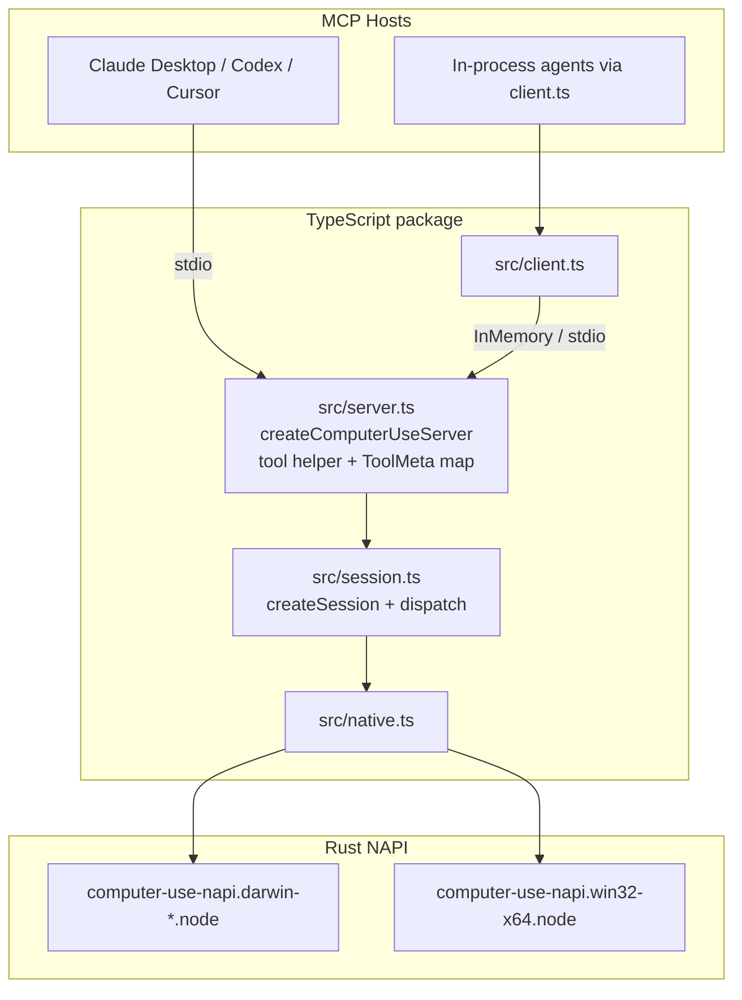
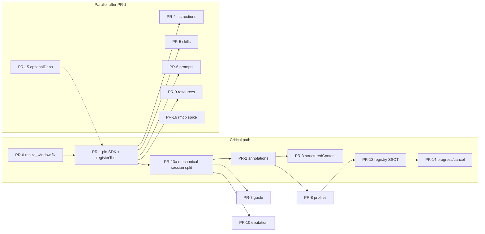
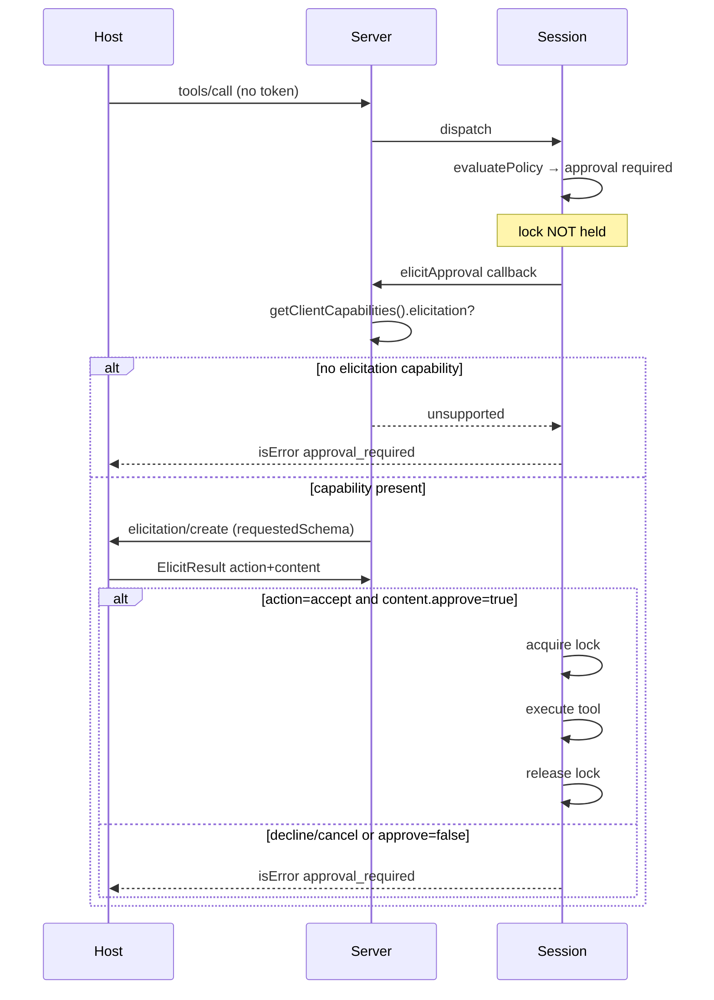
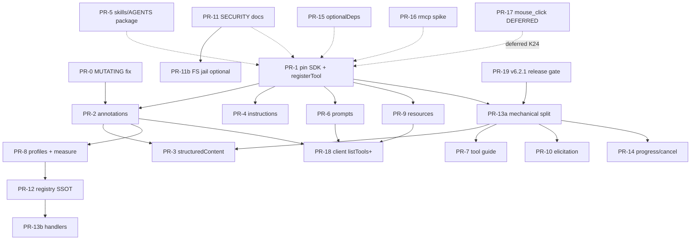

# computer-use-mcp Modernization Plan (v6.2 → v7)

| Field | Value |
|-------|--------|
| **Title** | `@zavora-ai/computer-use-mcp` Protocol & Architecture Modernization |
| **Author** | TBD (Zavora / maintainers) |
| **Date** | 2026-07-10 |
| **Status** | **Revision 3 — implementation in progress; completion plan below is authoritative** |
| **Current version** | 6.2.1 (`package.json`) |
| **Target versions** | v6.2 → v6.3 → v6.4 → v7.0 |
| **Primary distribution** | npm + stdio MCP (`npx @zavora-ai/computer-use-mcp`) |
| **Tool count** | **64** MCP tools, registered through `registerTool` |

---

## Overview

`@zavora-ai/computer-use-mcp` is a production MCP server + TypeScript client for cross-platform desktop control (macOS + Windows). `src/server.ts` registers **64 tools** on `@modelcontextprotocol/sdk`’s `McpServer`; `src/session.ts` (currently ~3458 LOC) owns policy, lock/pump, focus, and a giant `dispatch` switch; `src/native.ts` loads platform-specific Rust NAPI binaries; `src/client.ts` wraps the MCP client with typed helpers.

The product is feature-rich (AX/UIA, scripting, spaces, filesystem, snapshot, OpenAI computer adapter, policy/audit) and now exposes modern MCP surfaces: annotations, priority `structuredContent`/`outputSchema`, instructions, prompts, resources, profiles, and elicitation. The remaining protocol work is compatibility verification and cancellation/progress. The remaining architecture work is to replace the parallel catalog, inline schemas, and dispatcher with a true registry.

**SDK note:** the package pins `@modelcontextprotocol/sdk` to exact `1.29.0` (no caret) and uses `registerTool`. Resolved in v6.2.1 per K11 — release builds use an exact tested SDK version rather than a caret range.

This design is an **incremental, PR-ordered modernization**: ship protocol correctness first, then reduce the session/registry maintenance burden and harden packaging/security. The TypeScript/N-API server remains the product; rmcp is a bounded evaluation, not a rewrite commitment.

## Implementation Status and Completion Gates (2026-07-10)

The branch has already shipped work originally scheduled across v6.2–v6.4: `registerTool`, catalog-derived annotations and `MUTATING_TOOLS`, priority structured results/output schemas, server instructions, skills, prompts, profiles, resources, approval elicitation, client discovery methods, and the native virtual-pointer overlay. Protocol-level verification confirms 64 tools, 4 prompts, and 6 resources register and can be called.

| Area | State | Required completion evidence |
|---|---|---|
| MCP registration, annotations, priority schemas | Implemented | SDK integration tests cover annotations, text/structured equality, and every output-schema success path |
| `COMPUTER_USE_STRUCTURED_CONTENT=false` | Resolved (v6.2.1) | Both `outputSchema` **and** `structuredContent` are now omitted when disabled; positive + negative tests added (`test/v6.2-modernization.test.mjs`) |
| SDK dependency | Resolved (v6.2.1) | Pinned to exact `1.29.0` in `package.json` (K11); CHANGELOG/spec wording reconciled |
| Prompts, resources, profiles, elicitation, skills | Resolved (v6.2.1) | Regression coverage added in `test/v6.2-regression.test.mjs`: all profile tiers + nesting, all six resource reads incl. `screenshot/latest` cache-only (K15), and elicitation accept/decline/timeout + token-wins (K13) |
| Session split | In progress (v7.0) | Four modules extracted verbatim into `src/session/` (`tool-guide`, `fs-jail`, `scripting-dictionary`, `spawn`); `session.ts` re-exports (3184 LOC, down from ~3458). The dispatch switch + closure-bound domains (lock-pump/policy/focus/doctor) remain in `session.ts` — a larger dependency-injection refactor, deferred to avoid destabilizing the green 7.0.0 release |
| Registry SSOT | Partial | One definition owns name, input schema, output schema, metadata, profile, description, and handler routing |
| CI/release assurance | Resolved (v6.2.1) | macOS + Windows CI run the full Node suite; native build matrix; package-content assertion job; stdio protocol smoke included in the suite |
| Filesystem containment | Implemented (opt-in) | `COMPUTER_USE_FS_ROOTS` jail in `src/session/fs-jail.ts`; `realpath`/symlink/`..` escape tests in `test/fs-jail.test.mjs` prove no root escape; unset = legacy |
| rmcp | Evaluated — **NO-GO** | Desk parity evaluation + go/no-go recorded in `docs/specs/SPIKE-rmcp.md`; keep TS/NAPI (no perf win, would lose in-process transport + typed TS client). No production rewrite. |

---

## Background & Motivation

### Current architecture (verified)



| Layer | File(s) | Role today |
|-------|---------|------------|
| MCP registration | `src/server.ts` | Local `tool()` registers through `registerTool`, reads catalog metadata, appends focus tag, injects `approval_token` on mutators; **`get_tool_metadata` is server-local** |
| Session | `src/session.ts` | Policy (`COMPUTER_USE_*`), audit, session lock + runloop pump, focus strategies, `MUTATING_TOOLS`, full `dispatch` switch, tool guide table, doctor, FS/registry/process |
| Client | `src/client.ts` | Typed convenience for all 64 tools; discovery methods surface tool annotations/schemas plus resources/prompts; `ToolResult` includes `structuredContent` |
| Native | `src/native.ts` + `native/src/*` | Platform matrix: darwin-arm64, darwin-x64, win32-x64; hard fail if binary missing |
| Packaging | `package.json` `files` | Ships platform `.node` files, `AGENTS.md`, and skills from the package root; still lacks optional platform packages |
| Docs | `README.md`, `AGENTS.md`, `skills/**` | Agent playbook + setup, now shipped in npm; PR-19 verifies packed contents |
| Specs | `docs/specs/SPEC-v{3,4,6}.md` | Historical product specs |
| Tests | `test/*.test.mjs` | Strong unit/session coverage; Windows prebuilds not clearly CI-gated |

### Pain points

1. **Compatibility gap** — the structured-content opt-out advertises legacy behavior but still emits `structuredContent`; fix and test before release.
2. **Description + schema tax** — 64 tools with long descriptions and large Zod→JSON Schemas dominate context. Profiles are implemented; measure full `tools/list` bytes/tokens and publish the result.
3. **Partial registry** — metadata and lock membership derive from `TOOL_CATALOG`, fixing the prior `resize_window` drift, but schemas/descriptions/handlers remain duplicated in server/session. PR-12 is the permanent fix.
4. **Session monolith** — the ~3458-line `session.ts` mixes lock/pump, policy, doctor, guide, AX, scripting, spaces, FS, registry, scrape, and multi-select. Split it mechanically before more session changes.
5. **Security defaults** — approval, Windows documentation, and filesystem residual-risk documentation are implemented; unrestricted absolute paths remain by design until an optional jail is adopted.
6. **Packaging** — root-binary packaging remains large and lacks optionalDependencies; package-content verification is also not CI-gated.
7. **Release confidence** — CI does not run the full suite on both supported platforms or gate the newly added protocol features.

### What is already strong (preserve)

- Focus model (`strict` / `best_effort` / `none` / `prepare_display`) and recovery payloads
- Session lock + drainRunloop pump (macOS)
- Tool priority culture (scripting → AX → coordinates) in AGENTS.md and `get_tool_guide`
- Cross-platform native performance (Rust NAPI)
- Policy/audit hooks and `doctor`
- OpenAI computer-use adapter (`openai_computer`)
- Full typed client surface for all 64 tools

---

## Goals & Non-Goals

### Goals

1. **Modern MCP compliance** for tools: annotations, `structuredContent` with matching `outputSchema` rules, server instructions, profile-filtered tool lists.
2. **Better agent UX**: skills playbooks (in npm package), MCP prompts, resources for common desktop state, improved guide.
3. **Security hardening**: safer docs/defaults for destructive modes, elicitation path for interactive approval, SECURITY.md Windows + 6.x/7.x, explicit FS residual risk (optional jail).
4. **Maintainability**: early mechanical session split to cut thrash; single tool registry; packaging via optionalDependencies.
5. **Backward compatibility**: same tool names and primary argument shapes; default profile remains `full`; existing JSON-in-text responses remain for at least one minor line.

### Non-Goals

- Full rewrite of the server in Rust/rmcp (evaluate only in v7).
- Removing coordinate tools or consolidating clicks **as a required breaking change** (optional later).
- Changing focus strategy semantics or dropping `approval_token`.
- Supporting Linux desktop automation.
- Adding a network-facing transport (stdio remains primary).
- Replacing Zod or the NAPI native layer.
- Runtime profile hot-reload in v6.4 (init-time profile only; see profiles section).

---

## Proposed Design

### Version roadmap

| Version | Theme | Merge bar |
|---------|--------|-----------|
| **v6.2.1** | Release completion | Fix structured-content opt-out; reconcile SDK pin wording/version; full CI and package gates; changelog/spec correction |
| **v6.3** | Maintainability | Mechanical session split; guide tests; finish documentation/skill packaging hygiene |
| **v6.4** | Security + registry transition | Filesystem jail decision; approval/resource/profile hardening; migrate registration to a unified registry |
| **v7.0** | Architecture finish | Finish handlers, optionalDeps natives, cancellation/progress, and an rmcp parity spike report |

**Theme phases (not a serial schedule).** Independent work after SDK pin runs in parallel per the PR DAG (skills, resources, optionalDeps, rmcp spike). Critical path:



---

### P1 — Modern MCP protocol features

#### 1. Tool annotations from `ToolMeta`

Today (`src/server.ts`):

```typescript
export interface ToolMeta {
  focusRequired: FocusRequired  // scripting | ax | cgevent | none
  mutates: boolean
  requiresFocus: boolean
  movesUserCursor: boolean
  usesVirtualPointer: boolean
  physicalInput: boolean
}
```

**Derivation rules (defaults):**

| MCP annotation | Default derivation |
|----------------|--------------------|
| `readOnlyHint` | `!meta.mutates` |
| `destructiveHint` | Conservative static: `true` if tool is always or *any-mode* destructive (`run_script`, `process_kill`, `filesystem`, `registry`). Else `false`. Align with shared `isDestructiveTool` for policy (runtime can still be mode-aware). |
| `idempotentHint` | `!meta.mutates` **except** `wait` → `false` (elapsed time is a side effect). |
| `openWorldHint` | Explicit per-tool: `true` for `scrape`, `run_script`, `open_application`, `openai_computer`; else `false`. |

Multi-mode tools (`filesystem`, `process_kill`, `registry`) keep **static** `readOnlyHint: false` and `destructiveHint: true` even for list/read modes—hosts may over-warn on reads; that is intentional until mode-split tools exist.

**Authoritative per-tool table:** [Appendix A](#appendix-a--per-tool-annotations-all-64-tools).

**Custom fields** under MCP `_meta`:

```typescript
_meta: {
  'computer-use/focusRequired': meta.focusRequired,
  'computer-use/requiresFocus': meta.requiresFocus,
  'computer-use/movesUserCursor': meta.movesUserCursor,
  'computer-use/usesVirtualPointer': meta.usesVirtualPointer,
  'computer-use/physicalInput': meta.physicalInput,
  'computer-use/profiles': meta.profiles,  // v6.4
}
```

Kept the `[focusRequired: X]` description suffix through v6.x; **deprecated in v7** — off by default, opt back in with `COMPUTER_USE_LEGACY_FOCUS_TAG=true` (or `legacyFocusTag: true`). `focusRequired` remains in `_meta` and `get_tool_metadata`.

**Implementation** — migrate to `registerTool` (SDK 1.29; `server.tool()` is deprecated but still accepts annotations):

```typescript
server.registerTool(name, {
  description: tagged,
  inputSchema,
  // outputSchema: ONLY when handler always emits structuredContent on success
  annotations: toMcpAnnotations(meta),
  _meta: toComputerUseMeta(meta),
}, async (args, extra) => {
  const result = await session.dispatch(name, args)
  return mapToolResult(result)
})
```

#### 2. `structuredContent` + `outputSchema`

**Extend `ToolResult`:**

```typescript
export interface ToolResult {
  content: Array<
    | { type: 'text'; text: string }
    | { type: 'image'; data: string; mimeType: string }
  >
  /** JSON object only — never use for image-only success paths unless schema allows */
  structuredContent?: Record<string, unknown>
  isError?: boolean
}
```

**Critical SDK rule (1.29 `validateToolOutput`):**  
If `outputSchema` is registered and the result is **not** `isError`, missing `structuredContent` **throws at runtime**.  

**Hard rule for this project:**

1. **Never attach `outputSchema` until the handler always emits conforming `structuredContent` on every successful path.**
2. When `COMPUTER_USE_STRUCTURED_CONTENT=false`, omit **both** `outputSchema` advertisement and the `structuredContent` field (legacy text-only).
3. Add schemas **tool-by-tool** after converting that tool to `okJson` / dual-write.
4. Image-heavy tools (`screenshot`, `zoom`, vision `snapshot`): no `outputSchema` in v6.2; images stay in `content`. Optional later metadata object only if always present alongside images.
5. `okJson` dual-writes the **same** object to text and `structuredContent` (K5). Objects that already match wire stay as-is; top-level arrays/scalars use explicit wraps (K21) — see Appendix C.

**v6.2 priority tools — concrete Zod contracts** (see [Appendix C](#appendix-c--zod-output-contracts-v62-priority-tools)):

Class A (preserve wire): `doctor`, `policy_status`, `get_tool_guide`, `get_tool_metadata`, `get_app_capabilities`, `get_window`, `list_spaces`, policy errors.  
Class B (wrap + CHANGELOG break): `list_windows`, `get_frontmost_app`, `get_active_space`.

**Guide versioning (PR-7):** always keep `approach`, `toolSequence`, `explanation`, `bundleIdHints?`. New fields (`confidence`, `fallbackSequence`, `platform`) are **additive optional**.

**Client:** surface `structuredContent`; extend `listTools()` to pass through `annotations`, `_meta`, `inputSchema`, `outputSchema` (see API section).

#### 3. Resources (`computer://`)

| URI | MIME | Content | Notes |
|-----|------|---------|-------|
| `computer://display/main` | `application/json` | main display metrics | read-only |
| `computer://displays` | `application/json` | all displays | |
| `computer://windows` | `application/json` | on-screen windows | optional query later |
| `computer://frontmost` | `application/json` | frontmost app | |
| `computer://screenshot/latest` | image/* or empty JSON | **last cached screenshot only** | **never auto-capture on read** (K15) |
| `computer://policy` | `application/json` | policy_status without secrets | |
| `computer://tool-guide` | `application/json` | static priority hierarchy summary | optional |

Implementation: `src/resources.ts` closes over session/native; no mutations.

#### 4. Prompts

| Prompt name | Purpose | Arguments |
|-------------|---------|-----------|
| `diagnose-desktop` | Doctor mindset; permissions | `platform?` |
| `fill-form` | AX-first form filling | `app`, `fields_hint?` |
| `script-first` | Prefer run_script / filesystem | `task` |
| `safe-desktop-task` | Policy-aware workflow | `task`, `risk` |

#### 5. Elicitation for approval UX (concrete control flow)

**Key Decision K13:** If `approval_token` is present and matches `COMPUTER_USE_APPROVAL_TOKEN`, **token wins** — no elicitation. Elicitation runs only when approval is required, no valid token, elicitation is enabled, and the host supports it.

**SDK 1.29 API facts (verified against `@modelcontextprotocol/sdk@1.29.0` types):**

- Low-level API: `server.server.elicitInput(params, options?) → Promise<ElicitResult>`
- Form params field is **`requestedSchema`** (not `schema`) — `ElicitRequestFormParams`
- Result is **`ElicitResult`**: `{ action: 'accept' | 'decline' | 'cancel', content?: Record<string, string | number | boolean | string[]> }`
- Client capability probe: `server.server.getClientCapabilities()?.elicitation` (absent → do not call `elicitInput`)

**Injection (avoid circular imports):**

```typescript
// SessionOptions
elicitApproval?: (ctx: {
  tool: string
  args: Record<string, unknown>
  reasons: string[]
  targetApp?: string
  destructive: boolean
}) => Promise<'approved' | 'denied' | 'timeout' | 'unsupported'>

// createComputerUseServer wires (SDK 1.29-accurate):
const ELICIT_TIMEOUT_MS = Number(process.env.COMPUTER_USE_ELICITATION_TIMEOUT_MS ?? 60_000)

createSession({
  ...,
  elicitApproval: async (ctx) => {
    if (process.env.COMPUTER_USE_ELICITATION === 'false') return 'unsupported'

    // Capability gate: missing elicitation support → unsupported (no throw)
    const caps = server.server.getClientCapabilities()
    if (!caps?.elicitation) return 'unsupported'

    try {
      // ElicitRequestFormParams: message + requestedSchema (NOT "schema")
      const result = await server.server.elicitInput(
        {
          mode: 'form', // optional; form is default
          message:
            `Allow computer-use tool "${ctx.tool}"?` +
            (ctx.targetApp ? ` target=${ctx.targetApp}` : '') +
            ` reasons=${ctx.reasons.join(',')}` +
            (ctx.destructive ? ' [destructive]' : ''),
          requestedSchema: {
            type: 'object',
            properties: {
              approve: {
                type: 'boolean',
                title: 'Approve',
                description: 'Allow this tool call',
              },
              remember_session: {
                type: 'boolean',
                title: 'Remember for session',
                description: 'Approve this tool name again until process exit',
              },
            },
            required: ['approve'],
          },
        },
        { timeout: ELICIT_TIMEOUT_MS },
      )

      // ElicitResult: { action, content? } — not a bare form object
      if (result.action !== 'accept') {
        // 'decline' | 'cancel' → denied
        return 'denied'
      }
      const approve = result.content?.approve === true
      if (!approve) return 'denied'

      if (result.content?.remember_session === true) {
        // caller (session) records tool name in in-memory Set
        // signal via a side channel or return discriminated union with remember flag
      }
      return 'approved'
    } catch {
      // timeout, transport error, or host disconnect
      return 'timeout'
    }
  },
})
```

**Optional richer return** (preferred in PR-10 so session can honor remember without globals):

```typescript
type ElicitOutcome =
  | { status: 'approved'; rememberSession?: boolean }
  | { status: 'denied' | 'timeout' | 'unsupported' }
```

Map: `action === 'accept' && content.approve === true` → `approved`;  
`action === 'decline' | 'cancel'` → `denied`;  
capability missing / env off → `unsupported`;  
throw / request timeout → `timeout`.

**Lock policy:**

1. `evaluatePolicy` runs **before** `lockPump.acquire()` (already true today for deny paths).
2. If decision is `approval: 'required'` and no valid token:
   - Call `elicitApproval` **while lock is not held**.
   - On `approved`: optionally record `remember_session` in an in-memory `Set<toolName>`, then re-run policy as approved and **then** acquire lock.
   - On `denied` / `timeout` / `unsupported`: return existing `approval_required` / `policy_denied` JSON **without** acquiring lock.
3. Never hold the cross-process session lock across a multi-second human prompt (blocks other mutators; bad UX and deadlock risk with multi-server setups).



**Timeout:** 60s default (`COMPUTER_USE_ELICITATION_TIMEOUT_MS`) via `elicitInput` request `options.timeout`. On timeout → same payload as today:

```json
{ "error": "approval_required", "reasons": [...], "remediation": ["..."] }
```

**Session-scoped remember:** in-memory only; process exit clears; never persists to disk.

#### 6. Server instructions

Exact constructor wiring (SDK 1.29 second argument `ServerOptions.instructions` — advertised on **initialize**, not as a tool):

```typescript
const server = new McpServer(
  { name: 'computer-use', version: '6.2.0' },
  {
    instructions: `Desktop computer use is a last resort. Prefer:
1) connectors/APIs  2) shell/filesystem  3) browser automation  4) this server.
On this server prefer: scripting (run_script) > accessibility (find_element/click_element/fill_form)
> coordinate tools (left_click/type). Always pass target_app or target_window_id for input.
Call get_tool_guide before screenshot-and-click loops. Use doctor on first run.
Active tool profile is controlled by COMPUTER_USE_PROFILE (default full).`,
  },
)
```

#### 7. Progress + cancellation (v7 / PR-14)

- Tool handlers use `registerTool` callback `(args, extra) => ...`.
- **Cancellation:** honor `extra.signal` (`AbortSignal` from MCP cancel / `notifications/cancelled` when the host sends it). Many stdio hosts **never** cancel — treat as best-effort.
- Thread signal into `spawnBounded` (abort → `SIGKILL` child) and `wait` (reject/return early on abort).
- **Progress:** only if `extra._meta?.progressToken` (or SDK-equivalent progress token on request) is present; emit progress notifications for long `run_script` / filesystem search. No spam if token absent.
- Session lock: already released in `dispatch` `finally` — keep that invariant on cancel.

#### 8. Tool profiles (init-time only)

**Nested inclusion (semantic):**

| Profile | Includes | Intent |
|---------|----------|--------|
| `core` | minimal observation + primary input | Small-context computer use |
| `ax` | **⊇ core** + accessibility + extra pointer/window chrome | Semantic UI automation |
| `scripting` | **⊇ core** + run_script, dictionary, filesystem | Script-first |
| `windows-admin` | **⊇ scripting** + registry, process, notification, spaces | Admin / desktop lifecycle |
| `full` | **all 64 tools** | Default; backward compatible |

**Storage:** each tool has flat expanded `profiles: ProfileName[]` (see [Appendix B](#appendix-b--tool--profile-membership-matrix-all-64-tools)). Registration filters with `def.profiles.includes(activeProfile)`.

**Init-time only (v6.4):**  
`ServerOptions.profile` or `COMPUTER_USE_PROFILE` is read when `createComputerUseServer` runs. **No runtime profile mutator in this plan.** Therefore:

- Do **not** advertise `tools.listChanged: true` and do **not** call `sendToolListChanged` in v6.4 — clients list tools after initialize; list_changed would be dead code.
- Future (out of scope): `set_profile` tool or `RegisteredTool.enable/disable` + `listChanged: true` if product needs mid-session switching.

**Guide vs profile:** if `get_tool_guide` returns a `toolSequence` entry not in the active profile, include:

```typescript
{
  ...,
  unavailableInProfile: string[]  // tool names missing from active profile
  remediation: `Tool X requires profile Y or full; restart server with COMPUTER_USE_PROFILE=...`
}
```

**Measurement (PR-8 required):** script that connects in-process, calls `tools/list` for `full` vs `core`, reports **byte size** and estimated tokens for names + descriptions + inputSchema (+ outputSchema if any). Publish numbers in README — schema bloat may dominate description bloat.

---

### P2 — Skills to guide usage

```
skills/
  computer-use/SKILL.md
  forms/SKILL.md
  scripting/SKILL.md
  recovery/SKILL.md
  windows-admin/SKILL.md
```

Prior art format: `reference-projects/Windows-MCP/.claude/skills/windows-mcp-tool-tester/SKILL.md` (under `.claude/`).

**npm packaging (K14):** include in `package.json` `files`:

- `skills/**`
- slim `AGENTS.md`

Today neither AGENTS nor skills ship in the published tarball (only `dist/*`, natives, README, LICENSE). **npx users do not see AGENTS unless packaged.** Delete duplicate `Agents.md` from the repo.

---

### P3 — Architecture

#### Early mechanical session split (PR-13a, before heavy session edits)

Move code with **zero behavior change** and re-export from `src/session.ts`:

```
src/session/
  index.ts           # createSession facade
  types.ts
  lock-pump.ts
  policy.ts          # evaluatePolicy, isDestructiveTool, audit
  focus.ts
  tool-guide.ts
  doctor.ts
  handlers/          # optional in 13a: can stay as dispatch.ts initially
  dispatch.ts        # giant switch moved intact
src/session.ts       # export * from './session/index.js'
```

Then PR-3 / PR-7 / PR-10 edit smaller files instead of one 3376-line blob.

#### Single tool registry (PR-12, after profiles)

```typescript
export type ToolHandlerKind = 'session' | 'server'

export interface ToolDefinition {
  name: string
  description: string
  schema: Record<string, ZodTypeAny>
  meta: ToolMeta & {
    destructiveHint: boolean
    idempotentHint: boolean
    openWorldHint: boolean
    profiles: ProfileName[]
  }
  outputSchema?: ZodTypeAny  // only when structuredContent always present
  /** session: session.dispatch; server: handler runs in server.ts closure */
  handlerKind: ToolHandlerKind
  /** Only for handlerKind === 'server' */
  serverHandler?: (registry: ToolRegistry, args: Record<string, unknown>) => Promise<ToolResult>
}
```

**`get_tool_metadata` (special case):**

- `handlerKind: 'server'`
- Reads the registry map (same source as annotations)
- **Does not** call `session.dispatch`
- Registry **includes** a self-entry so `get_tool_metadata('get_tool_metadata')` works
- Counted in the 64-tool total

`MUTATING_TOOLS` becomes derived:  
`new Set(defs.filter(d => d.meta.mutates).map(d => d.name))`  
for session lock (server-local tools that are non-mutating never need lock).

#### Native packaging

See [Appendix D](#appendix-d--native-optionaldependencies-packaging).

#### rmcp evaluation

Spike only → `docs/specs/SPIKE-rmcp.md`. Not primary rewrite.

---

### P4 — Security

| Change | Detail |
|--------|--------|
| Annotations | Appendix A; scrape openWorld; run_script destructive |
| Elicitation | §5; token wins (K13) |
| SECURITY.md | Windows scope; 6.x/7.x support table; **docs-first, not blocked on elicitation** |
| Filesystem | **K16 residual risk (document) by default**; optional **K16-B** jail behind env (PR-11b) |
| Audit | Log elicitation outcomes; never log approval tokens |

**Filesystem reality (verified):** relative paths resolve under `~/Desktop`; **absolute paths unrestricted**; **no `..` jail**. Do not use “if not already” language.

**K16 product decision (default for this plan):**

- **(A) Document residual risk** in SECURITY.md and tool description: absolute paths have full FS power; treat `filesystem` as admin-equivalent; recommend `COMPUTER_USE_DESTRUCTIVE_REQUIRES_APPROVAL` and app allowlists.
- **(B) Optional implement** (PR-11b, not required for 6.4 ship): env `COMPUTER_USE_FS_ROOTS` (comma-separated absolute roots); resolve + `realpath` and reject escapes outside roots; tests for `..` and symlink escape. Default when unset: current behavior (compat).

This plan ships **(A)** in PR-11; **(B)** is an optional follow-up checkbox in the same security epic.

---

### P5 — Tool design improvements

| Item | Recommendation | Phase |
|------|----------------|-------|
| Click consolidation | **Deferred** — no additive `mouse_click` in v6.2–7.0 minimum (K24) | Out of scope / PR-17 deferred |
| Pixel descriptions | Expand one-liners; logical pixels | PR-4 |
| Windows ID wording | “window ID (macOS CGWindowID / Windows HWND-backed id)”; “bundle ID or process name” | PR-4 |
| `get_tool_guide` | Additive fields + profile unavailable list | PR-7 post-split |
| Batching | Document existing multi_* / openai_computer | skills + README |

---

## API / Interface Changes

### ToolResult (shared) — additive

```typescript
{
  content: Content[]
  structuredContent?: Record<string, unknown>
  isError?: boolean
}
```

### Server construction

```typescript
export interface ServerOptions extends SessionOptions {
  session?: Session
  profile?: 'core' | 'ax' | 'scripting' | 'windows-admin' | 'full'  // init-time only
  instructions?: string
  enableResources?: boolean  // default true after v6.4
  enablePrompts?: boolean
  enableElicitation?: boolean
}

// McpServer construction
new McpServer(
  { name: 'computer-use', version: '6.x.y' },
  { instructions: opts.instructions ?? DEFAULT_INSTRUCTIONS },
)
```

### Client

```typescript
export interface ListedTool {
  name: string
  description?: string
  inputSchema?: unknown
  outputSchema?: unknown
  annotations?: {
    readOnlyHint?: boolean
    destructiveHint?: boolean
    idempotentHint?: boolean
    openWorldHint?: boolean
  }
  _meta?: Record<string, unknown>
}

export interface ComputerUseClient {
  listTools(): Promise<ListedTool[]>  // was {name, description} only
  callTool(name: string, args?: Record<string, unknown>): Promise<ToolResult>
  // ... existing 64 wrappers (regression-guard coverage, not new work) ...

  listResources(): Promise<Array<{ uri: string; name?: string; mimeType?: string; description?: string }>>
  readResource(uri: string): Promise<{
    contents: Array<{ uri: string; mimeType?: string; text?: string; blob?: string }>
  }>
  listPrompts(): Promise<Array<{ name: string; description?: string; arguments?: unknown[] }>>
  getPrompt(name: string, args?: Record<string, string>): Promise<{
    description?: string
    messages: Array<{ role: string; content: unknown }>
  }>
}
```

### Env vars (additive)

| Variable | Default | Meaning |
|----------|---------|---------|
| `COMPUTER_USE_PROFILE` | `full` | Init-time tool profile |
| `COMPUTER_USE_ELICITATION` | host-dependent | Allow elicitation when supported |
| `COMPUTER_USE_ELICITATION_TIMEOUT_MS` | `60000` | Elicitation timeout |
| `COMPUTER_USE_LEGACY_FOCUS_TAG` | **`false` in v7** (opt-in) | Description focus suffix; off by default, `focusRequired` remains in `_meta` |
| `COMPUTER_USE_STRUCTURED_CONTENT` | `true` | Dual-write structuredContent; when false omit outputSchema too |
| `COMPUTER_USE_FS_ROOTS` | unset | Optional FS jail roots (PR-11b) |
| Existing `COMPUTER_USE_*` policy | unchanged | |

---

## Data Model Changes

No DB. In-memory: registry, profile at init, screenshot cache for resource, session-scoped elicitation remember set. Optional FS roots config. Package layout for optional natives + skills/AGENTS in tarball.

---

## Alternatives Considered

### A1. Full rewrite on rmcp (Rust MCP)

| Pros | Cons |
|------|------|
| Single language with native layer | Multi-month rewrite; lose TS client/in-process |

**Decision:** evaluate only.

### A2. Keep description-only metadata

Reject — fight ecosystem direction.

### A3. Collapse click tools immediately

Reject as breaking; optional additive later.

### A4. Default profile `core`

Reject for v6.x and **v7** (K22). Default remains `full`; users opt into smaller profiles via `COMPUTER_USE_PROFILE`.

### A5. Replace approval_token with elicitation only

Reject — headless needs tokens. Dual path; token wins (K13).

### A6. Multi-package vs server profiles vs host-side filtering

| Approach | Pros | Cons |
|----------|------|------|
| **Server profiles** (`COMPUTER_USE_PROFILE`) | One package; one install; env switch | Init-time only unless list_changed mutator added |
| **Split npm packages** (`-core` vs full) | Hard token guarantee; smaller deps | Dual publish, version skew, agents import wrong package |
| **Host-side tool allowlists** / MCP App filtering | No server changes | Every host differs; cannot rely on it for our defaults |
| **SDK `RegisteredTool.disable()` dynamic** | Mid-session without multi-package | Still needs a mutator API + listChanged; same design cost as set_profile |

**Decision:** **single package + init-time server profiles**. Do not split packages for token tax. Document that hosts may further filter. Dynamic enable/disable deferred until a real `set_profile` product need exists.

---

## Security & Privacy Considerations

| Threat | Severity | Mitigation |
|--------|----------|------------|
| Arbitrary code via `run_script` | **Critical** | destructiveHint; policy; elicitation; timeout |
| Unrestricted filesystem absolute paths | **High** | Document residual risk (K16-A); optional FS_ROOTS jail (K16-B) |
| Filesystem delete / registry write | **High** | destructive annotations; approval knobs; audit |
| Credential apps | **High** | `COMPUTER_USE_CREDENTIAL_APPS` |
| Screenshot privacy | **High** | Local stdio; resource never auto-captures (K15) |
| Lock held during elicitation | **Medium** | Elicit **before** acquire (specified) |
| Token leakage | **Medium** | Redact in audit |
| Native supply chain | **Medium** | codesign; CI checksums; scoped packages |

Annotations are **untrusted hints** per MCP; **policy is the gate**.

---

## Observability

- Audit JSONL: add `profile`, `elicitation`, `structured`, cancel/progress fields
- `policy_status` / doctor: report active profile
- Optional `COMPUTER_USE_METRICS=1` stderr counters
- Never log screenshot base64

---

## Rollout Plan

1. **v6.2.1** — close the compatibility/release gates in the implementation-status table.  
2. **v6.3** — mechanical session split, then guide/skill/documentation cleanup.  
3. **v6.4** — registry migration and optional filesystem containment, with regression coverage for already-shipped profiles/resources/elicitation.  
4. **v7.0** — complete handler modularization, platform packages, cancellation/progress, and the rmcp parity spike.  

Rollback = pin previous npm version. Public tool names/args stable.

---

## Open Questions

| ID | Question | Status |
|----|----------|--------|
| ~~Q1~~ | v7 default profile `core` vs `full`? | **Closed → K22** keep **`full`** through v7; opt-in via env |
| ~~Q6~~ | Expand SUPPORTED_TARGETS (win32-arm64, etc.)? | **Closed → K23** stay **darwin-arm64, darwin-x64, win32-x64 only** in 7.0 |
| ~~Q8~~ | Schedule additive `mouse_click` consolidation? | **Closed → K24** **skip** for v6.2–7.0 minimum; PR-17 deferred |
| ~~Q2~~ | Token vs elicitation | **Closed → K13** token wins |
| ~~Q3~~ | scrape readOnly + openWorld | **Closed → Appendix A** |
| ~~Q4~~ | skills/AGENTS in npm tarball | **Closed → K14** yes |
| ~~Q5~~ | screenshot resource auto-capture | **Closed → K15** cache-only |
| ~~Q7~~ | Zod vs hand JSON Schema | **Closed → K17** Zod in code; emit JSON Schema via SDK |

No open product questions remain for the v6.2–7.0 train.

---

## Key Decisions

| # | Decision | Rationale |
|---|----------|-----------|
| K1 | Incremental minors then architectural 7.0 | Independently mergeable |
| K2 | npm + stdio + Node/TS primary; rmcp research only | Ecosystem + velocity |
| K3 | Default tool profile = **`full`** (through v7; see K22) | Existing Claude/Codex configs expect full surface |
| K4 | `ToolMeta` → annotations; custom fields in `_meta` | Interop without losing focusRequired |
| K5 | Dual result encoding: text JSON + `structuredContent` are the **same** payload (`okJson`) | MCP SHOULD serialize structured as text; avoids dual parsers |
| K6 | Dual approval: elicitation + `approval_token` | Interactive + headless |
| K7 | Single tool registry SSOT; derive `MUTATING_TOOLS` | Stops resize_window-class drift |
| K8 | Session domain modules, not micro-packages | Reviewability without monorepo churn |
| K9 | Native optionalDependencies + legacy root fallback through 7.x | Smaller installs, safe migration |
| K10 | Skills + slim AGENTS in package; delete Agents.md | One guide; recipes as SKILL.md |
| K11 | Use an **exact tested MCP SDK version** for releases; upgrade deliberately | Avoid silently changing SDK behavior under a caret range |
| K12 | No breaking tool renames | Agent prompts stay valid |
| **K13** | **Token wins** over elicitation when valid `approval_token` present | Deterministic automation; elicitation only if still required |
| **K14** | Publish **`skills/**` + slim `AGENTS.md`** in npm `files` | npx users currently get neither |
| **K15** | `computer://screenshot/latest` is **cache-only**; never capture on resource read | Privacy |
| **K16** | FS path safety: **document residual risk** in 6.4; optional `COMPUTER_USE_FS_ROOTS` jail as PR-11b | Compat default; opt-in hardening |
| **K17** | Zod output contracts in TS; never register `outputSchema` without success-path `structuredContent` | Avoid SDK validateToolOutput throws |
| **K18** | Profiles are **init-time only** in v6.4; **no** `listChanged` until a mutator exists | Avoid dead notification code |
| **K19** | Mechanical session split **before** guide/elicitation/heavy structured edits | Reduce session.ts thrash |
| **K20** | `get_tool_metadata` is **server-local** registry handler, not `dispatch` | Preserves current architecture |
| **K21** | **Wire-compat dual-write:** (1) object tools → preserve current JSON keys (additive only); (2) top-level array/scalar tools → wrap for schema + change text JSON, **documented in PR-3 CHANGELOG** | Agents parse text today; only break non-object wire shapes (Appendix C) |
| **K22** | Default tool profile remains **`full` through v7** (and v6.x); users opt into `core`/`ax`/`scripting`/`windows-admin` via env | No surprise tool loss for existing Claude/Codex configs |
| **K23** | Native **SUPPORTED_TARGETS** for packaging stay **darwin-arm64, darwin-x64, win32-x64 only** in 7.0 — no win32-arm64 | Matches current NAPI matrix and CI; avoid unvalidated optionalDeps |
| **K24** | **No** additive `mouse_click` consolidation in the v6.2–7.0 minimum PR train; PR-17 deferred indefinitely | Avoid optional scope; existing click tools remain |

---

## Risks

| Risk | Severity | Mitigation |
|------|----------|------------|
| registerTool migration bugs | **High** | PR-1 smoke + full test |
| structured-content compatibility regression | **High** | K17 hard rule; feature flag drops both fields; integration test executes both modes |
| Profiles hide needed tools | **Medium** | Default full; guide `unavailableInProfile` |
| Elicitation hang headless | **Medium** | Capability check; 60s timeout; token path |
| Split regressions | **High** | Mechanical split first; parity tests |
| optionalDeps load fail | **High** | Dual resolver; doctor message |
| FS unrestricted absolute paths | **High** | K16 document; optional jail |
| Underestimated schema work in 6.2 | **Medium** | v6.2 = structuredContent + **priority** outputSchemas only |

### Effort (revised)

| Phase | Effort | Notes |
|-------|--------|-------|
| v6.2.1 | **1–3 d** | compatibility fix, test/CI/package gates, release-doc reconciliation |
| v6.3 | **4–7 d** | mechanical session split and documentation/guide cleanup |
| v6.4 | **6–10 d** | registry migration, profile/resource/approval regression coverage, optional FS jail |
| v7.0 | **10–15 d** | handlers, optionalDeps CI, progress/cancel, rmcp parity spike |

---

## References

- `src/server.ts`, `src/session.ts`, `src/client.ts`, `src/native.ts`, `package.json`, `package-lock.json` (sdk 1.29.0)
- `docs/specs/SPEC-v6.md`, `SECURITY.md`, `CHANGELOG.md`, `AGENTS.md`
- Tests: `test/v5.2-tool-metadata.test.mjs`, `test/v6-priorities.test.mjs`, `test/session.test.mjs`
- MCP Tools 2025-06-18: annotations, outputSchema, structuredContent
- Skills prior art: `reference-projects/Windows-MCP/.claude/skills/`

---

## Implementation notes

### okJson (same object → text + structuredContent)

```typescript
/** Dual-write: text JSON === structuredContent (K5). Payload must already match wire-compat rules (K21). */
function okJson(data: Record<string, unknown>): ToolResult {
  return {
    content: [{ type: 'text', text: JSON.stringify(data) }],
    structuredContent: data,
  }
}

/** For tools that today return a top-level array (list_windows, …) — intentional wire break (K21-2). */
function okJsonWrappedArray<T>(key: string, items: T[]): ToolResult {
  return okJson({ [key]: items } as Record<string, unknown>)
}

/** For tools that today return a bare scalar/null (get_active_space). */
function okJsonWrappedScalar(key: string, value: unknown): ToolResult {
  return okJson({ [key]: value })
}
```

### Annotation helper

```typescript
export function toMcpAnnotations(meta: {
  mutates: boolean
  destructiveHint: boolean
  idempotentHint: boolean
  openWorldHint: boolean
}) {
  return {
    readOnlyHint: !meta.mutates,
    destructiveHint: meta.destructiveHint,
    idempotentHint: meta.idempotentHint,
    openWorldHint: meta.openWorldHint,
  }
}
```

### Profile filter (init)

```typescript
const profile = opts.profile ?? process.env.COMPUTER_USE_PROFILE ?? 'full'
for (const def of TOOL_DEFINITIONS) {
  if (profile !== 'full' && !def.meta.profiles.includes(profile as ProfileName)) continue
  register(def)
}
// Do not send list_changed — profile is fixed for process lifetime (K18)
```

---

## Appendix A — Per-tool annotations (all 64 tools)

Legend: **RO** = readOnlyHint, **D** = destructiveHint, **I** = idempotentHint, **OW** = openWorldHint.  
**mut** = ToolMeta.mutates (server today). **focus** = focusRequired.

| Tool | mut | focus | RO | D | I | OW | Notes |
|------|-----|-------|----|---|---|-----|-------|
| doctor | f | none | T | F | T | F | |
| policy_status | f | none | T | F | T | F | |
| agent_pointer | t | none | F | F | F | F | virtual pointer |
| openai_computer | t | cgevent | F | F | F | **T** | adapter may open/act broadly |
| screenshot | f | none | T | F | T | F | no outputSchema v6.2 |
| zoom | f | none | T | F | T | F | no outputSchema v6.2 |
| left_click | t | cgevent | F | F | F | F | |
| right_click | t | cgevent | F | F | F | F | |
| middle_click | t | cgevent | F | F | F | F | |
| double_click | t | cgevent | F | F | F | F | |
| triple_click | t | cgevent | F | F | F | F | |
| mouse_move | t | cgevent | F | F | F | F | |
| left_click_drag | t | cgevent | F | F | F | F | |
| cursor_position | f | none | T | F | T | F | |
| left_mouse_down | t | cgevent | F | F | F | F | |
| left_mouse_up | t | cgevent | F | F | F | F | |
| scroll | t | cgevent | F | F | F | F | |
| type | t | cgevent | F | F | F | F | |
| key | t | cgevent | F | F | F | F | |
| hold_key | t | cgevent | F | F | F | F | |
| read_clipboard | f | none | T | F | T | F | |
| write_clipboard | t | none | F | F | F | F | |
| open_application | t | ax | F | F | F | **T** | launches external apps |
| get_frontmost_app | f | ax | T | F | T | F | |
| list_windows | f | ax | T | F | T | F | |
| list_running_apps | f | ax | T | F | T | F | |
| hide_app | t | ax | F | F | F | F | |
| unhide_app | t | ax | F | F | F | F | |
| get_display_size | f | none | T | F | T | F | |
| list_displays | f | none | T | F | T | F | |
| get_window | f | ax | T | F | T | F | |
| get_cursor_window | f | ax | T | F | T | F | |
| activate_app | t | ax | F | F | F | F | |
| activate_window | t | ax | F | F | F | F | |
| resize_window | t | ax | F | F | F | F | **must be in MUTATING_TOOLS** |
| wait | f | none | T | F | **F** | F | time side effect |
| snapshot | f | none | T | F | T | F | may include image; no outputSchema initially |
| get_ui_tree | f | ax | T | F | T | F | |
| get_focused_element | f | ax | T | F | T | F | |
| find_element | f | ax | T | F | T | F | |
| click_element | t | ax | F | F | F | F | |
| set_value | t | ax | F | F | F | F | |
| press_button | t | ax | F | F | F | F | |
| select_menu_item | t | ax | F | F | F | F | |
| fill_form | t | ax | F | F | F | F | |
| run_script | t | scripting | F | **T** | F | **T** | arbitrary code |
| get_app_dictionary | f | scripting | T | F | T | F | |
| list_menu_bar | f | ax | T | F | T | F | |
| get_tool_guide | f | none | T | F | T | F | |
| get_app_capabilities | f | ax | T | F | T | F | |
| list_spaces | f | none | T | F | T | F | |
| get_active_space | f | none | T | F | T | F | |
| create_agent_space | t | ax | F | F | F | F | |
| move_window_to_space | t | ax | F | F | F | F | |
| remove_window_from_space | t | ax | F | F | F | F | |
| destroy_space | t | ax | F | F | F | F | |
| get_tool_metadata | f | none | T | F | T | F | server-local |
| filesystem | t | none | F | **T** | F | F | any-mode destructive static |
| process_kill | t | none | F | **T** | F | F | any-mode destructive static |
| registry | t | none | F | **T** | F | F | any-mode destructive static |
| notification | t | none | F | F | F | F | |
| multi_select | t | cgevent | F | F | F | F | |
| multi_edit | t | cgevent | F | F | F | F | |
| scrape | f | none | **T** | F | T | **T** | network; use_dom may touch browser |

T = true, F = false, t/f under mut = mutates true/false.

---

## Appendix B — Tool → profile membership matrix (all 64 tools)

**Nesting expansion rule used to build this table:**

- `core` tools appear in: `core`, `ax`, `scripting`, `windows-admin`, `full`
- `ax`-only tools appear in: `ax`, `full`
- `scripting`-only tools appear in: `scripting`, `windows-admin`, `full`
- `windows-admin`-only tools appear in: `windows-admin`, `full`
- `full`-only tools appear in: `full`

| Tool | core | ax | scripting | windows-admin | full | Tier |
|------|:----:|:--:|:---------:|:-------------:|:----:|------|
| doctor | ✓ | ✓ | ✓ | ✓ | ✓ | core |
| policy_status | ✓ | ✓ | ✓ | ✓ | ✓ | core |
| get_tool_guide | ✓ | ✓ | ✓ | ✓ | ✓ | core |
| get_tool_metadata | ✓ | ✓ | ✓ | ✓ | ✓ | core |
| get_app_capabilities | ✓ | ✓ | ✓ | ✓ | ✓ | core |
| screenshot | ✓ | ✓ | ✓ | ✓ | ✓ | core |
| zoom | ✓ | ✓ | ✓ | ✓ | ✓ | core |
| get_display_size | ✓ | ✓ | ✓ | ✓ | ✓ | core |
| list_displays | ✓ | ✓ | ✓ | ✓ | ✓ | core |
| list_windows | ✓ | ✓ | ✓ | ✓ | ✓ | core |
| get_window | ✓ | ✓ | ✓ | ✓ | ✓ | core |
| get_frontmost_app | ✓ | ✓ | ✓ | ✓ | ✓ | core |
| cursor_position | ✓ | ✓ | ✓ | ✓ | ✓ | core |
| read_clipboard | ✓ | ✓ | ✓ | ✓ | ✓ | core |
| write_clipboard | ✓ | ✓ | ✓ | ✓ | ✓ | core |
| left_click | ✓ | ✓ | ✓ | ✓ | ✓ | core |
| double_click | ✓ | ✓ | ✓ | ✓ | ✓ | core |
| right_click | ✓ | ✓ | ✓ | ✓ | ✓ | core |
| mouse_move | ✓ | ✓ | ✓ | ✓ | ✓ | core |
| scroll | ✓ | ✓ | ✓ | ✓ | ✓ | core |
| type | ✓ | ✓ | ✓ | ✓ | ✓ | core |
| key | ✓ | ✓ | ✓ | ✓ | ✓ | core |
| hold_key | ✓ | ✓ | ✓ | ✓ | ✓ | core |
| wait | ✓ | ✓ | ✓ | ✓ | ✓ | core |
| open_application | ✓ | ✓ | ✓ | ✓ | ✓ | core |
| activate_app | ✓ | ✓ | ✓ | ✓ | ✓ | core |
| activate_window | ✓ | ✓ | ✓ | ✓ | ✓ | core |
| get_ui_tree | | ✓ | | | ✓ | ax |
| get_focused_element | | ✓ | | | ✓ | ax |
| find_element | | ✓ | | | ✓ | ax |
| click_element | | ✓ | | | ✓ | ax |
| set_value | | ✓ | | | ✓ | ax |
| press_button | | ✓ | | | ✓ | ax |
| select_menu_item | | ✓ | | | ✓ | ax |
| fill_form | | ✓ | | | ✓ | ax |
| list_menu_bar | | ✓ | | | ✓ | ax |
| list_running_apps | | ✓ | | | ✓ | ax |
| get_cursor_window | | ✓ | | | ✓ | ax |
| hide_app | | ✓ | | | ✓ | ax |
| unhide_app | | ✓ | | | ✓ | ax |
| resize_window | | ✓ | | | ✓ | ax |
| middle_click | | ✓ | | | ✓ | ax |
| triple_click | | ✓ | | | ✓ | ax |
| left_click_drag | | ✓ | | | ✓ | ax |
| left_mouse_down | | ✓ | | | ✓ | ax |
| left_mouse_up | | ✓ | | | ✓ | ax |
| run_script | | | ✓ | ✓ | ✓ | scripting |
| get_app_dictionary | | | ✓ | ✓ | ✓ | scripting |
| filesystem | | | ✓ | ✓ | ✓ | scripting |
| registry | | | | ✓ | ✓ | windows-admin |
| process_kill | | | | ✓ | ✓ | windows-admin |
| notification | | | | ✓ | ✓ | windows-admin |
| list_spaces | | | | ✓ | ✓ | windows-admin |
| get_active_space | | | | ✓ | ✓ | windows-admin |
| create_agent_space | | | | ✓ | ✓ | windows-admin |
| move_window_to_space | | | | ✓ | ✓ | windows-admin |
| remove_window_from_space | | | | ✓ | ✓ | windows-admin |
| destroy_space | | | | ✓ | ✓ | windows-admin |
| agent_pointer | | | | | ✓ | full-only |
| openai_computer | | | | | ✓ | full-only |
| snapshot | | | | | ✓ | full-only |
| scrape | | | | | ✓ | full-only |
| multi_select | | | | | ✓ | full-only |
| multi_edit | | | | | ✓ | full-only |

**Counts:** core **27** + ax-only **19** + scripting-only **3** + windows-admin-only **9** + full-only **6** = **64**.

When guide references a tool outside the active profile, return `unavailableInProfile` + remediation (see §8).

---

## Appendix C — Zod output contracts (v6.2 priority tools)

### Wire-compat policy (K5 + K21)

`okJson` dual-writes the **same** value to text and `structuredContent`. Therefore any reshape **is** a text-JSON change for agents that `JSON.parse` tool text.

| Class | Rule | Examples |
|-------|------|----------|
| **A — Preserve** | Schema matches **today’s** wire object. Additive optional fields only. | `doctor`, `policy_status`, `get_tool_guide`, `get_tool_metadata`, `get_app_capabilities`, `list_spaces`, `get_window` (success), policy errors |
| **B — Intentional wrap** | Today’s payload is a **top-level array or scalar/null**. Wrap to an object for `outputSchema` + `structuredContent`. **Same wrap goes into text** → document as **text JSON breaking change** in PR-3 CHANGELOG. | `list_windows`, `get_active_space`, `get_frontmost_app` (when using object wrap) |

**Do not** attach `outputSchema` until the handler emits the contracted shape on every success path (K17).

**Verified current wire (src/session.ts):**

| Tool | Current text JSON | Contract class |
|------|-------------------|----------------|
| `doctor` | `{ ok, summary: { passed, warned, failed, skipped }, platform: { os, arch, node }, checks }` | **A preserve** |
| `policy_status` | `{ allowed_apps, blocked_apps, sensitive_apps, require_approval_for, approval_required_for_all, destructive_requires_approval, approval_token_configured, audit: { enabled, path } }` | **A preserve** |
| `get_tool_guide` | `{ approach, toolSequence, explanation, bundleIdHints? }` | **A preserve** (+ additive PR-7) |
| `get_tool_metadata` | `{ tool_name, focusRequired, mutates, … }` | **A preserve** |
| `list_windows` | **top-level** `WindowRecord[]` | **B wrap** → `{ windows: [...] }` |
| `get_window` | bare `WindowRecord` on success; non-JSON error string on miss | **A preserve** success object; error stays `isError` text |
| `get_frontmost_app` | bare app object or `null` | **B wrap** → `{ app: object \| null }` |
| `list_spaces` | native object (`supported`, `active_space_id`, `displays`, …) | **A preserve** (+passthrough) |
| `get_active_space` | bare `number \| null` | **B wrap** → `{ active_space_id: number \| null }` |
| policy / approval errors | `{ error, reasons, … }` | **A preserve** |

```typescript
import { z } from 'zod'

// ── Class A: preserve wire ─────────────────────────────────────────────

const DoctorCheck = z.object({
  id: z.string(),
  status: z.enum(['pass', 'fail', 'warn', 'skip']),
  summary: z.string(),
  details: z.record(z.string(), z.unknown()).optional(),
  remediation: z.array(z.string()).optional(),
})

/** Matches runDoctor() return in session.ts */
export const DoctorOutput = z.object({
  ok: z.boolean(),
  summary: z.object({
    passed: z.number(),
    warned: z.number(),
    failed: z.number(),
    skipped: z.number(),
  }),
  platform: z.object({
    os: z.string(),
    arch: z.string(),
    node: z.string(),
  }),
  checks: z.array(DoctorCheck),
})

/** Matches policyStatus() — nested audit, not audit_log */
export const PolicyStatusOutput = z.object({
  allowed_apps: z.array(z.string()),
  blocked_apps: z.array(z.string()),
  sensitive_apps: z.array(z.string()),
  require_approval_for: z.array(z.string()),
  approval_required_for_all: z.boolean(),
  destructive_requires_approval: z.boolean(),
  approval_token_configured: z.boolean(),
  audit: z.object({
    enabled: z.boolean(),
    path: z.string().nullable(),
  }),
  profile: z.string().optional(), // additive when profiles land (K21-A)
})

export const ToolGuideOutput = z.object({
  approach: z.enum(['scripting', 'accessibility', 'keyboard', 'coordinate']),
  toolSequence: z.array(z.string()),
  explanation: z.string(),
  bundleIdHints: z.array(z.string()).optional(),
  // PR-7 additive only (K21-A):
  confidence: z.number().min(0).max(1).optional(),
  fallbackSequence: z.array(z.string()).optional(),
  platform: z.enum(['darwin', 'win32', 'any']).optional(),
  unavailableInProfile: z.array(z.string()).optional(),
  remediation: z.string().optional(),
})

export const ToolMetadataOutput = z.object({
  tool_name: z.string(),
  focusRequired: z.enum(['scripting', 'ax', 'cgevent', 'none']),
  mutates: z.boolean(),
  requiresFocus: z.boolean(),
  movesUserCursor: z.boolean(),
  usesVirtualPointer: z.boolean(),
  physicalInput: z.boolean(),
})

export const AppCapabilitiesOutput = z.object({
  bundleId: z.string(),
  scriptable: z.boolean().optional(),
  accessible: z.boolean().optional(),
  running: z.boolean().optional(),
  hidden: z.boolean().optional(),
  powershell: z.boolean().optional(),
}).passthrough()

const WindowRecord = z.object({
  windowId: z.number(),
  bundleId: z.string().nullable(),
  displayName: z.string(),
  pid: z.number(),
  title: z.string().nullable(),
  bounds: z.object({
    x: z.number(), y: z.number(), width: z.number(), height: z.number(),
  }),
  isOnScreen: z.boolean(),
  isFocused: z.boolean(),
  displayId: z.number(),
}).passthrough()

/** Success path only — preserves bare WindowRecord wire */
export const GetWindowOutput = WindowRecord

export const ListSpacesOutput = z.object({
  supported: z.boolean(),
  reason: z.string().optional(),
  active_space_id: z.number().nullable(),
  displays: z.array(z.object({
    display_id: z.string(),
    spaces: z.array(z.object({
      id: z.number(),
      type: z.number().optional(),
      uuid: z.string().optional(),
      name: z.string().optional(),
    }).passthrough()),
  }).passthrough()),
}).passthrough()

export const PolicyErrorOutput = z.object({
  error: z.enum(['approval_required', 'policy_denied']),
  reasons: z.array(z.string()),
  target_app: z.string().optional(),
  destructive: z.boolean().optional(),
  remediation: z.array(z.string()).optional(),
})

// ── Class B: intentional wrap (text JSON breaking — PR-3 CHANGELOG) ────

/**
 * Was: WindowRecord[]
 * Now: { windows: WindowRecord[] }
 * CHANGELOG: "list_windows text JSON is now an object with `windows` array"
 */
export const ListWindowsOutput = z.object({
  windows: z.array(WindowRecord),
})

/**
 * Was: app object | null
 * Now: { app: { bundleId, displayName, pid } | null }
 * CHANGELOG: "get_frontmost_app text JSON wrapped in `{ app }`"
 */
export const FrontmostAppOutput = z.object({
  app: z.object({
    bundleId: z.string(),
    displayName: z.string(),
    pid: z.number(),
  }).nullable(),
})

/**
 * Was: number | null (JSON number or null)
 * Now: { active_space_id: number | null }
 * CHANGELOG: "get_active_space text JSON wrapped in `{ active_space_id }`"
 */
export const ActiveSpaceOutput = z.object({
  active_space_id: z.number().nullable(),
})
```

### PR-3 implementation checklist

1. Class A tools: `okJson(existingObject)` — no reshape; attach `outputSchema` matching wire.
2. Class B tools: switch to wrap helpers; update any tests that parse top-level arrays/scalars; **CHANGELOG “Breaking (text JSON shape)”** subsection listing `list_windows`, `get_frontmost_app`, `get_active_space`.
3. Client typed helpers that `JSON.parse` these tools should prefer `structuredContent` when present, with fallback parse of text.
4. Until a Class B tool is converted, either leave it text-only (no `outputSchema`) or convert text+structured+schema in the **same** PR (never schema-only).

---

## Appendix D — Native optionalDependencies packaging

### Package names (lockstep version with main)

| Package | Contents | os/cpu |
|---------|----------|--------|
| `@zavora-ai/computer-use-mcp` | dist JS, README, LICENSE, skills, AGENTS, **legacy root binaries during 7.x** | darwin, win32 |
| `@zavora-ai/computer-use-mcp-darwin-arm64` | `computer-use-napi.darwin-arm64.node` | darwin / arm64 |
| `@zavora-ai/computer-use-mcp-darwin-x64` | `computer-use-napi.darwin-x64.node` | darwin / x64 |
| `@zavora-ai/computer-use-mcp-win32-x64` | `computer-use-napi.win32-x64.node` | win32 / x64 |

Main package:

```json
"optionalDependencies": {
  "@zavora-ai/computer-use-mcp-darwin-arm64": "7.0.0",
  "@zavora-ai/computer-use-mcp-darwin-x64": "7.0.0",
  "@zavora-ai/computer-use-mcp-win32-x64": "7.0.0"
}
```

**Versioning:** platform packages always published **same version** as main in one release train. Fail release if any platform package missing.

**Resolver order** (`src/native.ts`):

1. `COMPUTER_USE_NATIVE_PATH` env override  
2. `require.resolve('@zavora-ai/computer-use-mcp-${platform}-${arch}/...')` optional package  
3. Legacy package-root `computer-use-napi.${platform}-${arch}.node`  
4. Throw with doctor-friendly message  

**npx behavior:** npm installs optional deps for the current platform when available; on mismatch/omit, fall back to legacy root binary if present in tarball; else doctor fails with:

`Native binary missing for ${platform}-${arch}. Install @zavora-ai/computer-use-mcp-${platform}-${arch}@${version} or rebuild via npm run build:native.`

**CI matrix jobs:**

| Job | OS | Arch | Steps |
|-----|-----|------|-------|
| native-darwin-arm64 | macOS arm64 | arm64 | build native, unit tests, smoke |
| native-darwin-x64 | macOS x64 or cross | x64 | build, smoke |
| native-win32-x64 | windows-latest | x64 | build, smoke |
| publish | — | — | verify three platform tarballs + main; dry-run pack |

Keep root binaries in main `files` for entire **7.x** line (K9); remove only in a future 8.0 after telemetry shows optional path dominance.

**Monorepo vs multi-repo:** recommend **single repo**, `packages/native-*` or release script that packs platform tarballs from CI artifacts—avoid separate git repos for version skew.

---

## PR Plan

Ordered for independent review/merge. Soft dependencies marked.

### PR-0: Fix `resize_window` MUTATING_TOOLS drift

- **Files:** `src/session.ts` (`MUTATING_TOOLS`), `test/v5.2-tool-metadata.test.mjs` or new parity test (`ToolMeta.mutates` ⊆ lock set)
- **Dependencies:** none
- **Description:** Add `resize_window` to `MUTATING_TOOLS`. Add test that every tool with `mutates: true` in server registry is in `MUTATING_TOOLS` (and vice versa for session-dispatched tools). Motivating example for K7.

### PR-1: Pin SDK `^1.29.0` + migrate to `registerTool`

- **Files:** `package.json` (pin floor), lockfile (already 1.29.0), `src/server.ts`, `src/client.ts`, smoke tests
- **Dependencies:** none (PR-0 can parallel)
- **Description:** Raise declared range to `^1.29.0`. Replace deprecated `server.tool()` with `registerTool`. Prove annotations/_meta/outputSchema types compile. Capability smoke (server starts, listTools). **Not** “upgrade from 1.12 runtime”—lock is already 1.29.0.

### PR-13a: Mechanical session split (zero behavior change)

- **Files:** `src/session/**`, thin `src/session.ts` re-export, no logic edits
- **Dependencies:** none strictly; land early after or with PR-0/1
- **Description:** Move lock-pump, policy, focus, guide, doctor, dispatch into modules. Re-export `createSession`. All tests green. Unblocks later session work without thrash (K19).

### PR-2: Tool annotations + `_meta` + scrape/wait specials

- **Files:** `src/server.ts` or early `src/registry/annotations.ts`, Appendix A table encoded, tests, CHANGELOG
- **Dependencies:** PR-1
- **Description:** Map all 64 tools per Appendix A. Explicit `wait` idempotent false; `scrape` openWorld true. Keep focus description tag.

### PR-3: `structuredContent` for priority tools (+ matching outputSchema only when ready)

- **Files:** `src/session/**` (okJson), `src/server.ts` pass-through, `src/client.ts` ToolResult, tests, Appendix C schemas
- **Dependencies:** PR-1, **PR-13a preferred**
- **Description:** Dual-write per **K5/K21**: Class A tools preserve wire (`doctor` includes summary+platform; `policy_status.audit` nested object). Class B wraps `list_windows`/`get_frontmost_app`/`get_active_space` with CHANGELOG text-JSON breaks. **K17:** attach `outputSchema` only after success paths emit matching `structuredContent`. Flag `COMPUTER_USE_STRUCTURED_CONTENT=false` omits both.

### PR-4: Server instructions + description hygiene

- **Files:** `src/server.ts` (`new McpServer(info, { instructions })`), description strings, README, CHANGELOG
- **Dependencies:** PR-1 (soft)
- **Description:** Exact constructor second-arg instructions. Windows ID / bundle vs process wording; expand pixel tool blurbs.

### PR-5: Skills + slim AGENTS + package files

- **Files:** `skills/**/SKILL.md`, `AGENTS.md`, delete `Agents.md`, `package.json` `files` (+ skills, AGENTS), README
- **Dependencies:** none (parallel)
- **Description:** K14 packaging. npx users get skills + AGENTS.

### PR-6: MCP prompts

- **Files:** `src/prompts.ts`, `src/server.ts`, client list/get prompt methods, tests
- **Dependencies:** PR-1
- **Description:** diagnose-desktop, fill-form, script-first, safe-desktop-task.

### PR-7: Improve `get_tool_guide` (additive fields)

- **Files:** `src/session/tool-guide.ts`, tests, skills cross-links
- **Dependencies:** **PR-13a**; structuredContent soft (can ship text JSON first)
- **Description:** confidence, fallbackSequence, platform, unavailableInProfile. Keep core fields.

### PR-8: Init-time tool profiles + list size measurement

- **Files:** profile map (server-local or thin `src/registry/profiles.ts` **without** full SSOT), ServerOptions, env, tests, README numbers
- **Dependencies:** PR-1; PR-2 soft (can filter by name set alone)
- **Description:** Appendix B membership. Default `full`. **No list_changed** (K18). Script measures `tools/list` bytes/tokens full vs core (names+descriptions+inputSchema). Guide remediation when sequence tools missing.

### PR-9: MCP resources (`computer://`)

- **Files:** `src/resources.ts`, server registration, client list/read, tests
- **Dependencies:** PR-1
- **Description:** display, windows, frontmost, policy, tool-guide, screenshot/latest **cache-only** (K15).

### PR-10: Elicitation-based approval

- **Files:** `src/session/policy.ts` + dispatch, `src/server.ts` inject `elicitApproval`, tests with mock, CHANGELOG
- **Dependencies:** PR-1, **PR-13a**
- **Description:** Implement §5 control flow: token wins (K13); `getClientCapabilities()?.elicitation` gate; `elicitInput({ requestedSchema })` (not `schema`); map `ElicitResult.action` + `content.approve`; elicit before lock; 60s timeout; remember_session memory set.

### PR-11: SECURITY.md Windows + 6.x + FS residual risk (docs-first)

- **Files:** `SECURITY.md`, README policy section, tool description notes for filesystem
- **Dependencies:** none (not blocked on PR-10)
- **Description:** Windows threat model; support table 6.x/7.x; document unrestricted absolute FS paths (K16-A). Align openWorld/destructive narrative with Appendix A.

### PR-11b (optional): `COMPUTER_USE_FS_ROOTS` jail

- **Files:** filesystem handler, tests for `..`/symlink, SECURITY.md
- **Dependencies:** PR-11 docs
- **Description:** Optional root allowlist with realpath checks; unset = legacy behavior.

### PR-12: Unified tool registry SSOT

- **Files:** `src/registry/*`, server registration loop, derive MUTATING_TOOLS, **server-local `get_tool_metadata`**, client coverage regression test
- **Dependencies:** PR-2, PR-8 preferred
- **Description:** Single definition per tool; handlerKind session|server (K20).

### PR-13b: Finish handler modularization (if 13a left dispatch monolith)

- **Files:** `src/session/handlers/*`
- **Dependencies:** PR-12 soft / PR-13a
- **Description:** Split dispatch switch into domain handlers without behavior change.

### PR-14: Progress + cancellation

- **Files:** scripting/wait/spawnBounded, registerTool `extra.signal`, tests
- **Dependencies:** PR-1, PR-13a
- **Description:** AbortSignal through spawnBounded/wait; progress only if progressToken present; lock finally invariant.

### PR-15: Native optionalDependencies packaging

- **Files:** package.json, native packages, `src/native.ts`, doctor, CI matrix, Appendix D
- **Dependencies:** none (parallel after PR-1)
- **Description:** Platform packages lockstep; dual resolver; legacy root binaries through 7.x.

### PR-16: rmcp parity spike + decision record

- **Files:** `spikes/rmcp-parity/` (throwaway Rust crate), `docs/specs/SPIKE-rmcp.md`
- **Dependencies:** none; do not block v6.2.1–v6.4
- **Description:** Evaluate the official `modelcontextprotocol/rust-sdk` / `rmcp` crate at one exact, recorded version. Build a stdio prototype that delegates to no production code and proves: initialization; tool/resource/prompt discovery; `structuredContent` + annotations; cancellation/progress for a controlled long-running tool; and task behavior if the selected SDK version supports it. Compare wire transcripts with the TypeScript server. The report must record the version, API stability/migration risk, binary/package implications, parity gaps, benchmarks, and a **go/no-go** recommendation. Do not begin a production Rust-server rewrite from this PR.

### PR-19: v6.2.1 release-completion gate

- **Files:** `src/server.ts` / `src/result.ts`, `package.json`, `CHANGELOG.md`, `docs/specs/MODERNIZATION-v6.2-v7.md`, CI, integration tests
- **Dependencies:** current branch implementation
- **Description:** Make `COMPUTER_USE_STRUCTURED_CONTENT=false` omit both advertised output schemas and returned `structuredContent`. Decide and document an exact SDK version. Run the entire Node suite on both CI platforms, add a package dry-run assertion for all published runtime/docs/skills assets, and execute a real stdio initialize/list/call smoke test. Release only after these gates pass.

### PR-17 (deferred / out of scope for v6.2–7.0 minimum): Additive `mouse_click`

- **Files:** n/a until rescheduled
- **Dependencies:** n/a
- **Description:** **Deferred (K24).** Do not implement in the v6.2–7.0 minimum mapping. Existing `left_click` / `right_click` / etc. remain. Revisit only if a future product request reopens click consolidation.

### PR-18: Client listTools annotations + resource/prompt methods

- **Files:** `src/client.ts`, tests
- **Dependencies:** PR-2 (annotations), PR-6/9 for methods
- **Description:** `ListedTool` full fields; list/read resources; list/get prompts. Client wrapper coverage remains regression guard (already complete).

---

### PR dependency graph (revised)



**Soft / non-blocking:** PR-8 does not require PR-2 or PR-12; PR-11 does not require PR-10; PR-7 does not require PR-3. **PR-17 is deferred** and is not part of the v6.2–7.0 minimum release mapping.

### Suggested npm version mapping

| Release | PRs (minimum) |
|---------|----------------|
| **6.2.0** | Implemented branch baseline: PR-0/1/2/3/4 and work originally mapped to PR-5/6/8/9/10/18; verify against the completion table rather than treating this row as a release approval |
| **6.2.1** | **PR-19 required** — structured-content compatibility, exact SDK decision, full CI/package/stdio release gates |
| **6.3.0** | PR-13a, PR-7, remaining documentation/skill hygiene |
| **6.4.0** | PR-12, PR-11 (+ optional 11b), profile/resource/elicitation regression hardening |
| **7.0.0** | PR-14 (cancel+progress) ✅, PR-15 (optionalDeps packaging) ✅, PR-16 (rmcp NO-GO) ✅, focus-tag deprecation ✅; PR-13b handler split in progress |
| **Not in 6.2–7.0 minimum** | **PR-17** (`mouse_click`) — deferred (K24) |

---

*End of design document (revision 3).*
