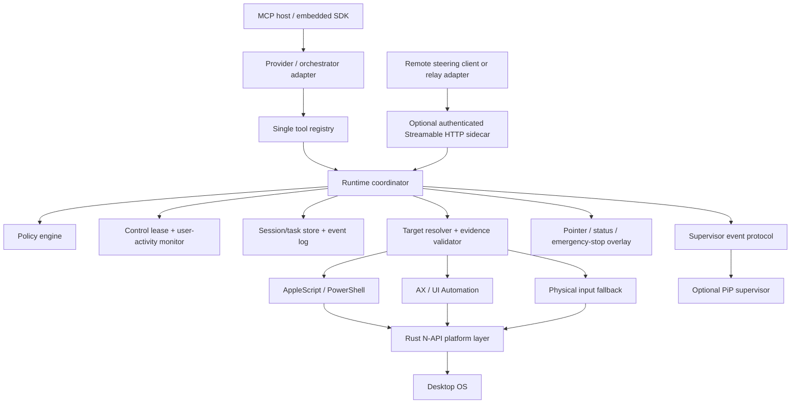

# computer-use-mcp v8 roadmap

**Status:** In implementation — core developer preview landed locally; see `V8-IMPLEMENTATION-STATUS.md`

**Research date:** 2026-07-13

**Baseline:** `@zavora-ai/computer-use-mcp` v7.0.0 at commit `e199e41`

**North star:** A local, model-independent computer-use runtime that an agent and a person can share safely, inspect, interrupt, and resume.

## Executive decision

v8 should not be a race to add more desktop primitives. v7 already exposes 64 tools and has unusually broad platform coverage. The missing product is a trustworthy control plane around those actuators.

The v8 program should therefore optimize for five outcomes:

1. **Safe coexistence:** explicit control leases, immediate interruption on real user input, bounded exclusive actions, and cursor/focus restoration.
2. **Policy that understands intent:** risk classification and confirmations based on the proposed operation, target, and data—not only a tool name or app ID.
3. **Evidence-bound execution:** targets are revalidated against window identity and UI state immediately before mutation.
4. **Observable, resumable work:** durable session state, a typed event timeline, pause/takeover/stop, and completion evidence.
5. **Optional managed access:** authenticated Streamable HTTP and remote steering as a separate sidecar, while local stdio remains the simple default.

This direction preserves the project’s advantages—open source, local-first, cross-platform, model-independent, and embeddable—without trying to reproduce the entire Codex product.

## Competitive strategy: do not clone the shell; own the execution layer

The current ChatGPT desktop app build observed during this research (`26.707.51957`) exposes Picture-in-Picture supervision, Ultra, and non-invasive computer use to the user. Treat those as verified product capabilities even where public documentation is incomplete. They raise the market baseline, but they do not remove this project’s opportunity: OpenAI’s implementation is part of one vertically integrated product, while `computer-use-mcp` can become the neutral runtime that any model, agent framework, or desktop product embeds.

### Product thesis

> **The open desktop execution kernel for AI agents: provider-neutral, background-first, policy-controlled, observable, and embeddable.**

The project should compete on guarantees and portability, not UI mimicry or raw tool count.

| Market dimension | Closed integrated products | v8 competitive advantage |
|---|---|---|
| Model/runtime choice | Coupled to one product and account system | OpenAI, Anthropic, Google, local models, custom orchestrators, and direct SDK use through one runtime. |
| Non-invasive control | Product behavior is visible, but implementation guarantees are private | Every action declares whether it is background-safe, may focus an app, moves the physical pointer, or requires exclusive foreground control. The runtime enforces the declaration. |
| Safety | Product policy is largely opaque to integrators | Portable policy-as-code, typed decisions, scoped grants, deterministic interruption, and auditable evidence. |
| Multi-agent use | Ultra is product-managed | One-writer/many-observer arbitration that any multi-agent host can use without agents fighting over cursor, focus, or state. |
| Supervision | Built-in PiP | An embeddable open supervisor protocol plus reference PiP app that works with any host/model. |
| Privacy/deployment | Account and product dependent | Local/offline core, no required cloud, self-hosted remote option, explicit screenshot retention. |
| Reliability evidence | Internal evaluation | Reproducible cross-platform task corpus, traces, action evidence, and public success/interference metrics. |
| Extensibility | Product plugins | Stable runtime SDK, capability adapters, policy adapters, and host-neutral MCP surfaces. |

### Three execution modes—not one misleading “non-invasive” flag

v8 should make coexistence a typed runtime contract:

| Mode | Allowed work | User impact | Runtime rule |
|---|---|---|---|
| `shadow` | Observe, plan, highlight targets with the virtual pointer, and propose actions. | No focus, pointer, keyboard, or state mutation. | Mutations are rejected. Ideal for preview, training, and approval. |
| `background` | Only scripting or AX/UIA operations proven not to require activation for the selected app/action. | User keeps their pointer and foreground app. | Any fallback that would focus an app or inject physical input returns `foreground_required`; it never silently escalates. |
| `foreground` | Bounded semantic or physical input transaction. | May temporarily take focus or move the OS pointer. | Requires a visible exclusive lease, time/action budget, interruption, and restoration policy. |

“Non-invasive” should mean the runtime can prove that a specific action stayed in `background` mode. A virtual pointer alone is not sufficient. This honest capability model is itself a differentiator because integrators can build predictable UX around it.

### Background-safety capability contract

```ts
type InterferenceLevel =
  | 'none'
  | 'visual_overlay_only'
  | 'may_raise_window'
  | 'takes_foreground'
  | 'moves_physical_pointer'

interface ExecutionCapability {
  appId: string
  operation: string
  backend: 'applescript' | 'powershell' | 'ax' | 'uia' | 'physical_input'
  supportedModes: Array<'shadow' | 'background' | 'foreground'>
  interference: InterferenceLevel
  confidence: number
  verifiedAt?: string
  verificationSource: 'platform_rule' | 'live_probe' | 'adapter' | 'unknown'
}
```

Add `get_execution_capabilities`, `preview_action`, and `execute_action` as the high-level v8 path. Existing low-level tools remain compatible, but internally produce the same action envelope and can be disabled from provider-facing profiles. `preview_action` must say whether execution will steal focus, move the physical pointer, show an overlay, require approval, or fall back to foreground control.

### PiP is a supervisor product, not a video hack inside MCP

Ship an optional `@zavora-ai/computer-use-supervisor` desktop package and a stable supervisor protocol. The core emits semantic events and change-driven visual frames; the UI renders them in a floating, always-on-top window.

Supervisor capabilities:

- live app/window, objective, current step, backend, and execution mode;
- agent pointer and target bounds;
- change-driven screenshot preview with a visible capture indicator;
- approve once, approve scoped, deny, pause, resume, take over, and emergency stop;
- before/after evidence and completion state;
- no secret values in labels, events, thumbnails, or notification text;
- local IPC by default, with authenticated remote event transport supplied by the optional sidecar.

Do not require every MCP server process to start an unauthenticated WebSocket. Define a transport-neutral event subscription interface and adapters for in-process callbacks, local IPC, and authenticated Streamable HTTP. This lets Electron, Tauri, native apps, IDEs, and headless agents use the same runtime.

### Ultra and multi-agent compatibility: many planners, one desktop writer

The MCP server should not implement a proprietary `spawn_subagent` tool. Agent spawning belongs to the host or model API. v8 should instead make parallel agents safe and efficient:

- concurrent read-only observations with snapshot deduplication;
- `execution_group_id`, `principal_id`, `agent_id`, and idempotent `action_id` on work;
- one active mutation lease per physical desktop, with a fair queue and priorities;
- target reservations so agents can declare intent without holding the mutation lease;
- conflict detection for two agents targeting the same app/window/document;
- shared immutable observation/evidence records;
- cancellation propagation from group, agent, session, and action levels;
- per-agent and aggregate budgets, metrics, and audit attribution.

This turns Ultra, subagents, LangGraph, Agents SDK, and other orchestrators into consumers of the same safe desktop runtime rather than special cases.

### ADK-Rust should be the flagship reference orchestrator

Zavora already has a strong strategic asset in ADK-Rust. Make it a major part of the v8 launch by using it to prove graph-based, multi-agent, authenticated, interruptible computer use—not by coupling the v8 safety kernel to one framework.

ADK-Rust owns reasoning and orchestration; v8 owns desktop truth and enforcement:

- `adk-graph` supplies conditional routing, fan-out/fan-in, durable checkpoints, human interrupts, and resume;
- `ParallelAgent` and graph super-steps run visual, semantic, capability, and risk analysis concurrently;
- exactly one executor graph node receives mutating tools, while v8’s lease remains the authoritative one-writer control;
- `adk-auth` supplies verified identity, RBAC/scopes, OIDC/SSO, and audit context; v8 re-evaluates the exact action, mode, target, and approval grant;
- `Runner::interrupt` and graph interrupts map to v8 stop/pause and PiP approval flows;
- `adk-telemetry` and `adk-eval` provide end-to-end traces and agent-quality evaluation over v8’s deterministic safety corpus.

Two bridge gaps are release-critical. The generic ADK MCP wrapper currently loses model-visible image bytes in common result paths, and an ADK graph checkpoint can replay an external side effect if the process crashes after desktop mutation but before the next checkpoint. Ship a multimodal computer-use adapter plus v8 idempotent execution receipts before calling the integration durable or fully multimodal.

The complete architecture, auth mapping, flagship graph, showcase workflows, bridge gaps, and phased delivery are specified in [ADK-Rust reference integration](./ADK-RUST-V8-INTEGRATION.md).

### Marketable v8 product surfaces

```text
@zavora-ai/computer-use-mcp          # local stdio server; compatibility + safe high-level tools
@zavora-ai/computer-use-runtime      # embeddable TypeScript API and policy/lease/session kernel
@zavora-ai/computer-use-supervisor   # optional PiP/status desktop application
@zavora-ai/computer-use-remote       # optional authenticated Streamable HTTP/relay sidecar
@zavora-ai/computer-use-adapters     # provider and app capability adapters
computer-use-adk                     # first-party Rust adapter/reference GraphAgent (name TBD)
```

The existing MIT core should remain genuinely useful. Commercial differentiation, if desired, can live in managed policy distribution, fleet analytics, signed enterprise deployment, hosted relay service, and support—not by weakening or withholding local safety.

## Research correction: the supplied assessment is not a v7 assessment

The supplied review cites `domdomegg/computer-use-mcp`, nut.js, Express, and Vitest. This repository is `zavora-ai/computer-use-mcp`; its current implementation is TypeScript orchestration over a Rust N-API native layer, uses the MCP TypeScript SDK and Zod, and tests with Node’s test runner. Several recommendations in the review are already implemented here.

| Review claim or recommendation | Verified state in this repository | Actual v8 gap |
|---|---|---|
| Primarily screenshot/mouse/keyboard primitives | False. v7 has 64 tools spanning AX/UI Automation, scripting, window/app management, policy, audit, diagnostics, filesystem/registry/process operations, virtual desktops, batching, and an OpenAI action adapter. | Reduce the 64-tool maintenance and token surface through one registry and dynamic capability negotiation. |
| Add a guided setup doctor | Mostly shipped. `doctor` performs native, capture, clipboard, accessibility/UIA, scripting, policy, audit, and overlay checks with typed remediation. | Add a host-neutral onboarding state machine and permission-request/test steps; keep `doctor` as its diagnostic engine. |
| Add a non-activating agent pointer | Shipped on macOS and Windows. `agent_pointer` maintains virtual state and can drive a native, click-through, always-on-top overlay without moving the OS cursor. | Improve visuals and multi-display mapping, but do not confuse a visual pointer with background-safe clicking or typing. |
| Add an explicit policy layer | Partly shipped. v7 supports app allow/block lists, sensitive apps, per-tool/global/destructive approval, MCP elicitation, approval tokens, and redacted JSONL audit. | Replace coarse tool-level classification with operation-level risk, targets, domain rules, data sensitivity, and short-lived grants. |
| Add a control lease | Only partially addressed. v7’s cross-process PID lock serializes a mutating tool call. It is not a user-versus-agent lease, has no owner/mode/expiry, and does not listen for physical user activity. | Build a real lease and platform input monitor. |
| Add session/takeover state | Not shipped as a product lifecycle. `TargetState`, screenshot cache, and session-scoped approval memory are internal and process-local. | Add explicit session APIs, events, persistence, pause/takeover/stop, and recovery after reconnect/restart. |
| Add remote continuation | Not shipped. This repository currently exposes stdio and in-process MCP transports, not Streamable HTTP or an authenticated relay. | Add an optional authenticated sidecar after local session semantics are stable. |
| Improve targeting reliability | Substantially shipped. v7 prefers AppleScript/PowerShell and AX/UIA, supports window IDs, structured focus diagnostics, similar-label recovery, and coordinate fallback. | Add target evidence, screenshot/UI-tree revisions, stale-target prevention, and postcondition verification. |

## What OpenAI actually demonstrates

OpenAI’s July 9, 2026 ChatGPT Work and GPT-5.6 release is the relevant competitive baseline. Official release material confirms a unified work surface, computer-use support in GPT-5.6, local files/apps with permission, a built-in browser, scheduled work, Plan mode, and an Ultra tier with multi-agent orchestration. The current installed product additionally demonstrates PiP and non-invasive coexistence in the user’s environment. Public material describes the product behavior but not all of the desktop-control implementation details.

- ChatGPT Work is positioned as an agentic work surface that can use files, apps, and the web while exposing plans and requesting approval for sensitive steps. [ChatGPT Work release notes](https://help.openai.com/en/articles/6825453-chatgpt-release-notes) [ChatGPT Work](https://openai.com/chatgpt-work/)
- GPT-5.6 is the current model family behind the release and supports computer-use workloads. [Introducing GPT-5.6](https://openai.com/index/gpt-5-6/) [OpenAI model catalog](https://developers.openai.com/api/docs/models)
- Ultra establishes multi-agent orchestration as a user-facing product expectation. It does not establish the internal scheduling, desktop arbitration, or isolation design, so v8 should interoperate at the action-runtime boundary rather than imitate unverified internals. [GPT-5.6 in ChatGPT](https://help.openai.com/en/articles/20001354-gpt-56-in-chatgpt/)

- Computer Use is installed as a plugin, enabled in the desktop app, and configured with per-app access and “Always allowed” choices. On macOS, Screen Recording and Accessibility are separate from app approvals. [Computer Use documentation](https://learn.chatgpt.com/docs/computer-use)
- On Windows, Computer Use runs on the active desktop, moves the pointer, types, and takes over foreground input. OpenAI recommends a VM or secondary device when the person needs to keep working. It is therefore **not evidence of background-safe Windows actuation**. [Windows foreground-use guidance](https://learn.chatgpt.com/docs/computer-use#windows-foreground-use)
- Users can stop or take over, and sensitive or disruptive actions may trigger permission prompts. [Permissions and safety guidance](https://learn.chatgpt.com/docs/computer-use#permissions-and-approvals)
- Remote control pairs devices, keeps execution and local context on the host, carries prompts/approvals/follow-ups across devices, and uses a secure relay rather than exposing the host directly. [Remote connections](https://learn.chatgpt.com/docs/remote-connections)
- Workspace controls can govern plugin/app access, read/write capability, confirmations, domain restrictions, and role assignment. [Plugins in ChatGPT and Codex](https://help.openai.com/en/articles/20001256-plugins-in-codexOpenAI)
- Computer Use screenshots fall under the user’s ChatGPT/Codex data controls. [Codex context and data controls](https://help.openai.com/en/articles/11369540-using-codex-with-chatgpt#h_9d759b4982)

The current product experience confirms PiP, Ultra, and non-invasive coexistence for the user’s environment. OpenAI still does not publicly document the implementation of its pointer overlay, background actuation, input injection, target grounding, or policy classifier. The capabilities are valid competitive evidence; inferred internals are not.

## v7 technical baseline

### Strengths to preserve

- **Native hot path:** Rust N-API backends use CoreGraphics/AppKit/AXUIElement on macOS, Win32/SendInput/UI Automation/DXGI on Windows, and X11/XTest or Wayland-adjacent system tools on Linux.
- **Layered targeting:** scripting first where possible, then AX/UIA, then coordinate input.
- **Precise focus handling:** app/window targeting, strict/best-effort/none/prepare-display strategies, structured `FocusFailure`, and recovery hints.
- **Visible agent identity:** virtual pointer state plus native overlay on macOS and Windows.
- **Basic safety:** policy gates, elicitation, redacted audit, filesystem roots, bounded scripts/waits, cancellation, and a cross-process mutation lock.
- **Modern MCP surfaces:** annotations, structured content/output schemas, resources, prompts, profiles, progress, and cancellation.
- **Distribution:** per-platform optional native packages with a fallback resolver.
- **Test baseline:** `npm test` passes **141/141** tests on the research machine; CI builds native artifacts and runs tests on macOS arm64, Windows x64, and Linux x64.

### Structural debt that blocks safe expansion

1. **`src/session.ts` is still a 3,141-line closure and giant dispatcher.** Policy, audit, focus, doctor, target state, session lock, virtual pointer, compatibility mapping, and many domain handlers remain coupled.
2. **Tool definitions are still split.** `tool-catalog.ts` owns metadata, `server.ts` owns descriptions and schemas, and `session.ts` owns handlers. A policy-sensitive v8 cannot tolerate drift across these sources.
3. **The current lock is call-scoped serialization, not ownership.** It cannot express cooperative versus exclusive control, expiry, takeover, user activity, or a safe multi-action transaction.
4. **Policy evaluates coarse metadata.** “Destructive tool” and target app are useful, but `filesystem(mode=read)` and `filesystem(mode=delete)`, or typing into a search box versus a password field, need different treatment.
5. **Audit is append-only JSONL without a stable public event schema.** It lacks session/action IDs, proposed-versus-executed state, before/after evidence, user-interruption events, retention controls, or a query API.
6. **Target state is not evidence.** A window ID and app can become stale between observation and mutation; coordinate actions are not bound to a screenshot/UI revision.
7. **No durable task model or network transport.** MCP stdio is correct for local clients but cannot provide reconnect, remote steering, multi-device approvals, or authenticated session ownership.
8. **Documentation truth has drifted.** `SECURITY.md` omits v7 from supported versions, while README Linux/Wayland and “no network calls” statements conflict with other code/docs (`scrape` performs network access).
9. **The declared native package matrix is wider than CI.** The package declares Linux arm64 support, but the current workflow builds/tests macOS arm64/x64, Windows x64, and Linux x64 only; Linux arm64 can be skipped during best-effort publish because no artifact is built.

## v8 design principles

1. **Local-first, remote-optional.** `npx @zavora-ai/computer-use-mcp` remains stdio, single-user, and useful without an account or daemon.
2. **Safety below the model.** The runtime—not the prompt—enforces leases, app boundaries, risk policy, stale-target checks, time/action budgets, and interruption.
3. **Observe and mutate are different capabilities.** Read-only observation should remain concurrent and cheap; mutation requires a lease and policy decision.
4. **Semantic APIs before physical input.** Scripting and AX/UIA can avoid cursor movement and sometimes reduce foreground dependence. Physical input stays the explicit fallback.
5. **Every mutation is attributable.** A mutation has a session ID, action ID, principal, policy decision, target evidence, result, and timestamps.
6. **No false promise of concurrency.** v8 should say exactly which operations can run without focus. A virtual pointer is visual coexistence, not input coexistence.
7. **Major-version defaults may become safer.** v8 may break unsafe default behavior when the migration path is explicit and measurable.
8. **Remote is not raw MCP exposure.** Never put the stdio server or an unauthenticated app-server transport on a public/shared network.

## Target architecture



### Proposed module boundaries

```text
src/
  registry/
    definitions.ts       # name, schemas, annotations, profiles, risk mapper
    register.ts          # MCP registration generated from definitions
  runtime/
    coordinator.ts       # execute action pipeline
    capabilities.ts      # shadow/background/foreground + interference contract
    supervisor.ts        # transport-neutral event subscription
    types.ts
  session/
    store.ts             # interface; memory implementation in core
    lifecycle.ts         # start/get/pause/resume/takeover/stop
    events.ts            # stable event schema
  control/
    lease.ts
    activity-monitor.ts
    transaction.ts       # acquire, validate, act, verify, restore
  policy/
    classify.ts
    evaluate.ts
    grants.ts
    redact.ts
  targeting/
    evidence.ts
    resolve.ts
    validate.ts
  handlers/              # domain handlers, no policy/lock duplication
native/src/
  input_monitor_*.rs
  accessibility_*.rs
  overlay.rs
packages/
  computer-use-runtime/  # embeddable execution kernel
  computer-use-supervisor/ # optional PiP/status application
  computer-use-adapters/ # provider/orchestrator and app capability adapters
  remote-sidecar/        # optional; auth, persistence, Streamable HTTP
integrations/
  adk-rust/              # reference adapter, graph agent, workflows, evals
```

## Core data contracts

### Control lease

```ts
interface ControlLease {
  leaseId: string
  sessionId: string
  principalId: string
  mode: 'cooperative' | 'exclusive'
  allowedDisplays: string[] | '*'
  allowedApps: string[] | '*'
  allowedActionClasses: ActionClass[]
  issuedAt: string
  expiresAt: string
  lastUserActivityAt?: string
  state: 'active' | 'paused_by_user' | 'revoked' | 'expired'
  revision: number
}
```

Rules:

- Every mutating action must present or inherit one active lease.
- Cooperative mode pauses before mutation if non-injected user activity occurred after observation or inside the configured quiet period.
- Exclusive mode is explicit, visible, time-bounded, and restricted to an app/window set. It does not imply background execution.
- User activity, emergency stop, expiry, policy revocation, or target escape invalidates the lease atomically.
- Multi-action batches renew or validate the lease before every action; a lease is never “checked once” for the whole batch.

Windows can distinguish injected low-level mouse and keyboard events using `LLMHF_INJECTED` and `LLKHF_INJECTED`. Hook callbacks should stay on a dedicated fast thread; Microsoft recommends Raw Input for robust asynchronous monitoring. [Mouse event flags](https://learn.microsoft.com/en-us/windows/win32/api/winuser/ns-winuser-msllhookstruct) [Keyboard event flags](https://learn.microsoft.com/en-us/windows/win32/api/winuser/ns-winuser-kbdllhookstruct) [Low-level mouse hook guidance](https://learn.microsoft.com/en-us/windows/win32/winmsg/lowlevelmouseproc) On macOS, a passive `CGEventTap` can observe input events and feed the same state machine. [CGEventTapCreate](https://developer.apple.com/documentation/coregraphics/cgevent/tapcreate%28tap%3Aplace%3Aoptions%3Aeventsofinterest%3Acallback%3Auserinfo%3A%29)

### Action envelope and risk classes

```ts
type ActionClass =
  | 'observe'
  | 'navigate'
  | 'edit_reversible'
  | 'communicate_external'
  | 'authentication'
  | 'financial'
  | 'destructive'
  | 'privilege_change'
  | 'secret_access'

interface ActionEnvelope {
  actionId: string
  sessionId: string
  tool: string
  operation: string
  actionClass: ActionClass
  target: TargetEvidence
  dataLabels: Array<'public' | 'private' | 'credential' | 'payment' | 'health' | 'unknown'>
  reversible: boolean
  externalSideEffect: boolean
  proposedAt: string
  expiresAt: string
  argsDigest: string
}
```

Default v8 policy:

| Class | Default |
|---|---|
| `observe`, `navigate` | Allow inside lease/app boundaries. |
| `edit_reversible` | Allow in cooperative mode when the target is revalidated. |
| `communicate_external` | Confirm immediately before send/submit/publish. |
| `authentication`, `financial`, `destructive`, `privilege_change`, `secret_access` | Deny or require explicit, short-lived approval; never remember globally by default. |

Policy must be operation-aware. Examples: `filesystem/read` is not equivalent to `filesystem/delete`; `registry/get` is not equivalent to `registry/set`; `run_script` remains high-risk because arbitrary code defeats finer static classification; `set_value` on a password field is `secret_access` even though the same tool on a normal text field may be `edit_reversible`.

### Target evidence

```ts
interface TargetEvidence {
  platform: 'darwin' | 'win32' | 'linux'
  appId: string
  pid?: number
  windowId?: number | string
  windowTitleDigest?: string
  displayId?: string
  role?: string
  labelDigest?: string
  bounds?: { x: number; y: number; width: number; height: number }
  observationId: string
  screenshotHash?: string
  uiTreeRevision?: string
  confidence: number
  capturedAt: string
}
```

Before a click, type, or semantic mutation, v8 re-resolves the target and compares app, process, window, role/label, bounds tolerance, observation age, and UI revision. A mismatch returns `stale_target` with fresh evidence; it never silently clicks the old coordinate.

### Session lifecycle and events

```ts
type SessionState =
  | 'created'
  | 'running'
  | 'waiting_for_user'
  | 'paused_by_user'
  | 'paused_by_policy'
  | 'stopping'
  | 'completed'
  | 'failed'
  | 'stopped'

interface SessionEvent {
  eventId: string
  sequence: number
  sessionId: string
  actionId?: string
  type: string
  at: string
  principalId?: string
  payload: Record<string, unknown> // redacted before persistence/emission
}
```

Add MCP tools/resources only after the lifecycle exists internally:

- `start_session`, `get_session`, `pause_session`, `resume_session`, `take_over`, `stop_session`
- `get_session_events` with cursor pagination
- `computer://session/current` and `computer://session/{id}`
- progress and logging notifications for live events

Use MCP Tasks behind an experimental capability flag for long-running/resumable operations. Tasks are durable state machines with polling, cancellation, and `input_required`, but the current MCP specification still labels them experimental; v8 must keep its internal lifecycle independent of that wire format. [MCP Tasks](https://modelcontextprotocol.io/specification/2025-11-25/basic/utilities/tasks)

## Delivery roadmap

### 8.0 — Foundation and safe local control

**Goal:** Make v8 internally coherent and prevent the agent from silently fighting the user.

#### Work packages

1. **One tool registry**
   - Move tool name, description, Zod input/output schemas, profiles, annotations, handler binding, risk mapper, and metadata into one definition.
   - Generate MCP registration, `MUTATING_TOOLS`, client typings, and metadata from it.
   - Add a golden wire-shape test for all 64 existing tools before changing behavior.

2. **Finish the session split**
   - Extract policy/audit, focus, doctor, lock, target state, virtual pointer, adapter, and handlers from `session.ts`.
   - Make handlers pure with injected native/platform services.
   - Keep a compatibility facade so the existing TypeScript client does not need an all-at-once rewrite.

3. **Execution modes and high-level action facade**
   - Implement `shadow`, `background`, and `foreground` as enforced modes, not descriptive metadata.
   - Add the `ExecutionCapability` registry and live-probe cache per app/operation/backend.
   - Add `get_execution_capabilities`, `preview_action`, and `execute_action` with explicit interference and fallback behavior.
   - In `background` mode, return `foreground_required` instead of activating an app, moving the OS pointer, or injecting keystrokes.

4. **Control lease v1**
   - Replace call-scoped mutation locking with a lease manager layered over the cross-process lock.
   - Map background work to a cooperative lease and foreground work to an exclusive lease; implement TTL, action budgets, app/display boundaries, and atomic revocation.
   - Add native input monitors on macOS and Windows; Linux starts with best-effort X11 monitoring and reports capability limits on Wayland.

   **Developer-preview implementation (2026-07-13):** macOS now uses a passive
   HID event tap and accepts only hardware-source-state events; all runtime
   CGEvent injection uses a private source. Windows uses dedicated low-level
   mouse and keyboard hooks and rejects the OS injected flags. Governed
   physical input fails closed on these platforms if attributed monitoring is
   unavailable, and a packaged conformance probe proves synthetic exclusion on
   the local macOS build. Linux X11 now uses XI2 raw events, tracks originating
   slave-device IDs, excludes the X server's XTEST devices, and refreshes the
   device set after hierarchy changes. It is explicitly best-effort because
   arbitrary virtual/uinput devices cannot be proven physical; native Wayland
   remains unsupported and the capability never claims injected-event
   distinction. Windows live hardware results, physical-event latency
   distributions, lifecycle fault injection, and the 10,000 interactive race
   corpus remain release evidence—not inferred from compilation.

5. **Safe transaction wrapper**
   - Snapshot cursor, frontmost app/window, target evidence, and lease revision.
   - Revalidate; execute one bounded action; verify; restore cursor/focus when policy says restoration is safe.
   - Persist an idempotent execution receipt keyed by session, action ID, and action digest so graph/task retries cannot repeat a physical side effect.
   - Add a global emergency-stop chord configurable by the user and a native/API stop path.
   - **Implemented developer-preview emergency boundary (2026-07-13):** macOS HID event-tap and Windows low-level keyboard-hook threads recognize a configurable physical-only chord (default `Ctrl+Alt+Shift+Escape`) and atomically latch native input off without waiting for the JavaScript event loop, MCP connection, lease polling, or target application. Keyboard/mouse loops check the latch between bounded effects, held keys and agent-held mouse buttons are safely released, API/PiP stops invoke the same latch, and only the authenticated host supervisor can reset both native and lease state. Linux reports the global chord unsupported instead of claiming coverage. Deterministic latch/reacquisition tests pass; disconnected live-hardware latency and zero-post-latch mutation evidence remains mandatory for beta/stable.

6. **Supervisor protocol and PiP alpha**
   - Emit versioned lifecycle, action, target, policy, lease, screenshot-change, and completion events.
   - Provide in-process and local-IPC subscriptions in the runtime.
   - Ship a minimal PiP alpha showing status, target, mode, preview, pause, take over, approve, and stop.
   - **Implemented developer-preview emergency UX (2026-07-13):** authenticated supervisors receive process-global latch changes even when no session owns a lease, so a native physical chord updates PiP without originating from the renderer or MCP. The sandboxed window shows the allowlisted chord/backend generation and mutation-blocked state. Reset is not model-callable: the Electron main process requires an explicit destructive confirmation before sending the authenticated host command, and the prior lifecycle display is restored only after the runtime reports the latch cleared.
   - **Implemented developer-preview visual review (2026-07-13):** explicit opt-in captures target-window/app before and verified-after frames (plus governed image observations) through the runtime transaction hook. A bounded, five-minute, process-memory-only store validates PNG/JPEG bytes, caps each frame at 1 MiB, evicts beyond six frames per session/8 MiB globally, deletes with the terminal session, and emits metadata-only events. Protocol v2 returns pixels only to an authenticated local client already subscribed to that principal-bound session. Electron main sanitizes each explicit frame response; renderer state retains only the latest frame per phase, while the PiP itself has no desktop native module or capture permission. Deterministic boundary/adversarial tests pass; signed packaging and live cross-platform visual inspection remain release gates.

7. **Safer major-version defaults**
   - Default `COMPUTER_USE_FS_ROOTS` to a documented user-selected root or disable filesystem mutation until configured; offer `unrestricted` only as an explicit migration setting.
   - Require approval for destructive and sensitive classes by default.
   - Disable `scrape` in high-privilege desktop profiles unless explicitly enabled.
   - Make audit mode explicit: memory-only event log by default for library use; redacted local persistence opt-in for stdio, with a visible status.

8. **ADK-Rust contract spike and deterministic reference graph**
   - Add shared Rust fixtures/client types for capabilities, preview, execution, policy, lease, evidence, events, and receipts.
   - Preserve MCP image/evidence content through a specialized adapter or generalized ADK multimodal tool-result path.
   - Build the flagship discover → parallel observe → plan → preview → approve → execute → verify graph against the fake desktop.
   - Correlate ADK session/invocation/thread/principal IDs with v8 session/action/receipt/evidence IDs and telemetry.

#### 8.0 release gates

- No behavior drift across the existing 64-tool compatibility suite unless listed in the v8 migration guide.
- User input revokes cooperative control in under **100 ms p95** on supported macOS/Windows test hardware.
- Zero post-revocation physical inputs in 10,000 randomized race tests.
- Every mutation has session/action/lease IDs and a policy decision in the event stream.
- Emergency stop succeeds even when the MCP request is cancelled, disconnected, or the target app is hung.
- `background` mode produces zero app activations, physical pointer moves, or injected keystrokes in conformance tests; unsupported operations return `foreground_required`.
- OpenAI-, Anthropic-, and generic MCP-style action adapters produce the same internal `ActionEnvelope` and policy behavior for equivalent actions.
- The PiP alpha can supervise and interrupt an in-process or stdio session without obtaining desktop-control permissions itself.
- The deterministic ADK-Rust graph survives injected crashes before and after execution without duplicating a physical mutation, and visual evidence reaches a vision-capable agent without a text placeholder.

### 8.1 — Policy v2 and evidence-bound targeting

**Goal:** Prevent high-impact or stale actions even when the model chooses a valid low-level tool.

#### Work packages

1. Operation-level `ActionEnvelope` classification for every mutating tool and mode.
2. App, window, browser-domain, filesystem-root, registry-hive, and process boundaries.
3. One-shot and session-scoped approval grants with narrow scopes, TTLs, and revocation.
4. Sensitive UI detection from AX/UIA roles and attributes; never echo or persist secret values.
5. `TargetEvidence`, observation IDs, age limits, confidence thresholds, and `stale_target` errors.
6. Before/after postcondition verification for click, set-value, form-fill, filesystem, registry, and process operations.
   - **Implemented developer-preview core (2026-07-13):** typed UI-element, filesystem, registry, process, and window postconditions are action/resource/approval/receipt-digest bound. Independent readback is mandatory and automatic for exact `set_value`/`fill_form` values, filesystem write/append/delete and copy/move state transitions, named registry set/delete, and PID kill. Clicks and other targeted mutations accept an explicit final-state check. Expected values and contents cross review/audit boundaries only as SHA-256 digests. A false-success handler becomes `indeterminate`, revokes its lease, and its receipt prevents replay. Copy currently proves destination presence rather than byte equality unless the caller supplies a content digest; broader automatic click semantics remain adapter-specific.
7. Prompt-injection risk state for actions derived from open-world screenshots/pages; require re-approval when an untrusted instruction attempts to cross a data/action boundary.
8. App capability adapters that certify background-safe AppleScript, PowerShell, AX, and UIA operations and invalidate certification after app version or live-probe changes.
   - **Implemented developer-preview core (2026-07-13):** trusted, version/tool/action-contract/instance-authority-bound certification; atomic redacted traces; explicit certification IDs; fail-closed restore and live version checks; reversible Finder/AppleScript and PowerShell sandbox reference adapters; and a shared exact-window AX/UIA semantic adapter with a direct non-focusing native executor, sensitive-target rejection, postcondition readback, and rollback readback. A live Finder 26.2 trace is published under `docs/conformance/v8/`. AX and UIA paths are deterministically tested. Live AX was attempted but the workstation locked before AX window resolution; live AX/UIA traces, signed Windows evidence, and broader app/version matrices remain platform-lab gates.
9. Supervisor beta with evidence review, scoped approval, capture indication, redaction, and cross-platform packaging.

#### 8.1 release gates

- 100% of mutating tool modes map to an action class in a registry completeness test.
- No credential/password text appears in logs, error payloads, screenshots retained by default, or structured events.
- A stale window, changed UI label, moved control, or changed screenshot revision cannot result in a coordinate fallback without a fresh policy evaluation.
- Policy tests cover default-deny/confirm behavior for send, submit, delete, install, credentials, payments, and privilege changes.

### 8.2 — Sessions, takeover, and observability

**Goal:** Make long-running computer use inspectable and resumable on one machine.

#### Work packages

1. Internal session state machine and append-only, versioned event schema.
2. Pause/resume/takeover/stop APIs and explicit `waiting_for_user` reasons.
3. Completion evidence: objective summary, postconditions, last known app/window, action counts, failure/interrupt reason, and relevant hashes.
4. Local session store interface:
   - in-memory implementation in the core package;
   - durable implementation in the sidecar using SQLite or another transactional embedded store;
   - retention/size limits and explicit deletion.
5. Stabilize the supervisor protocol and PiP app: agent pointer, action label, execution mode, lease owner, recording/audit state, paused state, emergency-stop hint, and before/after evidence. Never put secret text in the overlay.
6. Optional MCP Tasks adapter plus `computer://session/*` resources.
7. Queryable audit export with a stable JSON Schema and integrity chain between events.

#### 8.2 release gates

- Restart/reconnect recovery never resumes physical input automatically; recovered sessions start paused and require lease reacquisition.
- Event ordering is monotonic and duplicate-safe across retry/reconnect tests.
- A user can take over at every nonterminal state and the runtime reports why automation stopped.
- Screenshot bytes are memory-only unless persistence is explicitly enabled; retention and deletion are tested.

### 8.3 — Authenticated remote sidecar

**Goal:** Allow secure remote progress, approvals, and steering without weakening local defaults.

#### Scope

- New optional `@zavora-ai/computer-use-remote` package/process.
- MCP Streamable HTTP endpoint with secure session IDs, resumability/redelivery, OAuth-compatible authorization, rate limiting, and per-principal task/session isolation.
- Pairing flow for a local remote client: short-lived code/QR, explicit host confirmation, revocation, device list, and key rotation.
- Remote event stream for progress, approvals, screenshots when allowed, pause/resume/stop, and follow-up instructions.
- Adapter interface for self-hosted relays; no Zavora-operated cloud service is required for v8.
- Bind to loopback by default. LAN binding requires TLS and authentication. Public ingress is unsupported without a reviewed relay deployment.

MCP Streamable HTTP supports session IDs, resumability, and redelivery, while MCP authorization defines the HTTP authorization path. The sidecar should conform rather than invent a transport. [Streamable HTTP transport](https://modelcontextprotocol.io/specification/2025-06-18/basic/transports) [MCP authorization](https://modelcontextprotocol.io/specification/2025-03-26/basic/authorization)

#### 8.3 release gates

**Developer-preview implementation (2026-07-13):** the optional remote package,
stateful Streamable HTTP transport, bounded redelivery, host-confirmed pairing,
durable hash-only device authorization, context/principal isolation, scoped
screenshots/approval/control/execution, resumable redacted events, follow-up
steering, rate limits, safe binding defaults, and authorization-loss suspension
are implemented and tested locally. A host-owned synchronous durable credential-
vault adapter now supports injected stores and first-party native macOS
Keychain, Windows DPAPI CurrentUser, and Linux Secret Service bindings. It
rejects async acknowledgment-before-persistence and retains the atomic mode-
`0600` file store as an explicit headless fallback; no path persists bearer
bytes. Values stay out of child-process arguments and environments, and missing
OS services fail closed. A digest-linked monotonic state envelope and separate
high-water anchor reject partial rollback/tampering and recover only the linked
state-first crash window; atomic rollback of both same-vault records remains a
documented privileged platform-backup residual risk. Independent security
review, signed cross-platform execution, and any production relay deployment
remain release gates; this note does not mark remote stable.

- Sessions/tasks are cryptographically bound to an authorization context; cross-principal lookup and event access are impossible.
- Remote disconnect, token expiry, host lock, or relay loss pauses mutation and expires the lease.
- No unauthenticated listener and no default public bind.
- Threat model covers replay, task-ID enumeration, screenshot leakage, confused deputy, CSRF/origin validation, stolen pairing code, and denial of service.
- Independent security review before declaring remote control stable.

### 8.4 — Ecosystem, onboarding, and reliability lab

**Goal:** Make the safe runtime easy to adopt and continuously measurable.

#### Work packages

1. Host-neutral guided onboarding protocol over tools/resources:
   - inspect capability;
   - request/describe permission;
   - test capture;
   - test virtual pointer;
   - test semantic action in a bundled sandbox surface;
   - choose app/action policy;
   - persist a capability profile.
2. Reference setup UIs for Electron/Tauri and terminal hosts; the core package remains UI-independent.
   - **Implemented developer-preview setup surfaces (2026-07-13):** the packaged `computer-use-onboard` terminal runner supports interactive/non-interactive execution and durable resume without applying configuration implicitly. A shared disclosure-safe setup projection and versioned command/view schemas drive a reusable WebView UI, strict Electron main/preload adapter, and Tauri invoke transport. Doctor results are reduced to allowlisted permission IDs/statuses; terminal and desktop views reconstruct bounded Screen Capture, Accessibility/UI Automation, and Automation guidance plus fixed macOS Settings URIs locally, so raw summaries/remediation cannot enter renderer state. A trusted desktop host may inject the settings opener and the host-only native macOS TCC adapter for Accessibility and Screen Capture. Renderer requests carry only a known permission ID; native results are discarded before rendering; Automation, arbitrary URLs, and unsupported-platform prompts fail closed; and the MCP tool can neither request permission nor open settings. Prompt capability (`canRequestInProcess`) is distinct from settings navigation (`canOpenSettings`). Pointer presentation and user confirmation are separate protocol actions, avoiding UI timing races while preserving the legacy combined call. Emergency-stop capability presentation and acknowledgment are likewise separate; policy configuration is refused until the user has seen and acknowledged the configured chord/backend, and unsupported physical-chord platforms are labeled API-stop-only. Renderer-visible state contains capability facts, counts, stage/progress, the non-secret stop chord/backend, permission guidance, and environment key names only; configuration values remain host-only.
3. Dynamic profiles/capability negotiation so hosts expose only relevant tools and receive `notifications/tools/list_changed` when supported.
4. Browser bridge interface for DOM/CDP evidence when a host supplies it; no bundled browser takeover required.
   - **Implemented developer-preview bridge (2026-07-13):** a host may inject a typed `BrowserBridge`; its internal-only actuator is classified by the registry but never registered as a raw MCP tool. Browser page evidence binds bridge/page identity, URL digest, DOM revision, viewport, observation freshness, and target confidence. The normal domain policy, exact-action approval, background/foreground capability, target revalidation, one-writer lease, idempotency receipt, operation allowlist, and verified postcondition path remain mandatory. Gemini browser and coordinate actions can route through the bridge without physical desktop input. Model-visible results receive a URL digest rather than the potentially credential-bearing URL. No CDP client, browser engine, or arbitrary script evaluator is bundled.
5. Cross-platform reliability lab:
   - multi-monitor, mixed DPI, Retina scaling;
   - Windows integrity levels/UAC boundaries;
   - RDP, lock/unlock, sleep/wake, VM sessions;
   - macOS Spaces/full-screen/Stage Manager;
   - X11 and major Wayland compositors/portals;
   - focus thieves, notifications, overlays, and modal dialogs.
   - **Implemented developer-preview lab contract and runner (2026-07-13):** a digest-bound 17-scenario corpus covers every listed dimension plus deterministic emergency-latch and live disconnected physical-chord tests, with platform, approach, condition, assertions, required facts, and minimum evidence declared per row. The public runner has three deterministic geometry/drift/latch probes and accepts explicit operator probe modules for interactive sessions. Passing live evidence requires an interactive environment; headless CI, deterministic fakes, blocked probes, and unrun cells remain distinguishable. macOS, Windows, Linux x64, and Linux arm64 jobs publish separate artifacts. The checked-in macOS baseline has 3 deterministic passes, 16 local unrun cells, zero live passes, and lists every missing live scenario instead of implying platform certification.
6. Recorded, sanitized task corpus and deterministic fake-desktop harness for policy/lease/targeting regressions.
7. Public metrics report by platform and approach (scripting, AX/UIA, physical input).
   - **Implemented developer-preview metrics format (2026-07-13):** versioned corpus/report schemas and a public API calculate scenario pass/failure counts, attempts, success rate, unintended mutations, interference, attribution, stale-action blocking, restoration, and p50/p95 latency by platform, approach, and evidence level. Counts are validated for impossible relationships, exact matrix membership and result uniqueness are enforced, source/result/report digests detect edits, and adversarial tests reject deterministic evidence for live-only scenarios and non-interactive live claims. Real cross-platform measurements remain release evidence work, not an implementation claim.
8. Provider adapters and examples for GPT‑5.6 computer actions, Anthropic computer use, Gemini-style actions, LangGraph, and direct SDK use; provider adapters translate wire shapes only and never bypass policy.
   - **Implemented developer-preview provider boundary (2026-07-13):** OpenAI, Anthropic, generic MCP, and Gemini legacy/streamlined function calls normalize into the same governed request. Gemini coordinate conversion requires trusted host viewport geometry, scroll conversion is explicit, bridge-only actions fail closed, and composite coordinate typing expands into independently approved, leased, and receipted actions. Packaged direct-SDK and LangGraph-compatible examples exercise preview, exact-action review, lease acquisition, completion evidence, checkpoint-before-interrupt, and receipt-aware crash resume.
9. An open compatibility badge based on conformance results: `background-safe`, `supervisor-ready`, `policy-v2`, `multi-agent-safe`, and platform coverage.
   - **Implemented developer-preview evaluator (2026-07-13):** versioned evidence/report schemas, source and output digests, scoped assertion requirements, live-trace validation, exact platform/approach/operation coverage, adversarial tamper tests, a packaged report CLI, and per-platform CI artifacts. Overall background and supervisor badges require both macOS and Windows proof; current missing Windows evidence is represented as `partial`, never promoted from deterministic tests.
10. ADK-Rust flagship integration: live multi-agent graph, PiP interrupts, OIDC/RBAC/scoped approval example, action-receipt-aware resume, telemetry correlation, and end-to-end evaluations.
    - **Implemented developer-preview flagship and evaluation receipt (2026-07-13):** the first-party crate uses real `adk-graph`, `adk-auth`, `adk-tool` MCP, and `adk-eval` paths for parallel observation, target reservation, digest-bound approval interrupt/resume, a sole executor, receipt-aware verification/recovery, cancellation ordering, principal/tenant binding, and trace correlation. Separate pre-effect and post-commit crashes prove exactly one mutation across retry. A canonical receipt verified in both Rust and TypeScript binds 16 graph/auth/eval/wire/multimodal tests, nine mandatory assertions, 16 source digests, test-output digest, two crash points, zero duplicates, actual MCP image preservation, and rejection of contradictory process postconditions. ADK CI regenerates the unsigned receipt; the v8 readiness gate requires a trusted release signature over its digest. Live macOS/Windows background and PiP evidence remains a release gate.

## PR sequence and dependencies

| Order | PR | Outcome | Depends on |
|---:|---|---|---|
| 1 | v8-01 wire baseline | Freeze v7 wire shapes, tool inventory, and migration tests. | — |
| 2 | v8-02 registry | Single source for schemas, metadata, handlers, profiles, and risk mapping. | 1 |
| 3 | v8-03 session decomposition | Extract runtime services behind existing facade. | 1–2 |
| 4 | v8-04 execution modes | Enforce shadow/background/foreground and implement interference metadata. | 2–3 |
| 5 | v8-05 high-level actions | `preview_action`, `execute_action`, and capability queries over existing handlers. | 4 |
| 6 | v8-06 event schema | Session/action IDs and typed in-memory supervisor events. | 3–5 |
| 7 | v8-07 input monitors | macOS/Windows user-activity monitor and capability reporting. | 3 |
| 8 | v8-08 leases | Multi-principal, one-writer lease state machine and cross-process arbitration. | 6–7 |
| 9 | v8-09 transactions | Revalidate, act, verify, restore; emergency stop; idempotent execution receipts; no silent mode escalation. | 8 |
| 10 | v8-10 supervisor protocol | In-process/local-IPC subscriptions and change-driven visual frames. | 6, 8–9 |
| 11 | v8-11 PiP alpha | Cross-platform reference supervisor with approve/pause/takeover/stop. | 10 |
| 12 | v8-12 policy v2 | Action classes, scoped grants, sensitive-field handling. | 2, 6, 9 |
| 13 | v8-13 target evidence | Observation revisions and stale-target enforcement. | 9, 12 |
| 14 | v8-14 v8 defaults/migration | Safer FS, scrape, approval, audit, and provider-facing profiles. | 12–13 |
| 15 | v8-15 app capability adapters | Certify and live-probe background-safe AppleScript/PowerShell/AX/UIA actions. | 4–5, 9, 13 |
| 16 | v8-16 session lifecycle | Pause/resume/takeover/stop and completion evidence. | 6, 8–13 |
| 17 | v8-17 durable store + MCP tasks | Optional persistence and experimental wire adapter. | 16 |
| 18 | v8-18 remote sidecar | Streamable HTTP, authorization, pairing, remote events. | 10, 16–17 |
| 19 | v8-19 ADK-Rust reference + provider adapters | Multimodal MCP bridge, deterministic/live reference graph, auth mapping, receipt-aware resume, evals, and provider examples. | 5–16 |
| 20 | v8-20 reliability lab | Platform corpus, public metrics, conformance badges, release evidence. | continuous; gates 8.0–8.4 |

PRs 1–15 are the **8.0 core critical path**; the contract and deterministic portions of PR 19 are the **reference-launch critical path** and should begin once PRs 5–10 stabilize their wire contracts. PiP may ship as alpha while the protocol is stabilized. Remote work must not begin by exposing the current session dispatcher over HTTP.

### Indicative effort, not release commitments

These ranges are for sequencing and staffing, assuming two engineers who can work across TypeScript and native Rust, access to real macOS/Windows/Linux test machines, and no hosted relay build:

| Milestone | Engineering estimate | Likely calendar range with two engineers | Main uncertainty |
|---|---:|---:|---|
| 8.0 | 28–40 engineer-weeks | 15–22 weeks | Background-safety proofs, revocation races, PiP packaging, multimodal ADK bridge, and exactly-once side effects. |
| 8.1 | 12–18 engineer-weeks | 7–11 weeks | Sensitive-field detection, app capability adapters, and postcondition coverage. |
| 8.2 | 8–12 engineer-weeks | 5–8 weeks | Durable event semantics and host support for experimental MCP Tasks. |
| 8.3 | 16–24 engineer-weeks plus security review | 10–16 weeks | Pairing/auth UX, reconnect safety, and deployment threat model. |
| 8.4 | 10–16 engineer-weeks, then ongoing | 6–10 weeks initial | Interactive CI availability and Wayland/compositor variance. |

Re-estimate after v8-03, v8-08, v8-11, and v8-16. Those PRs resolve the largest architectural, platform, supervisor, and lifecycle unknowns. A one-engineer plan should reduce parallel scope rather than simply doubling every calendar estimate; 8.3 in particular needs independent security review.

## Minimum competitive release and first 90 days

Do not wait for every v8 milestone before testing the market. The first externally meaningful release is an **8.0 developer preview** containing five things that work together:

1. enforced `shadow`, `background`, and `foreground` modes with no silent escalation;
2. `preview_action` and `execute_action` over the existing v7 actuator set;
3. one-writer/many-observer arbitration with physical-user interruption;
4. a local PiP supervisor alpha with pause, approve, take over, and stop;
5. one certified background-safe workflow on macOS and one on Windows, backed by reproducible traces;
6. the ADK-Rust reference graph running the same contracts with multimodal evidence, one-writer arbitration, graph interrupts, and crash-safe execution receipts.

Suggested 90-day de-risking sequence, assuming two engineers:

| Window | Build | Proof required before continuing |
|---|---|---|
| Days 1–30 | Registry, execution-mode kernel, action/receipt envelope, event schema, deterministic fake desktop, and ADK-Rust contract spike. | Existing 64-tool compatibility is preserved; a background request cannot enter a physical-input handler; Rust fixtures round-trip every high-level contract. |
| Days 31–60 | Native input monitoring, leases, bounded transactions, and supervisor protocol. | User input revokes control within the latency target; no action occurs after revocation in the race corpus. |
| Days 61–90 | PiP alpha, two app capability adapters, ADK-Rust flagship graph, provider examples, and a public conformance harness. | A third-party host can embed the runtime and supervisor; the ADK graph handles vision, approval, interruption, and injected crash/resume without duplicate mutation. |

At day 90, make a scope decision from evidence:

- **Proceed to v8.0 beta** if background-mode purity, interruption safety, and host integration gates pass.
- **Narrow to foreground-safe runtime** if operating-system limitations prevent honest background guarantees; keep the mode contract and report unsupported capabilities explicitly.
- **Delay remote control** regardless of demand until local session ownership, interruption, and event semantics are stable.

The launch message should avoid “more tools.” Demonstrate one task in four views: the user keeps working, PiP shows what the agent is doing, a second planning agent queues work without fighting for control, and the evidence log proves which actions stayed in the background.

## Compatibility and migration policy

- Keep existing tool names and wire shapes for v8 unless a security issue requires removal. Add fields; do not silently reinterpret coordinates or targets.
- Preserve `openai_computer` as a compatibility adapter, but route every mapped action through the same lease, policy, evidence, and event pipeline.
- Keep ADK-Rust first-party and release-tested without making it mandatory: the runtime protocol and safety kernel must work without ADK, while the flagship graph pins a published compatible ADK version or clearly labels a development dependency.
- Keep provider adapters thin and versioned independently. OpenAI, Anthropic, Gemini, and framework-specific shapes must translate into the same `ActionEnvelope`; no adapter may bypass policy, execution-mode checks, or evidence validation.
- Keep stdio and in-process clients first-class. The remote sidecar is optional and separately packaged.
- Provide `COMPUTER_USE_V7_COMPAT=true` for one major release cycle only, covering unsafe defaults—not bypassing emergency stop, audit redaction, or target revalidation.
- Emit startup warnings for v7-compatible unrestricted filesystem/network combinations and provide an exact generated v8 config.
- **Implemented migration boundary (2026-07-13):** compatibility restores only
  unrooted filesystem mutation and open-world scrape policy for the migration
  cycle. The stdio host emits value-free warnings, while the packaged
  `computer-use-migrate-v8` CLI and public migration API generate exact JSON,
  POSIX, or PowerShell configuration from an allowlist of non-secret policy
  fields. Supervisor credentials, persistence paths, and other control-plane
  values are excluded. Tests prove safer defaults, compatibility behavior,
  secret exclusion, shell escaping, and that sensitive actions still require
  confirmation.
- Publish a machine-readable capability manifest so hosts can adapt to platform limitations instead of inferring from errors.

## Testing and release strategy

### Test layers

1. **Registry contract:** every definition has schemas, annotations, profiles, risk mapper, handler, docs, client coverage, and stable wire snapshots.
2. **Property/state-machine tests:** leases, approvals, session transitions, retry/idempotency, action budgets, and user-interruption races.
3. **Native unit tests:** injected-versus-physical input attribution, event monitor lifecycle, DPI transforms, and overlay behavior.
4. **Fake desktop integration:** deterministic windows/UI trees and time control for stale-target and focus races.
5. **Live platform smoke:** signed binaries on actual macOS/Windows/Linux interactive runners, not only headless native-load checks.
6. **Adversarial safety tests:** focus stealing, malicious UI labels, prompt injection, secret fields, stale screenshots, rapid user input, and reconnect races.
7. **Packaging/supply chain:** per-target artifact smoke, checksums/provenance, code signing/notarization where applicable, npm install matrix, Node 18/20/22/current.
   - **Implemented release-integrity pipeline (2026-07-13):** a public schema and deterministic manifest bind all five optional platform packages to the root version, exact target identity, Mach-O/PE/ELF format, byte length, and SHA-256. Release CI requires every target, verifies copied bytes, downloads and checks any already-published immutable platform version, fails before the main package on mismatch or publish failure, packs once, publishes the exact attested tarballs with npm provenance, emits a CycloneDX SBOM, and attaches GitHub build/SBOM attestations. A separate packed-tarball install matrix runs on Node 18/20/22/current with optional packages omitted. Platform code signing/notarization remains credential- and service-bound release work and is not claimed by these checks.

### Product metrics

| Metric | v8 target |
|---|---:|
| Unintended mutations after physical user input | 0 in release corpus |
| User-input detection to lease pause | <100 ms p95 on supported macOS/Windows |
| Mutation events with full attribution | 100% |
| Sensitive value leakage in retained artifacts | 0 |
| Coordinate actions blocked on stale evidence | 100% |
| Semantic action success on reference workflows | >95% |
| Actions accepted as `background` that activate an app, move the physical pointer, or inject keys | 0 |
| Capability predictions matching observed interference level | >99.9% in certified app/workflow corpus |
| Supervisor event-to-display latency | <150 ms p95 locally |
| Supervisor control response (pause/stop acknowledged by runtime) | <100 ms p95 locally |
| Conflicting simultaneous desktop mutations | 0; all non-owners queue or receive a typed conflict |
| Duplicate physical mutations after retry/reconnect | 0 |
| ADK graph crash/resume duplicate physical mutations | 0 across every injected pre/post-commit crash point |
| MCP visual evidence delivered as model-visible image or typed artifact | 100%; no byte-count placeholders in the ADK integration |
| ADK/v8 trace records with complete cross-runtime correlation IDs | 100% |
| Cursor/focus restoration after bounded exclusive action | >99% where restoration is declared supported |
| Cross-platform registry/wire parity | 100% |
| Remote cross-principal isolation failures | 0 |

## Security and privacy workstream

Before 8.0 beta:

- Update `SECURITY.md` to include v7/v8 support and actual Linux/Wayland/network behavior.
- Publish a v8 threat model covering local MCP host compromise, malicious screen content, prompt injection, injected input spoofing, focus theft, TOCTOU target changes, sensitive screenshots, filesystem escape, arbitrary scripting, and remote threats.
- Define screenshot policy: memory-only default, explicit persistence, redaction hooks, encryption expectations for the sidecar, retention/size limits, and delete/export APIs.
- Treat the audit log as sensitive data. Redaction hashes can still enable correlation; document that risk and allow keyed hashing or omission.
- Add signed release provenance and publish checksums for native artifacts.
- Establish a security review gate for native input monitors, lease revocation, policy bypasses, and the remote sidecar.

## Documentation corrections to ship before or with v8 planning

These are not roadmap features; they are present-tense accuracy fixes:

1. Add 7.x to `SECURITY.md` supported versions.
2. Reconcile Linux/Wayland claims across README, AGENTS.md, changelog, and native implementation.
3. Replace “the MCP server itself makes no network calls” with an accurate statement that `scrape` and user-supplied scripts may access the network.
4. State clearly that the virtual pointer does not move the OS cursor, while physical click/type tools can still take foreground control.
5. Remove any implication that the repository currently provides HTTP transport or remote continuation.
6. Document the 64-tool registry and current 141-test baseline in the v8 design record, not as permanent marketing counts.
7. Document Linux arm64 as unverified until CI produces and exercises that artifact, or remove it from the declared support matrix.

## Explicit non-goals

- Rebuilding Codex, ChatGPT mobile, workspace analytics, billing, profiles, or a hosted multi-tenant cloud.
- Claiming background-safe physical input on platforms that do not provide it.
- Replacing the native Rust layer with a protocol rewrite; the existing rmcp spike correctly found little product value in that move.
- Bundling a general browser automation engine; integrate with host-provided DOM/CDP tools through evidence adapters.
- Autonomous handling of credentials, payments, account/security settings, or privilege escalation without present-user approval.
- Adding more low-level tools until the registry, lease, policy, and event pipelines can govern them automatically.

## Go/no-go criteria for v8.0 stable

Ship v8.0 stable only when:

- the single registry and session decomposition are complete;
- the existing 64-tool behavior suite plus v8 migration tests are green on all supported build targets;
- user-activity interruption and emergency stop meet the latency and zero-post-revocation-action gates;
- all three execution modes are enforced, and certified `background` operations cause zero app activation, physical-pointer movement, or injected keystrokes;
- every mutation flows through one transaction, policy, lease, target-validation, and event path;
- simultaneous agents cannot mutate the same desktop outside the lease queue, and retries cannot duplicate a physical action;
- the PiP alpha can observe and interrupt work through the supervisor protocol without holding desktop-control permissions;
- the ADK-Rust reference graph preserves multimodal evidence, binds authenticated identity to v8 actions, and resumes from checkpoints without replaying committed effects;
- safer filesystem, scrape, sensitive-action, and audit defaults are documented and migration-tested;
- the security model and public docs match the code.

**Implemented evidence-driven go/no-go evaluator (2026-07-13):** the public
release API and CLI encode ten mandatory, non-removable gates across the stable
criteria and minimum competitive preview. Repository conformance/reliability
and native-artifact reports are digest-verified. Cross-platform CI, live
background purity, hardware interruption/10,000-race results, ADK crash/resume,
platform signing/notarization, and independent review require version-bound,
expiring Ed25519 evidence from explicitly trusted keys, bound to the relevant
report/artifact digests. Verification rejects deleted gates, recomputed report
digests with changed mandatory structure, expired/untrusted/edited signatures,
and version drift. The current published evaluation is `no_go` even for the
roadmap's minimum developer preview; this is expected until the missing external
evidence exists and is not a waiver of those criteria.

Do not block v8.0 on remote control. A trustworthy local runtime is the dependency for every managed or remote experience that follows.

## Primary sources

- Local repository: `README.md`, `SECURITY.md`, `CHANGELOG.md`, `package.json`, `.github/workflows/ci.yml`, `src/server.ts`, `src/session.ts`, `src/tool-catalog.ts`, `native/src/*`, `test/*`, and `docs/specs/MODERNIZATION-v6.2-v7.md` at `e199e41`.
- [OpenAI Computer Use](https://learn.chatgpt.com/docs/computer-use)
- [ChatGPT Work release notes, July 9, 2026](https://help.openai.com/en/articles/6825453-chatgpt-release-notes)
- [ChatGPT Work](https://openai.com/chatgpt-work/)
- [Introducing GPT-5.6](https://openai.com/index/gpt-5-6/)
- [GPT-5.6 in ChatGPT](https://help.openai.com/en/articles/20001354-gpt-56-in-chatgpt/)
- [OpenAI model catalog](https://developers.openai.com/api/docs/models)
- [OpenAI Remote connections](https://learn.chatgpt.com/docs/remote-connections)
- [OpenAI May 29, 2026 Business release notes](https://help.openai.com/en/articles/11391654-chatgpt-business-release-notes)
- [Plugins in ChatGPT and Codex](https://help.openai.com/en/articles/20001256-plugins-in-codexOpenAI)
- [MCP Streamable HTTP](https://modelcontextprotocol.io/specification/2025-06-18/basic/transports)
- [MCP Authorization](https://modelcontextprotocol.io/specification/2025-03-26/basic/authorization)
- [MCP Tasks](https://modelcontextprotocol.io/specification/2025-11-25/basic/utilities/tasks)
- [ADK-Rust repository](https://github.com/zavora-ai/adk-rust)
- [adk-graph documentation](https://docs.rs/adk-graph/latest/adk_graph/)
- [adk-auth documentation](https://docs.rs/adk-auth/latest/adk_auth/)
- [Microsoft LowLevelMouseProc](https://learn.microsoft.com/en-us/windows/win32/winmsg/lowlevelmouseproc)
- [Microsoft MSLLHOOKSTRUCT](https://learn.microsoft.com/en-us/windows/win32/api/winuser/ns-winuser-msllhookstruct)
- [Microsoft KBDLLHOOKSTRUCT](https://learn.microsoft.com/en-us/windows/win32/api/winuser/ns-winuser-kbdllhookstruct)
- [Apple CGEventTapCreate](https://developer.apple.com/documentation/coregraphics/cgevent/tapcreate%28tap%3Aplace%3Aoptions%3Aeventsofinterest%3Acallback%3Auserinfo%3A%29)
