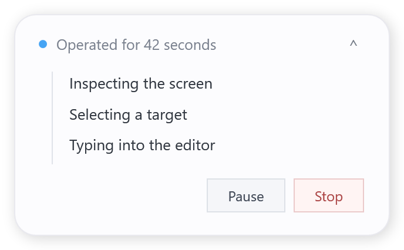
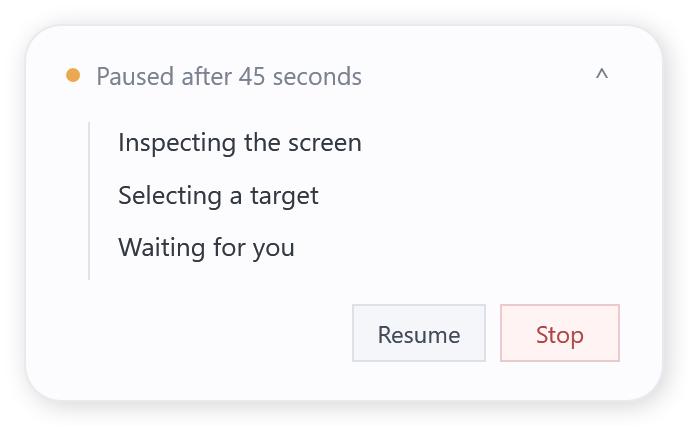
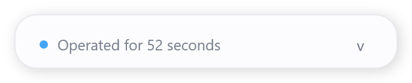

# Optional Windows desktop status card

The native Windows status card is an **opt-in display** for Computer Use MCP tool activity.
It does not replace the MCP server, session, or mouse pointer driver.

## Use

On a signed-in Windows desktop, set `COMPUTER_USE_STATUS_OVERLAY=1` in
your MCP server environment (for example through your local MCP client config).
Start the existing `computer-use-mcp` binary as usual. The floating card
opens when the first non-diagnostic tool runs, shows elapsed time and a short
history of recent tool activity, and stays above desktop windows.

The card has a non-activating startup, a draggable header, a collapse button,
and **Pause / Resume / Stop** buttons. The existing native
`agent_pointer` overlay continues to work; this feature adds no pointer
hook or secondary MCP transport.

Pause rejects **new mutating tools**; read-only observations can continue.
Stop prevents further mutations for the lifetime of the session. Both request
cancellation of a running tool through its AbortSignal; a platform-native
operation that does not support cancellation may finish before stopping.
This UI is therefore a cooperative guard, **not** a hard emergency stop.
Use the project's existing trusted-host native emergency stop for high-risk
situations instead. The panel never accepts consent on behalf of the user.

To opt out, omit `COMPUTER_USE_STATUS_OVERLAY` (or set it to `0`).
All macOS, Linux, and injected test-native sessions remain headless.

## UI preview

The three images below are off-screen renders of the actual XAML from
`libexec/windows-status-overlay.ps1`, not photographs of a live desktop:

| Running | Paused | Collapsed |
| --- | --- | --- |
|  |  |  |

## Implementation notes

The original XAML/Powershell is shipped with the existing `libexec` package
files. The server spawns the local panel on demand and communicates over an
ephemeral per-session directory containing two small files:
`state.json` (atomic write) and `control.txt` (user intent).
There is no HTTP listener, external endpoint, or copied Codex asset.
The overlay continues to use the upstream authorization, focus, activity and
policy checks; neither those checks nor the native pointer have been changed.

The panel is designed to be unobtrusive, not a pixel-for-pixel recreation
of proprietary OpenAI graphics or branding. Windows multi-monitor/DPI, real
cancellation, screen-recording interaction, and interactions with protected
windows need additional testing in a real interactive desktop session.
